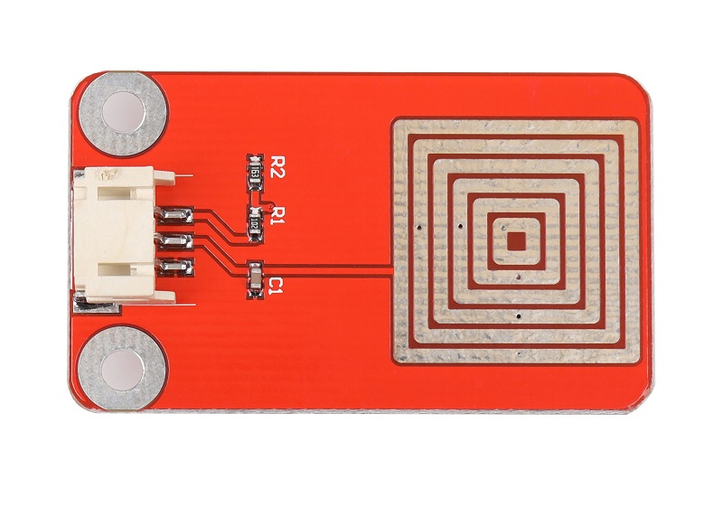
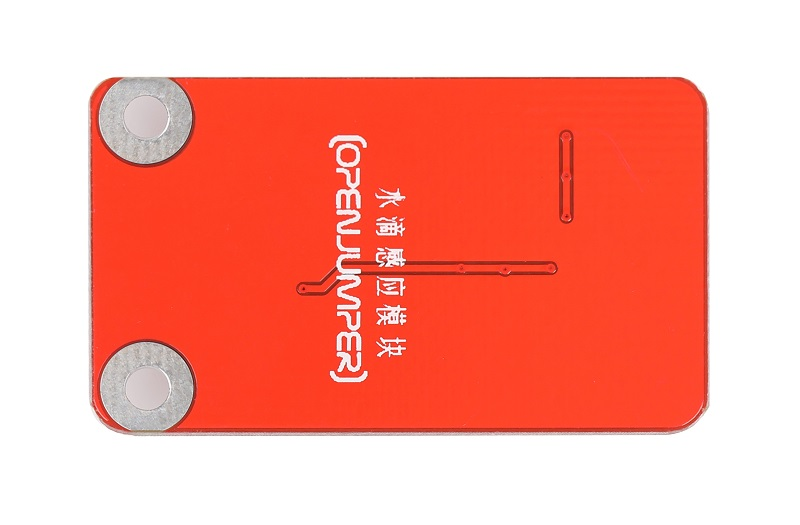
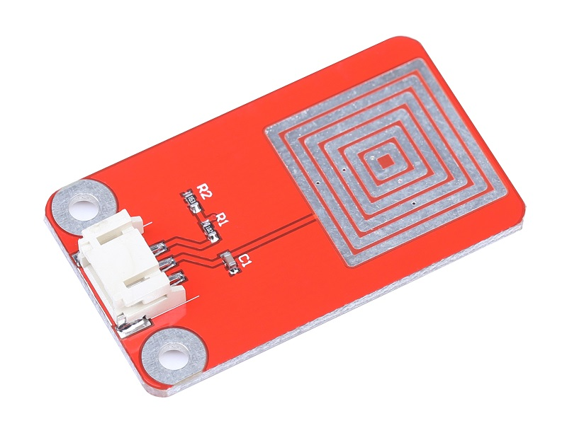
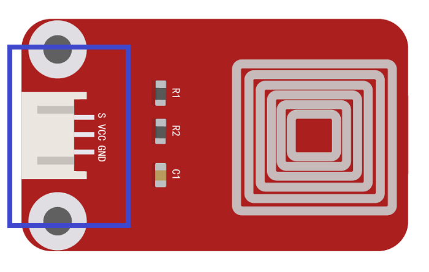

# 水滴感应模块

## 产品概述
本模块是基于水体导电率设计的模拟水滴量传感器具有灵敏度高使用方便等优点。因模块基于水体导电率设计可能会应水体不同模拟数据有所不同。 

<table border="1">

<tr>
  <td align="center"></td>
  <td align="center"></td>
  <td align="center"></td>
</tr>
<tr>
  <td style="background-color:rgb(232,232,232,0.5) "colspan="3" align="center"><a href="https://item.taobao.com/item.htm?id=600137819827"><font style="font-size:16px">水滴感应模块</font></a></td>
</tr>
</table>


## 产品参数
- 工作电压：DC3.3—5v
  
- 板子尺寸：27mm*45mm
  
- 信号方式：模拟量采集
- 
## 端口说明

- S: 信号输出

- +：VCC

- -：GND



## Arduino示例程序
```C++
/*
www.openjumper.cn
*/
const int analogInPin = A0;
int sensorValue = 0;

void setup() {
Serial.begin(9600);
}
void loop() {
sensorValue = analogRead(analogInPin);
Serial.print("sensor = ");
Serial.print(sensorValue);
delay(2);
}
```
## Mixly图形化示例程序


[mixly程序下载](http://download.openjumper.cn/mixly/water-drop.mix)