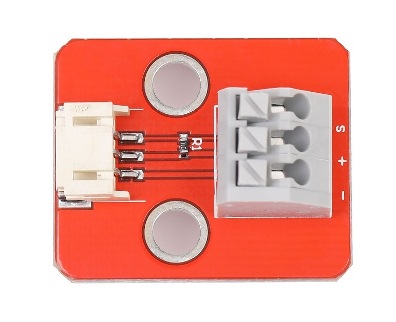
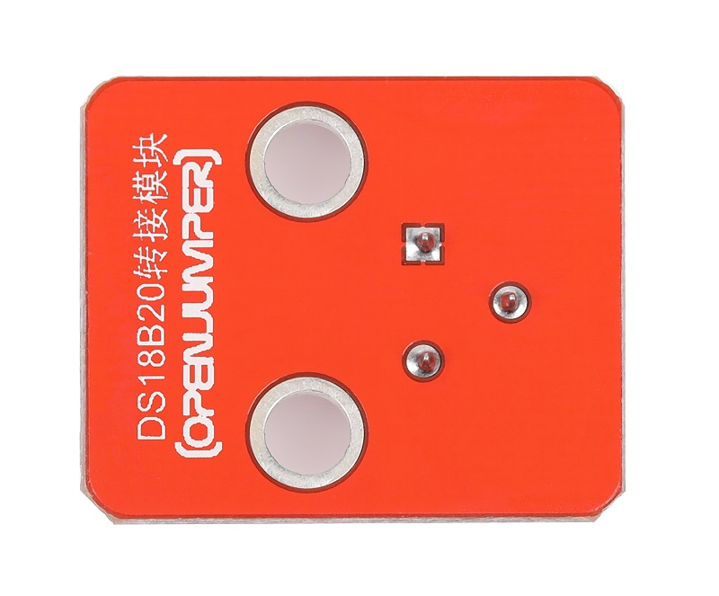
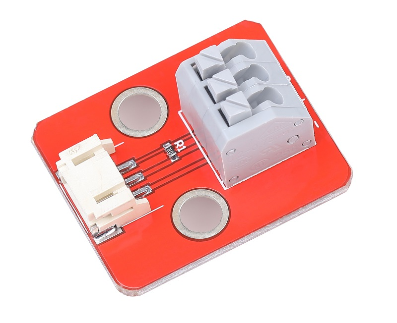
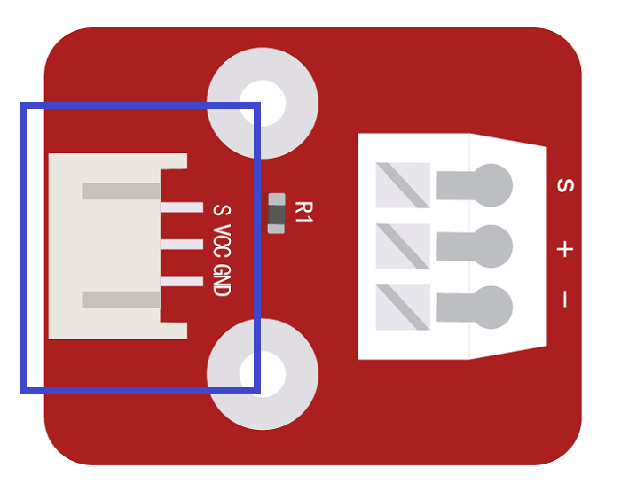

# DS18B20转接模块

## 产品概述

转接模块是一款将普通导线快速转接为3_pin插口的模块，模块采用快速压接接口不需要焊接，只需要将压接端子按住把导线插入即可快速接线，信号端口带有10K上拉电阻方便插接配套ds28b20等模块。

DS18B20是常用的数字温度传感器，其输出的是数字信号，具有体积小，硬件开销低，抗干扰能力强，精度高的特点。封装后的DS18B20可用于电缆沟测温，高炉水循环测温，锅炉测温，机房测温，农业大棚测温，洁净室测温，弹药库测温等各种非极限温度场合。耐磨耐碰，体积小，使用方便，封装形式多样，适用于各种狭小空间设备数字测温和控制领域

<table border="1">

<tr>
  <td align="center"></td>
  <td align="center"></td>
  <td align="center"></td>
</tr>
<tr>
  <td style="background-color:rgb(232,232,232,0.5) "colspan="3" align="center"><a href="https://item.taobao.com/item.htm?id=599752337999"><font style="font-size:16px">DS18B20转接模块</font></a> </td>
</tr>
</table>

## 产品参数

+ 接触电阻：20mΩ
  
+ 使用线径：1.5mm ²

+ 剥线长度：8-9mm

+ 转接端口：2.0_3pin

+ 板子尺寸：27mm*32mm

+ S18B20工作电压：3-5v

+ 测温范围：－55℃～+125℃


## 端口说明

+ S：信号端口
  
+ +：VCC

+ -：GND



## 示例程序

```C++
#include <OneWire.h>

// OneWire DS18S20, DS18B20, DS1822 Temperature Example
//
// http://www.pjrc.com/teensy/td_libs_OneWire.html
//
// The DallasTemperature library can do all this work for you!
// http://milesburton.com/Dallas_Temperature_Control_Library
// For more products, please visit www.openjumper.cn

OneWire  ds(10);  // on pin 10

void setup(void) {
  Serial.begin(9600);
}

void loop(void) {
  byte i;
  byte present = 0;
  byte type_s;
  byte data[12];
  byte addr[8];
  float celsius, fahrenheit;
  
  if ( !ds.search(addr)) {
    Serial.println("No more addresses.");
    Serial.println();
    ds.reset_search();
    delay(250);
    return;
  }
  
  Serial.print("ROM =");
  for( i = 0; i < 8; i++) {
    Serial.write(' ');
    Serial.print(addr[i], HEX);
  }

  if (OneWire::crc8(addr, 7) != addr[7]) {
      Serial.println("CRC is not valid!");
      return;
  }
  Serial.println();
 
  // the first ROM byte indicates which chip
  switch (addr[0]) {
    case 0x10:
      Serial.println("  Chip = DS18S20");  // or old DS1820
      type_s = 1;
      break;
    case 0x28:
      Serial.println("  Chip = DS18B20");
      type_s = 0;
      break;
    case 0x22:
      Serial.println("  Chip = DS1822");
      type_s = 0;
      break;
    default:
      Serial.println("Device is not a DS18x20 family device.");
      return;
  } 

  ds.reset();
  ds.select(addr);
  ds.write(0x44,1);         // start conversion, with parasite power on at the end
  
  delay(1000);     // maybe 750ms is enough, maybe not
  // we might do a ds.depower() here, but the reset will take care of it.
  
  present = ds.reset();
  ds.select(addr);    
  ds.write(0xBE);         // Read Scratchpad

  Serial.print("  Data = ");
  Serial.print(present,HEX);
  Serial.print(" ");
  for ( i = 0; i < 9; i++) {           // we need 9 bytes
    data[i] = ds.read();
    Serial.print(data[i], HEX);
    Serial.print(" ");
  }
  Serial.print(" CRC=");
  Serial.print(OneWire::crc8(data, 8), HEX);
  Serial.println();

  // convert the data to actual temperature

  unsigned int raw = (data[1] << 8) | data[0];
  if (type_s) {
    raw = raw << 3; // 9 bit resolution default
    if (data[7] == 0x10) {
      // count remain gives full 12 bit resolution
      raw = (raw & 0xFFF0) + 12 - data[6];
    }
  } else {
    byte cfg = (data[4] & 0x60);
    if (cfg == 0x00) raw = raw << 3;  // 9 bit resolution, 93.75 ms
    else if (cfg == 0x20) raw = raw << 2; // 10 bit res, 187.5 ms
    else if (cfg == 0x40) raw = raw << 1; // 11 bit res, 375 ms
    // default is 12 bit resolution, 750 ms conversion time
  }
  celsius = (float)raw / 16.0;
  fahrenheit = celsius * 1.8 + 32.0;
  Serial.print("  Temperature = ");
  Serial.print(celsius);
  Serial.print(" Celsius, ");
  Serial.print(fahrenheit);
  Serial.println(" Fahrenheit");
}
```
## 其他资料

[示例程序下载](http://download.openjumper.cn/ds18b20.rar)