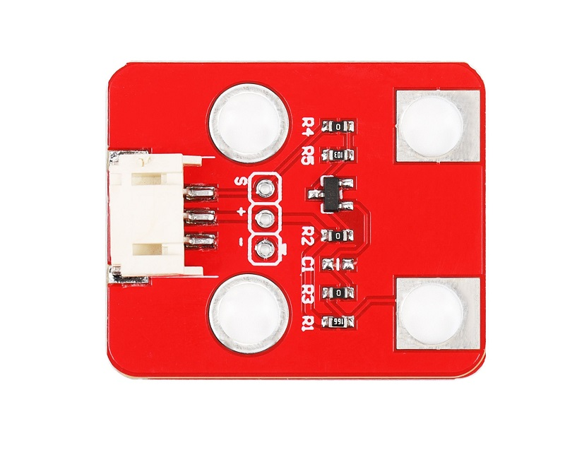
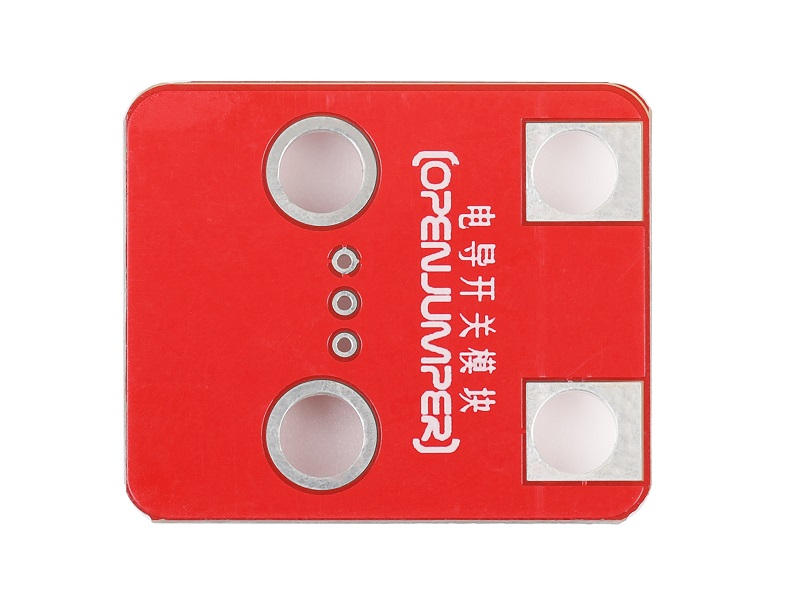
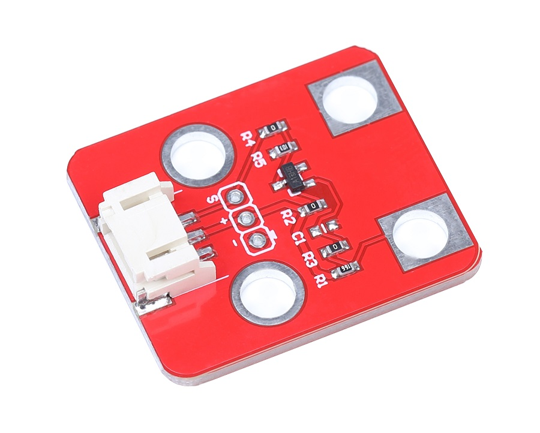
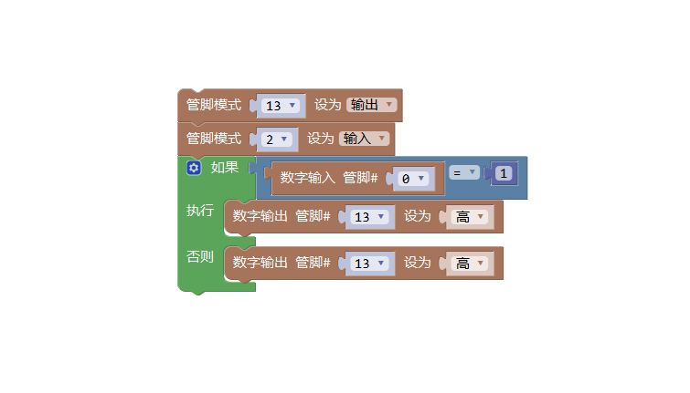

# 电导开关模块

## 产品概述
电导开关模块是一款基于人体存在导电率而设计的产品，体积小巧，使用方便，广泛应用于科普小实验，创客教育等领域。当用手触摸模块两端口模块即可输出电平信号，模块可直接通过3_pin线与各种开发板相连。

<table border="1">

<tr>
  <td align="center"></td>
  <td align="center"></td>
  <td align="center"></td>
</tr>
<tr>
  <td style="background-color:rgb(232,232,232,0.5) "colspan="3" align="center"> <a href="https://item.taobao.com/item.htm?id=599479784159"><font style="font-size:16px">电导开关模块</font></a> </td>
</tr>
</table>


## 产品参数
- 工作电压：3.3v-5v

- 触发方式：可重复触发

- 输出电平：触摸时输出电源电压

- 板子尺寸：27mm*32mm
  
## 端口说明
- S：信号输出
  
- \+：VCC
  
- –：GND

## Arduino示例程序
```C++
/*
www.openjumper.cn
*/
const int condPin = 2;
const int ledPin = 13;
int condState = 0;
void setup() {
pinMode(ledPin, OUTPUT);
pinMode(condPin, INPUT);
}
void loop() {
condState = digitalRead(condPin);
if (condState == HIGH)
{
digitalWrite(ledPin, HIGH);
}
else
{
digitalWrite(ledPin, LOW);
}
}
```
## Mixly图形化示例程序



[mixly程序下载](http://download.openjumper.cn/mixly/ojff43-switch.mix)