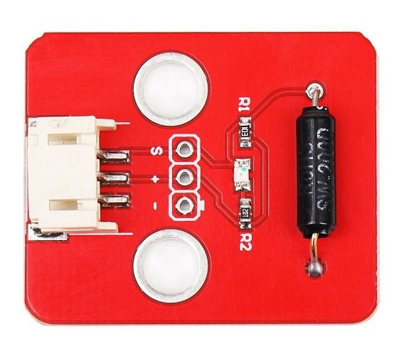

# 倾斜传感器

## 产品概述
本倾斜模块是基于sw_200d滚珠倾角开关设计的倾斜模块，体积小巧使用方便灵敏度高输出状态为高低数字电平，模块指示灯显示倾斜触发状态。

<table border="1">

<tr>
  <td align="center"></td>
  <td align="center"></td>
  <td align="center"></td>
</tr>
<tr>
  <td style="background-color:rgb(232,232,232,0.5) "colspan="3" align="center"> <a href="https://item.taobao.com/item.htm?id=599519620883"><font style="font-size:16px">倾斜传感器</font></a> </td>
</tr>
</table>


## 产品参数

- 工作电压：3.3-5v

- 信号方式：数字信号

- 板子尺寸：27mm*32mm
  
## 端口说明

+ s：信号输出
  
+ +：VCC
  
+ -：GND
  
## Arduino示例程序
```C++
/*
www.openjumper.cn
*/
const int slopePin = 2;
const int ledPin = 13;
int slopeState = 0;
void setup() {
pinMode(ledPin, OUTPUT);
pinMode(slopePin, INPUT);
}
void loop() {
slopeState = digitalRead(slopePin);
if (slopeState == HIGH) {
digitalWrite(ledPin, HIGH);
} else {
digitalWrite(ledPin, LOW);
}
}
```
## Mixly图形化示例程序


[mixly程序下载](http://download.openjumper.cn/mixly/tilt.mix)