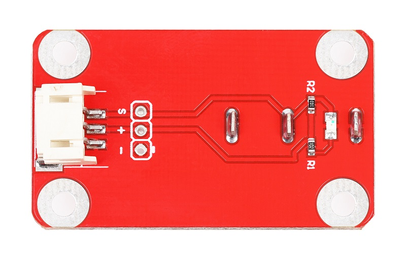
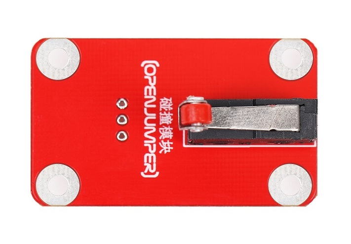
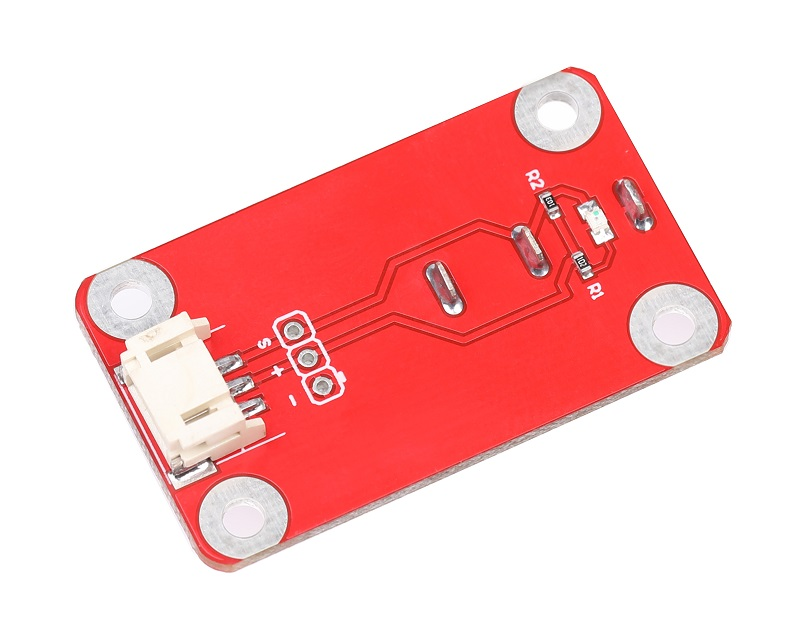
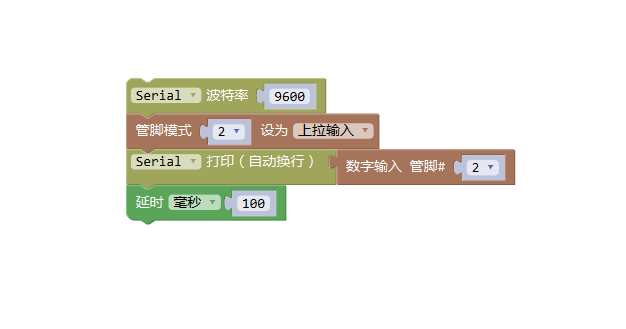

# 碰撞传感器

## 概述

碰撞开关即微型开关，当开关片闭合时，信号与GND两端连接起来。使用十分广泛，可应用于家电，机械，工业控制，运输工具以及很多其他电路控制领域。还在机械方面的雕刻机、3D打印机等起限位作用。

OJ碰撞开关可以配合arduino传感器扩展板使用，模块板载LED灯，可指示开关闭合状态。

<table border="1">

<tr>
  <td align="center"></td>
  <td align="center"></td>
  <td align="center"></td>
</tr>
<tr>
  <td style="background-color:rgb(232,232,232,0.5) "colspan="3" align="center"> <a href="https://item.taobao.com/item.htm?id=599749569672"><font style="font-size:16px">碰撞传感器</font></a> </td>
</tr>
</table>


## 引脚定义

+ S：信号

+ +：VCC

+ -：GND

## 参数及特点

+ 工作电压：5V

+ 板子尺寸：20*25mm

+ 安装孔尺寸：

+ LED指示灯：按下点亮

## Arduino示例程序
```C++
 /*OJ Button module 
www.openjumper.cn
*/
 
int pushButton = 2;
 
void setup() {
  Serial.begin(9600);
  pinMode(pushButton, INPUT_PULLUP);
}
 
void loop() {
  int buttonState = digitalRead(pushButton);
  Serial.println(buttonState);
  delay(100);       
}
```
 
## Mixly图形化示例程序



[mixly程序下载](http://download.openjumper.cn/mixly/crash.mix)