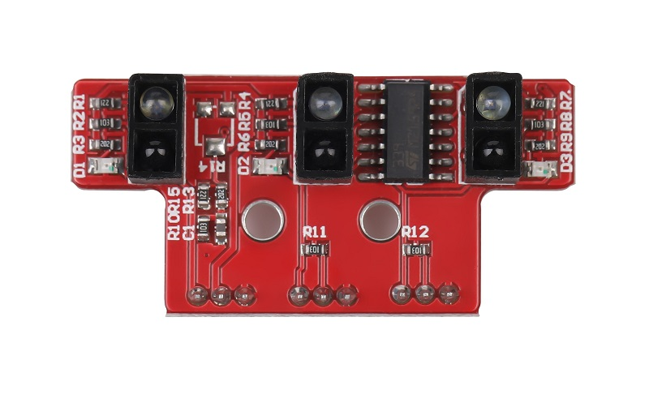
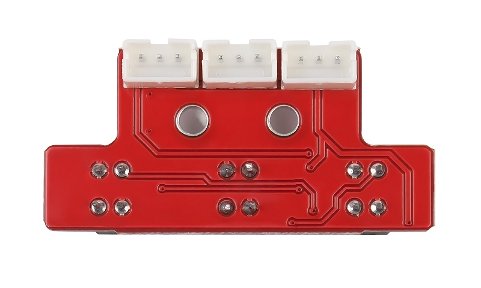
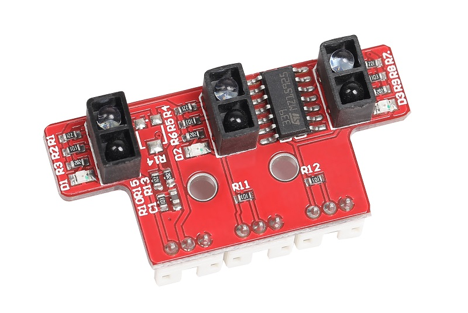

# 3路灰度传感器/3路循迹模块 

## 概述

三路红外寻线传感器的原理是利用红外接收管检测红外发射管发出的红外线的反射光（深色反射弱，浅色反射强）。三路寻线传感器可以帮助智能小车进行白线或者黑线的跟踪，可以检测白底中的黑线，也可以检测黑底中的白线，检测到黑线返回的数值比检测到白线返回的数值低。

<table border="1">

<tr>
  <td align="center"></td>
  <td align="center"></td>
  <td align="center"></td>
</tr>
<tr>
  <td style="background-color:rgb(232,232,232,0.5) "colspan="3" align="center"><a href="https://item.taobao.com/item.htm?id=618005056583"> <font style="font-size:16px">3路灰度传感器</font></a> </td>
</tr>
</table>

## 参数及特点

+ 工作电压：5V

+ 模块尺寸：43mm*21mm

+ 输出信号：数字信号
  
  + 黑线——低电平（数字0）  
  + 白线——高电平（数字1）
  
+ **特点：**
  
  + 根据反射面的颜色深浅返回不同高低电平。  

  + 集成三路光电式传感器，使用方便简单，节省空间。

     
## 引脚定义
 
+ S3：3号传感器信号接口 

- S2：2号传感器信号接口

- S1：1号传感器信号接口

- +：5V

- –：GND

## Arduino 示例程序
```C++
/**********OJ 3 grey sensor***********/
/**********www.openjumper.cn********/

int RightValue;
int MiddleValue;
int LeftValue;

void setup() {
Serial.begin(9600);
pinMode(6,INPUT);
pinMode(7,INPUT);
pinMode(8,INPUT);
}
void loop() {
RightValue = digitalRead(6);
MiddleValue = digitalRead(7);
LeftValue = digitalRead(8);
Serial.print(“Right=”);
Serial.print(RightValue);
Serial.print(“;”);
Serial.print(“Middle=”);
Serial.print(MiddleValue);
Serial.print(“;”);
Serial.print(“Left”);
Serial.print(LeftValue);
Serial.println(“;”);
delay(100);
}
```

## 其他资料

[mixly程序下载](http://download.openjumper.cn/mixly/3grey.mix)