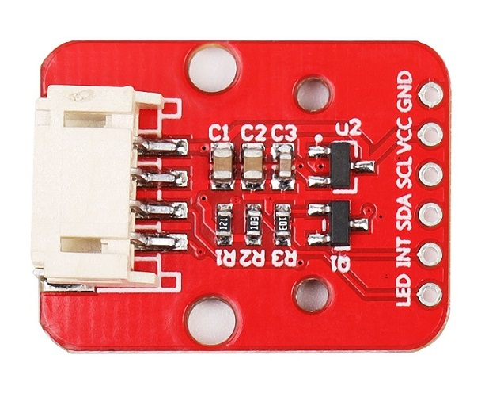
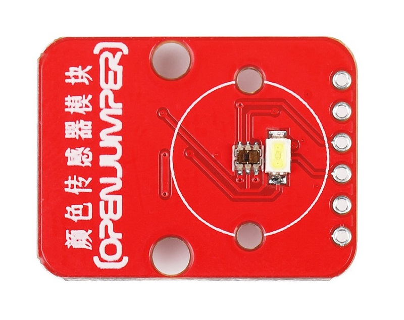
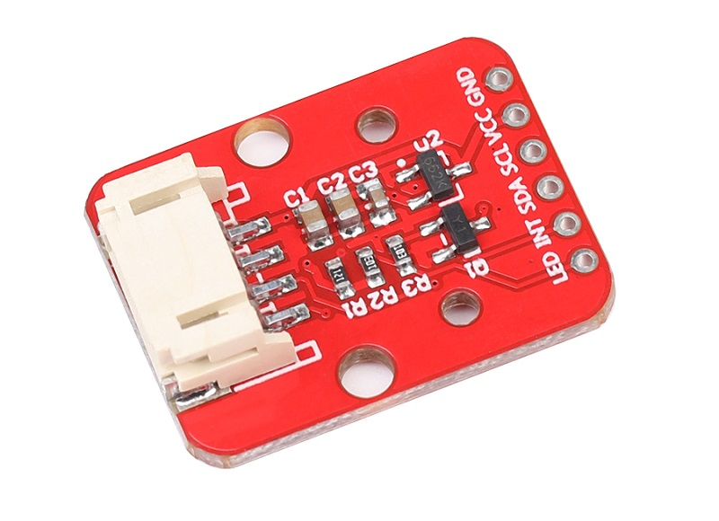
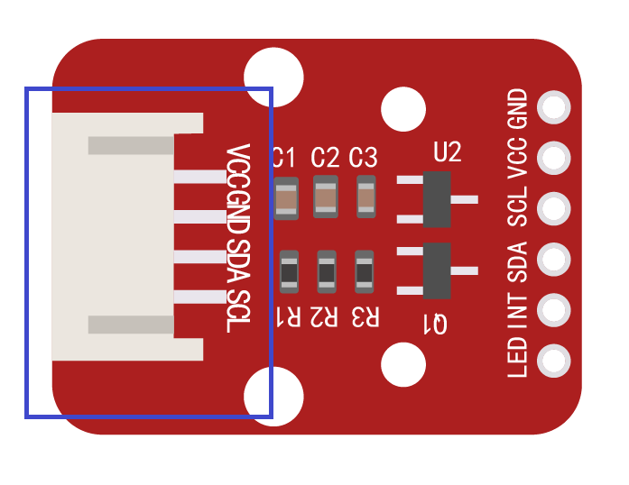
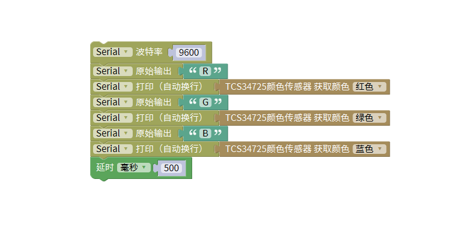

# 颜色传感器TCS34725
## 概述

OJ颜色传感器（TCS34725）是一款低成本颜色识别传感器模块。 提供红、绿、蓝 (RGB) 以及明光感应的数字返回值。 色敏光电二极管集成片裁和局部化的红外遮光滤光片，最大程度减小了入射光的红外频谱成份，让颜色管理更加准确。 高敏感性、宽动态范围以及红外遮光滤光片使得 TCS34725 成为光线条件变化和通过衰减材料条件下的理想色敏元件解决方案。

<table border="1">

<tr>
  <td align="center"></td>
  <td align="center"></td>
  <td align="center"></td>
</tr>
<tr>
  <td style="background-color:rgb(232,232,232,0.5) "colspan="3" align="center"> <a href="https://item.taobao.com/item.htm?id=606143532430"><font style="font-size:16px">颜色传感器TCS34725</font></a> </td>
</tr>
</table>

## 模块参数

+ 模块尺寸：26mm*20mm

+ 宽工作电压：3V-5V

+ 工作电流：65uA

+ 检测距离：3-10mm

+ 时钟频率：0-400KHZ

+ 温度范围：-30℃ ~ +70℃

+ 接口：IIC接口(PH2.0接口+ 2.54排针接口)  



## 特点

+ 光强度的高精度分辨率转换成频率。  
  
+ 可编程颜色和全面的输出频率。

## 引脚说明

|序号|符号|功能描述|
|:----|:----|:----|
|1|LED|控制传感器附近的LED灯，高信号或者悬空时LED灯亮，低信号灭|
|2|INT|中断输出，低电平有效|
|3|SDA|I2C数据信号|
|4|SCL|I2C时钟信号|
|5|VCC|电源正极3.3-5V|
|6|GND|电源负极|
|7|PH2.0-4P座|通过4p连接线与Openjumper传感器扩展板的IIC接口相连|

## arduino示例程序
```C++
#include <Wire.h>
#include <Adafruit_TCS34725.h>

float red, green, blue;

Adafruit_TCS34725 tcs = Adafruit_TCS34725(TCS34725_INTEGRATIONTIME_50MS, TCS34725_GAIN_4X);

void setup(){
  Serial.begin(9600);
  if (tcs.begin()) {
Serial.println("Found sensor");
}
else {
Serial.println("No TCS34725 found ... check your connections");
while (1);
}
}

void loop(){
  Serial.write('R');
  Serial.print(tcs.getR());
  Serial.write('G');
  Serial.print(tcs.getG());
  Serial.write('B');
  Serial.print(tcs.getB());
  delay(500);

}
```

## mixly示例程序



## 其他资料

+ [mixly程序下载](http://download.openjumper.cn/mixly/tcs34725.mix)

+ TCS34725芯片资料  

+ 模块原理图  

链接：<https://pan.baidu.com/s/1k67S-JjLnGDE3Z4bR5DVZw>提取码: ih4q

