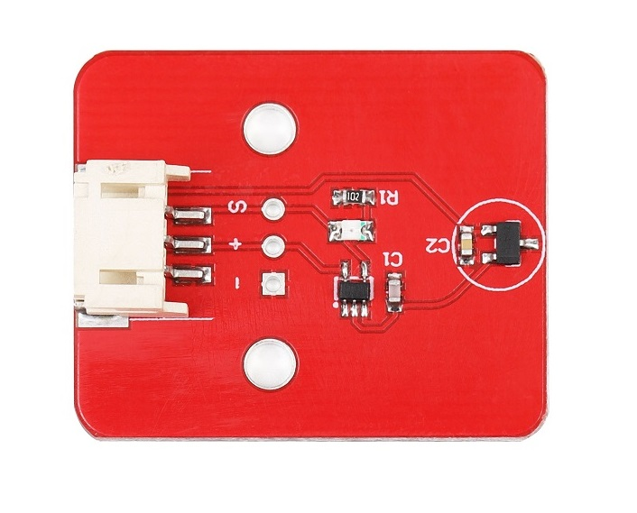
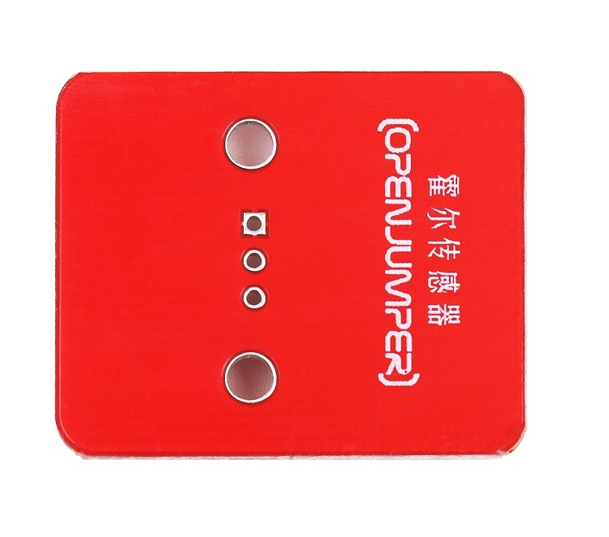
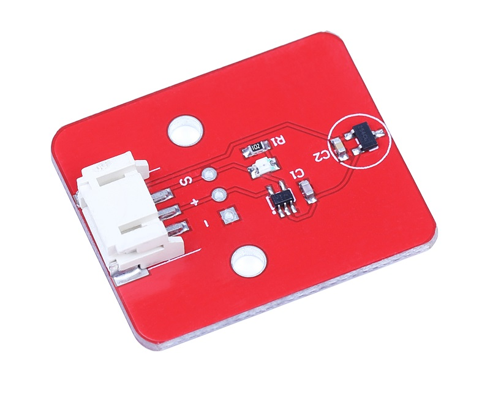
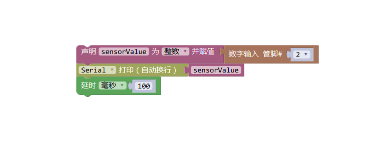

# 霍尔磁感应模块

## 概述

OJ霍尔传感器模块是用来检测磁场的传感器模块，当有磁铁靠近霍尔开关模块的探头，模块将产生一个低电平信号。磁铁远离，模块默认输出高电平，与Arduino的传感器扩展板结合使用，非常容易地实现与磁场感知相关的互动效果。

<table border="1">

<tr>
  <td align="center"></td>
  <td align="center"></td>
  <td align="center"></td>
</tr>
<tr>
  <td style="background-color:rgb(232,232,232,0.5) "colspan="3" align="center"> <a href="https://item.taobao.com/item.htm?id=616404101636"><font style="font-size:16px">霍尔磁感应模块</font></a> </td>
</tr>
</table>

## 模块参数

+ 尺寸：19*26mm

+ 工作电压：5V

+ 信号类型：数字模式

+ 磁极性：有磁极性

+ 检测距离：0-2cm

## 引脚定义

+ S：输出

+ +：DC5V

+ -：GND地

## 示例程序
```C++
/*OJ hall module
 www.openjumper.cn
 */

 int Sensor_pin = 2;

 void setup() {
   Serial.begin(9600);
 }
 void loop() {
   int sensorValue = digitalRead(Sensor_pin);
   Serial.println(sensorValue);
   delay(100);
 }
```
## ArduinoMixly图形化程序



## 其他文档

[mixly程序下载](http://download.openjumper.cn/mixly/hall-sensor.mix)

[Hall-Sensor](http://www.openjumper.cn/wp-content/uploads/2012/08/Hall-Sensor.pdf)

