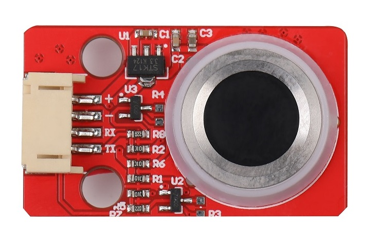
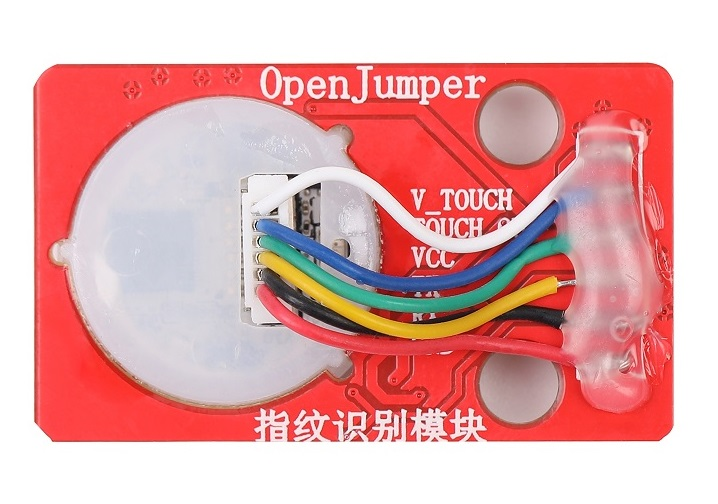
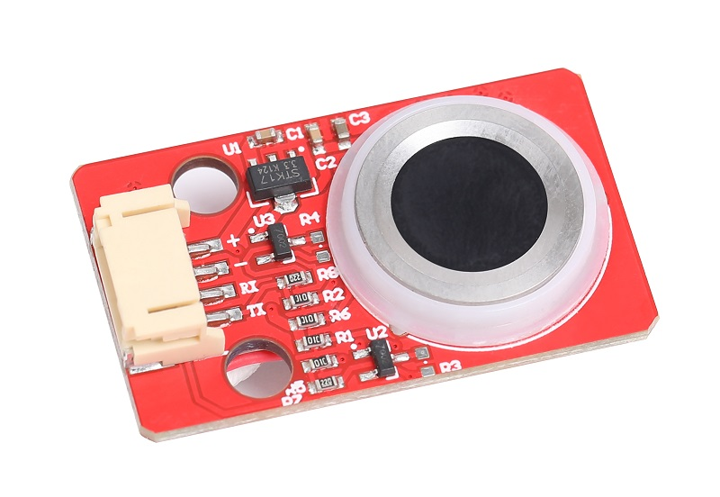

# 串口指纹识别模块

## 简介

串口指纹识别模块是一款半导体指纹识别识别模块。其控制核心为AS608。通过串口与主控通讯，实现指纹模型数据的传输和命令的发送与接收。模块高电平为5V，适合连接Arduino UNO R3等控制器。

该款指纹识别模块具有体积小、功耗低、接口简单、连接方便、带灯光提示、兼容性好可靠性高、识别速度快等优点。兼容Arduino UNO R3、WIFIduino、MEGA2560 R3、STM32等控制器。 适合用于DIY的指纹考勤、指纹门锁、智能家居系统指纹验证等场景。

<table border="1">

<tr>
  <td align="center"></td>
  <td align="center"></td>
  <td align="center"></td>
</tr>
<tr>
  <td style="background-color:rgb(232,232,232,0.5) "colspan="3" align="center"><a href="https://item.taobao.com/item.htm?id=656861367288"> 指纹识别模块</a> </td>
</tr>
</table>

## 参数

+ 尺寸：23.8X39.8（mm）

+ 通信方式：UART（默认波特率57600，可选115200）

+ 电源电压：5V

+ 数据IO高电平：5V（默认）/3.3V

+ 可储存指纹数：200枚

+ 工作电流：30-60mA

+ 像素分辨率：500DPI

+ 有效像素：88X108

+ 固定孔：标准乐高孔，间距2个乐高单位

## 库文件及示例程序下载

[mixly程序下载](http://download.openjumper.cn/mixly/fingerprint.mix)

[Arduino指纹库下载](http://download.openjumper.cn/Adafruit_Fingerprint_Sensor_Library.zip)

[Arduino简易使用教程下载](http://download.openjumper.cn/%E7%AE%80%E6%98%93%E5%9B%BE%E6%96%87%E6%95%99%E7%A8%8B.zip)