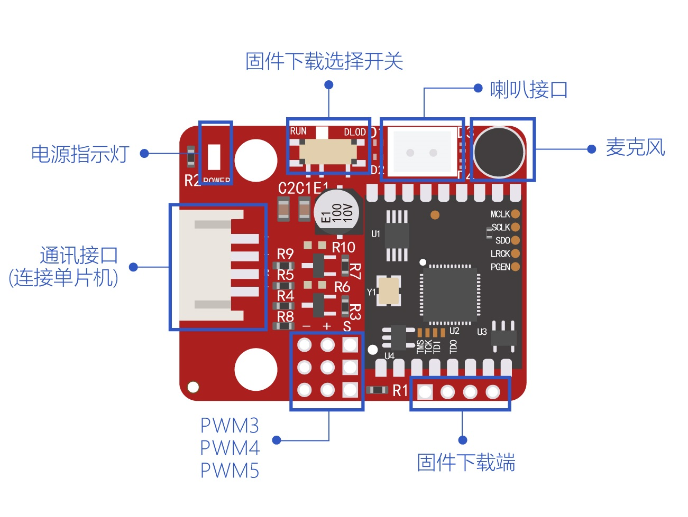

# 串口语音识别模块

## 简介

串口语音识别模块是一款兼容 Arduino、ESP8266和ESP32的模块。模块带一个高灵敏度麦克风，识别率高。
且同时具有语音播报功能，实现语音对话交互。
模块出厂已经写好默认固件，到手即可使用。也可对模块下载其他固件。
模块具有3个GPIO，可以连接红外接收、发射模块或LED模块。


[点我购买](https://item.taobao.com/item.htm?id=657787607581)

## 参数

+ 尺寸：31.8X39.8（mm）

+ 通信方式：UART（默认波特率9600）

+ 电源电压：5V

+ 数据IO高电平：5V（默认）/3.3V

+ 最大可存储识别词条：200条

+ 工作电流：40-60mA

+ 固定孔：中心距24mm，孔直径4.8mm


## 端口说明



## 默认固件唤醒词及识别词

|智能管家(唤醒词)|||||
|:--|:--|:--|:--|:--|
|打开空调|关闭睡眠模式|二十一度|红色模式|增大音量|
|关闭空调|定时一小时|二十二度|绿色模式|大点声|
|增大风速|定时两小时|二十三度|蓝色模式|小声点|
|减小风速|定时二小时|二十四度|彩色模式|音量减小|
|升高一度|左右摆动|二十五度|打开主卧灯|减小音量|
|降低一度|上下摆动|二十六度|关闭主卧灯|小点声|
|全自动|停止摆动|二十七度|打开花园灯|最大声|
|制热模式|最小风|二十八度|关闭花园灯|音量最大|
|制冷模式|低速风|二十九度|打开客房灯|最大音量|
|送风模式|中速风|三十度|关闭客房灯|最小声|
|节能模式|高速风|打开台灯|开餐厅灯|音量最小|
|关闭节能模式|最大风|关闭台灯|关闭餐厅灯|最小音量|
|除湿模式|强劲风|最高亮度|打开厕所灯|打开语音|
|关闭除湿|风小点|中等亮度|关闭厕所灯|开启语音|
|电加热|风大点|最低亮度|打开阳台灯|启动语音|
|关闭电加热|十六度|调亮一点|关闭阳台灯|关闭语音|
|空气清新|十七度|调暗点|打开书房灯|停止语音|
|空气净化|十八度|照明模式|关闭书房灯|结束语音|
|关闭空气清新|十九度|阅读模式|大声点|
|睡眠模式|二十度|夜灯模式|音量增大|

## 示例程序

**硬件连接**

|UNO|语音识别模块|
|:--|:--|
|VCC| +|
|GND|-|
|3|R|
|2|T|


```C++
/* company:OpenJumper
 * time:2022/1/13
*/

#include <VoiceCode.h>
#include <SoftwareSerial.h>//软串口

SoftwareSerial SpeechSerial(2, 3); // RX, TX，创建软串口对象,用于连接语音模块

#define HeadData1 0xA5//包头1
#define HeadData2 0xFC//包头2
#define TailData  0xFB//帧结尾
#define SerialDataPacketLength 20//串口数据最大字节数，使用默认固件时不需修改
#define DataLength  7  //数据部分总长度
#define ValidDataLength  4//数据有效部分长度

#define DEBUG
#define unsigned char u8
#define unsigned int  u16
int VoiceState;//每次识别到语音后置1，语音对比执行相应动作后置0

#define RelayPin 13
#define OFF LOW
#define ON  HIGH

u8 SerialDatatNamber;
int Voice_OK_Number;//每次识别到语音指令后的语音编号，使用后置-1

u8 SerialDataPacket[SerialDataPacketLength]={0};//每次接收到的串口数据包
u8 VoiceData[ValidDataLength]={0};//数据为7个十六进制数，最后一个为置信度，倒数第二、第三个均为0，则只用对比前4个即可

void setup() {
  Serial.begin(9600);//调试输出信息
  while (!Serial) {
    ; // wait for serial port to connect. Needed for native USB port only
  }
  Serial.println("Serial begin!");

  SpeechSerial.begin(9600);//语音模块串口波特率默认为9600
  Serial.println("Speech begin!");
  
  VoiceState = 0;
  SerialDatatNamber = 0;

  Voice_OK_Number = -1;
  pinMode(RelayPin,OUTPUT);
  digitalWrite(RelayPin,OFF);
}

void loop() {
    if(SpeechSerial.available() > 0){
      u8 SerialNowData = SpeechSerial.read();
      if(SerialNowData <= 9)
        Serial.print("0x0");
      else Serial.print("0x");
      Serial.print(SerialNowData,HEX);
      Serial.print(" ");
      if(SerialNowData == HeadData1 || SerialDataPacket[0] == HeadData1){
         SerialDataPacket[SerialDatatNamber++] = SerialNowData;       
      }
  
      if(SerialNowData == TailData && (SerialDatatNamber > (DataLength + SerialDataPacket[2]))){//读取到数据包最后一个数据，即帧结尾
          SerialDataPacket[0] = 0;
          Serial.print("ReadDataEnd!");
          if(SerialDataPacket[2] == 0x02){//唤醒或睡眠时
              if(SerialDataPacket[7] == 0 && SerialDataPacket[8] == 0xB1){//唤醒时
                VoiceState = 2;
                }
              else if(SerialDataPacket[7] == 0 && SerialDataPacket[8] == 0xB2){//进入休眠时
                VoiceState = 3;
                }
          }
          else if(SerialDataPacket[2] == 0x07){//识别到命令时
              if(SerialDataPacket[7] == 0x01 && SerialDataPacket[8] == 0x55 && SerialDataPacket[9] == 0xE0 && SerialDataPacket[10] == 0x01){//这里还是属于唤醒命令
                VoiceState = 2;
                }
              else {//识别到语音命令时
                Serial.println("Heard!");
                VoiceState = 1;
            }
          }
          SerialDatatNamber = 0;       
          for(int i=0;i<4;i++){
              VoiceData[i] = SerialDataPacket[(i+7)];
              //Serial.print("0x");
              //Serial.print(VoiceData[i],HEX);
              //if(i == 3)Serial.println();
          }
       }
       else {
        if(VoiceState != 0) VoiceState = 0;
        }
   }

//   Serial.println("VoiceCode begin!");//输出数组数据对照查看
//   for(int check_arry_x=0;check_arry_x<98;check_arry_x++){
//       for(int check_arry_y=0;check_arry_y<4;check_arry_y++){
//         if(check_arry_y == 3)
//             Serial.println(VoiceCode[check_arry_x][check_arry_y],HEX);
//         else {
//             Serial.print(VoiceCode[check_arry_x][check_arry_y],HEX);
//             }
//        }
//    }
//   Serial.println("VoiceCode end!");
   
      if(VoiceState == 1){
        Serial.print("Loading...");
        for(int VoNum=0;VoNum<98;VoNum++){//查找语音对应的编码
            for(int arrnu=0;arrnu<4;arrnu++){           
               if(VoiceData[arrnu] != VoiceCode[VoNum][arrnu])
                  break;
               if(arrnu == 3){//找到语音对应的数据
                  Serial.print("heard the sound:");
                  Serial.println(VoNum);
                  Voice_OK_Number = VoNum;
                  VoiceState = 0;
                }
            }       
        } 
        if(VoiceState == 1){
          VoiceState = 0;
          Serial.println("NO VOICE!");
          }
     }
     else if(VoiceState == 2){
       VoiceState = 0;
       Serial.println("HELLO!");
     }
     else if(VoiceState == 3){
       VoiceState = 0;
       Serial.println("SLEEP!");
     }

   switch(Voice_OK_Number){
    case 64: {
             digitalWrite(RelayPin,ON);//执行的动作,开
             VoiceState = -1;
            } break;
    case 65: {
             digitalWrite(RelayPin,OFF);//执行的动作,关
             VoiceState = -1;
            }break;
    }
   //}
}
```

## 其他资料

[示例程序下载](https://pan.baidu.com/s/1wkWMsy3frk0mX7neZ2-hPQ?pwd=7b5n)  提取码：7b5n

[库文件下载](https://pan.baidu.com/s/1w0mnP_cJ7ND-xPJlcgd6vw?pwd=7m7k)  提取码: 7m7k

[固件制作指南](https://document.chipintelli.com/%E8%BD%AF%E4%BB%B6%E5%BC%80%E5%8F%91/SDK/CI110X%E8%8A%AF%E7%89%87SDK/start/%E5%91%BD%E4%BB%A4%E8%AF%8D%E5%92%8C%E5%9B%BA%E4%BB%B6%E5%88%B6%E4%BD%9C%E6%8C%87%E5%8D%97/)

[主模组数据手册](https://document.chipintelli.com/%E7%A1%AC%E4%BB%B6%E5%BC%80%E5%8F%91/%E6%A8%A1%E5%9D%97%E6%95%B0%E6%8D%AE%E6%89%8B%E5%86%8C/CI-C22GS02S%E6%A8%A1%E5%9D%97%E6%95%B0%E6%8D%AE%E6%89%8B%E5%86%8C/)

[模块数据手册下载](https://pan.baidu.com/s/1Elx_ecy9yFuGOSPQ9lPPKQ?pwd=txn6) 提取码: txn6
