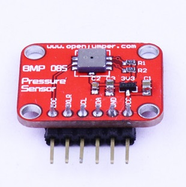

# 气压传感器BMP085

## 概述

BMP085是一款高精度、超低能耗的压力传感器，可以应用在移动设备中。它的性能卓越，绝对精度最低可以达到0.03hPa，并且耗电极低，只有3μA。BMP085采用强大的8-pin陶瓷无引线芯片承载（LCC）超薄封装，可以通过I2C总线直接与各种微处理器相连。



 

## 芯片特性

+ 芯片内置AD转换器

+ 供电电压：5V

+ 通信方式：IIC通信协议

+ 电源电压：  
  
  1.8V － 3.6V（VDDA）  
  
  1.62V － 3.6V（VDDD）


## 主要特点


+ 压力范围：300 － 1100hPa（海拔9000米至-500米）
   
+  LCC8封装：无铅陶瓷载体封装（LCC）
    
+ 尺 寸： 5.0mmx5.0x1.2mm
    
+ 低功耗： 5μA 在标准模式
    
+ 高精度: 低功耗模式下，分辨率为0.06hPa（0.5米）
    
+ 高线性模式下，分辨率为0.03hPa（0.25米）
    
+ 含温度输出
    
+ I2C接口
    
+ 温度补偿
    
+ 反应时间：7.5ms
    
+ 待机电流：0.1μA
    
+ 无需外部时钟电路

 

## 典型应用

+ GPS精确导航（航位推算，上下桥检测等）

+ 室内室外导航

+ 休闲、体育和医疗健康等监测

+ 天气预报

+ 垂直速度指示（上升/下沉速度）

+ 风扇功率控制

 

## Arduino驱动示例
```C++
#include <Wire.h>

#define BMP085_ADDRESS 0x77  // I2C address of BMP085

const unsigned char OSS = 0;  // Oversampling Setting

// Calibration values
int ac1;
int ac2;
int ac3;
unsigned int ac4;
unsigned int ac5;
unsigned int ac6;
int b1;
int b2;
int mb;
int mc;
int md;

// b5 is calculated in bmp085GetTemperature(...), this variable is also used in bmp085GetPressure(...)
// so ...Temperature(...) must be called before ...Pressure(...).
long b5; 

void setup(){
  Serial.begin(9600);
  Wire.begin();

  bmp085Calibration();
}

void loop()
{
  float temperature = bmp085GetTemperature(bmp085ReadUT()); //MUST be called first
  float pressure = bmp085GetPressure(bmp085ReadUP());
  float atm = pressure / 101325; // "standard atmosphere"
  float altitude = calcAltitude(pressure); //Uncompensated caculation - in Meters 

  Serial.print("Temperature: ");
  Serial.print(temperature, 2); //display 2 decimal places
  Serial.println("deg C");

  Serial.print("Pressure: ");
  Serial.print(pressure, 0); //whole number only.
  Serial.println(" Pa");

  Serial.print("Standard Atmosphere: ");
  Serial.println(atm, 4); //display 4 decimal places

  Serial.print("Altitude: ");
  Serial.print(altitude, 2); //display 2 decimal places
  Serial.println(" M");

  Serial.println();/ne break

  delay(1000); //wait a second and get values again.
}

// Stores all of the bmp085's calibration values into global variables
// Calibration values are required to calculate temp and pressure
// This function should be called at the beginning of the program
void bmp085Calibration()
{
  ac1 = bmp085ReadInt(0xAA);
  ac2 = bmp085ReadInt(0xAC);
  ac3 = bmp085ReadInt(0xAE);
  ac4 = bmp085ReadInt(0xB0);
  ac5 = bmp085ReadInt(0xB2);
  ac6 = bmp085ReadInt(0xB4);
  b1 = bmp085ReadInt(0xB6);
  b2 = bmp085ReadInt(0xB8);
  mb = bmp085ReadInt(0xBA);
  mc = bmp085ReadInt(0xBC);
  md = bmp085ReadInt(0xBE);
}

// Calculate temperature in deg C
float bmp085GetTemperature(unsigned int ut){
  long x1, x2;

  x1 = (((long)ut - (long)ac6)*(long)ac5) >> 15;
  x2 = ((long)mc << 11)/(x1 + md);
  b5 = x1 + x2;

  float temp = ((b5 + 8)>>4);
  temp = temp /10;

  return temp;
}

// Calculate pressure given up
// calibration values must be known
// b5 is also required so bmp085GetTemperature(...) must be called first.
// Value returned will be pressure in units of Pa.
long bmp085GetPressure(unsigned long up){
  long x1, x2, x3, b3, b6, p;
  unsigned long b4, b7;

  b6 = b5 - 4000;
  // Calculate B3
  x1 = (b2 * (b6 * b6)>>12)>>11;
  x2 = (ac2 * b6)>>11;
  x3 = x1 + x2;
  b3 = (((((long)ac1)*4 + x3)<<OSS) + 2)>>2;

  // Calculate B4
  x1 = (ac3 * b6)>>13;
  x2 = (b1 * ((b6 * b6)>>12))>>16;
  x3 = ((x1 + x2) + 2)>>2;
  b4 = (ac4 * (unsigned long)(x3 + 32768))>>15;

  b7 = ((unsigned long)(up - b3) * (50000>>OSS));
  if (b7 < 0x80000000)
    p = (b7<<1)/b4;
  else
    p = (b7/b4)<<1;

  x1 = (p>>8) * (p>>8);
  x1 = (x1 * 3038)>>16;
  x2 = (-7357 * p)>>16;
  p += (x1 + x2 + 3791)>>4;

  long temp = p;
  return temp;
}

// Read 1 byte from the BMP085 at 'address'
char bmp085Read(unsigned char address)
{
  unsigned char data;

  Wire.beginTransmission(BMP085_ADDRESS);
  Wire.write(address);
  Wire.endTransmission();

  Wire.requestFrom(BMP085_ADDRESS, 1);
  while(!Wire.available())
    ;

  return Wire.read();
}

// Read 2 bytes from the BMP085
// First byte will be from 'address'
// Second byte will be from 'address'+1
int bmp085ReadInt(unsigned char address)
{
  unsigned char msb, lsb;

  Wire.beginTransmission(BMP085_ADDRESS);
  Wire.write(address);
  Wire.endTransmission();

  Wire.requestFrom(BMP085_ADDRESS, 2);
  while(Wire.available()<2)
    ;
  msb = Wire.read();
  lsb = Wire.read();

  return (int) msb<<8 | lsb;
}

// Read the uncompensated temperature value
unsigned int bmp085ReadUT(){
  unsigned int ut;

  // Write 0x2E into Register 0xF4
  // This requests a temperature reading
  Wire.beginTransmission(BMP085_ADDRESS);
  Wire.write(0xF4);
  Wire.write(0x2E);
  Wire.endTransmission();

  // Wait at least 4.5ms
  delay(5);

  // Read two bytes from registers 0xF6 and 0xF7
  ut = bmp085ReadInt(0xF6);
  return ut;
}

// Read the uncompensated pressure value
unsigned long bmp085ReadUP(){

  unsigned char msb, lsb, xlsb;
  unsigned long up = 0;

  // Write 0x34+(OSS<<6) into register 0xF4
  // Request a pressure reading w/ oversampling setting
  Wire.beginTransmission(BMP085_ADDRESS);
  Wire.write(0xF4);
  Wire.write(0x34 + (OSS<<6));
  Wire.endTransmission();

  // Wait for conversion, delay time dependent on OSS
  delay(2 + (3<<OSS));

  // Read register 0xF6 (MSB), 0xF7 (LSB), and 0xF8 (XLSB)
  msb = bmp085Read(0xF6);
  lsb = bmp085Read(0xF7);
  xlsb = bmp085Read(0xF8);

  up = (((unsigned long) msb << 16) | ((unsigned long) lsb << 8) | (unsigned long) xlsb) >> (8-OSS);

  return up;
}

void writeRegister(int deviceAddress, byte address, byte val) {
  Wire.beginTransmission(deviceAddress); // start transmission to device 
  Wire.write(address);       // send register address
  Wire.write(val);         // send value to write
  Wire.endTransmission();     // end transmission
}

int readRegister(int deviceAddress, byte address){

  int v;
  Wire.beginTransmission(deviceAddress);
  Wire.write(address); // register to read
  Wire.endTransmission();

  Wire.requestFrom(deviceAddress, 1); // read a byte

  while(!Wire.available()) {
    // waiting
  }

  v = Wire.read();
  return v;
}

float calcAltitude(float pressure){

  float A = pressure/101325;
  float B = 1/5.25588;
  float C = pow(A,B);
  C = 1 - C;
  C = C /0.0000225577;

  return C;
}
```