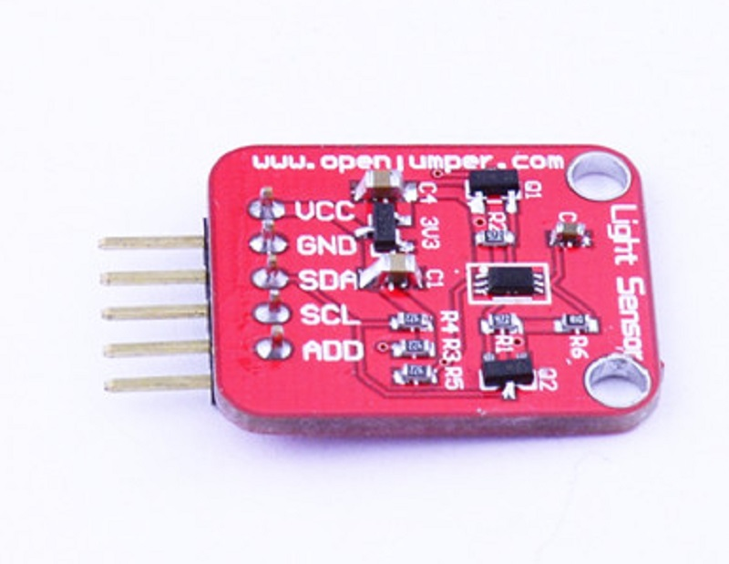
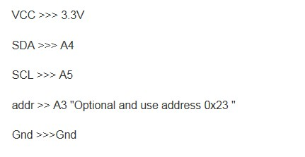

# 光照传感器



## 概述

+ 供电电源：3-5V

+ 光照强度范围：0-65535 lx

+ 传感器内置16bitAD转换器

+ 不区分环境光源

+ 接近于视觉灵敏度的分光特性

+ 可对广泛的亮度进行1勒克斯的高精度测定

+ 标准NXP IIC通信协议

+ 模块内部包含通信电平转换，与5V单片机Io直接连接
  
## 主要特点

+ 电源电压 Vmax 4.5 V

+ 工作温度 Topr -40- 85 ℃

+ 贮藏温度 Tstg -40- 100 ℃ 

+ SDA灌电流 7mA

+ 功率耗散 260 毫瓦 

+ for operating above Ta=25℃

+ Features I2C 总线接口（f / s模式支持） 50Hz / 60Hz光噪声reject-function

光源的依赖性不大（例如白炽灯、荧光灯、卤素灯、白LED）

小测变异(+/- 20%)13)的红外线的影响很小。

## 典型应用

+ Descriptions2BH1750FVI是一个数字环境光传感器IC为IC总线接口。这IC是最合适的环境光获得数据调整LCD和键盘的移动电话背光电源。它可以探测到高分解广泛。（1 – 65535勒克斯）。

+ Applications手机，LCD TV, PC,便携式游戏机，数码相机，数码摄像机，车载导航，PDA,LCD显示

## 芯片常识

### candela的定义


1.烛光、国际烛光、坎德拉（candela）

在每平方米101325牛顿的标准大气压下，面积等于1/60平方厘米的绝对“黑体”（即能够吸收全部外来光线而毫无反射的理想物体），在纯铂（Pt）凝固温度（约2042K获1769℃）时，沿垂直方向的发光强度为1 坎德拉。并且，烛光、国际烛光、坎德拉三个概念是有区别的，不宜等同。从数量上看，60 坎德拉等于58.8国际烛光，亥夫纳灯的1烛光等于0.885国际烛光或0.919坎德拉。

2.发光强度与光亮度

Lcd是指光源在指定方向的单位立体角内发出的光通量。光源辐射是均匀时，则光强为I=F/Ω，Ω为立体角，单位为球面度（sr）,F为光通量，单位是流明，对于点光源由I=F/4 。光亮度是表示发光面明亮程度的，指发光表面在指定方向的发光强度与垂直且指定方向的发光面的面积之比，单位是坎德拉/平方米。以下是部分光源的亮度值：单位cd/m&sup2; 太阳：1.5*10 ；日光灯：（5—10）*10&sup3;；月光（满月）：2.5*10&sup3;；黑白电视机荧光屏：120左右；彩色电视机荧光屏：80左右。

3.光通量与流明

光源所发出的光能是向所有方向辐射的，对于在单位时间里通过某一面积的光能，称为通过这一面积的辐射能通量。各色光的频率不同，眼睛对各色光的敏感度也有所不同，即使各色光的辐射能通量相等，在视觉上并不能产生相同的明亮程度，在各色光中，黄、绿色光能激起最大的明亮感觉。如果用绿色光作水准，令它的光通量等于辐射能通量，则对其它色光来说，激起明亮感觉的本领比绿色光为小，光通量也小于辐射能通量。光通量的单位是流明，是英文lumen的音译，简写为lm。绝对黑体在铂的凝固温度下，从5.305*10&sup3;cm&sup2;面积上辐射出来的光通量为1lm。为表明光强和光通量的关系，发光强度为1坎德拉的点光源在单位立体角（1球面度）内发出的光通量为1流明。一只40W的日光灯输出的光通量大约是2100流明。

4.光照度与勒克斯

光照度可用照度计直接测量。光照度的单位是勒克斯，是英文lux的音译，也可写为lx。被光均匀照射的物体，在1平方米面积上得到的光通量是1流明时，它的照度是1勒克斯。有时为了充分利用光源，常在光源上附加一个反射装置，使得某些方向能够得到比较多的光通量，以增加这一被照面上的照度。例如汽车前灯、手电筒、摄影灯等。

以下是各种环境照度值：单位lux

黑夜：0.001—0.02；月夜：0.02—0.3；阴天室内：5—50；阴天室外：50—500；晴天室内：100—1000；夏季中午太阳光下的照度：约为10*6次方；阅读书刊时所需的照度：50—60；家用摄像机标准照度：1400

## 接线示意图



## Arduino测试代码

```C++
#include <Wire.h>
#include <BH1750FVI.h>
BH1750FVI LightSensor;
void setup()
{ // put your setup code here, to run once:
Serial.begin(9600);
LightSensor.begin();
/*
Set the address for this sensor
you can use 2 different address
Device_Address_H "0x5C"
Device_Address_L "0x23"
you must connect Addr pin to A3 .
*/
LightSensor.SetAddress(Device_Address_H);//Address 0x5C
// To adjust the slave on other address , uncomment this line
// lightMeter.SetAddress(Device_Address_L); //Address 0x5C
//———————————————–
/*
set the Working Mode for this sensor
Select the following Mode:
Continuous_H_resolution_Mode
Continuous_H_resolution_Mode2
Continuous_L_resolution_Mode
OneTime_H_resolution_Mode
OneTime_H_resolution_Mode2
OneTime_L_resolution_Mode

The data sheet recommanded To use Continuous_H_resolution_Mode
*/

LightSensor.SetMode(Continuous_H_resolution_Mode);

Serial.println("Running…");
}

void loop()
{
// put your main code here, to run repeatedly:
uint16_t lux = LightSensor.GetLightIntensity();// Get Lux value
Serial.print("Light: ");
Serial.print(lux);
Serial.println(" lux");
delay(1000);
}
```

## 相关资料

BH175库(停止维护)     [BH1750FVI]（http://www.openjumper.cn/wp-content/uploads/2014/06/BH1750FVI.rar）

Git下载:[Arduino BH1750](https://github.com/claws/BH1750)