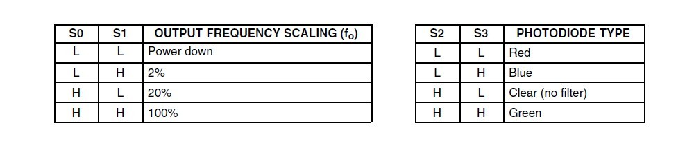
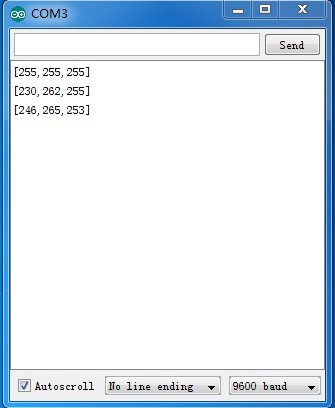
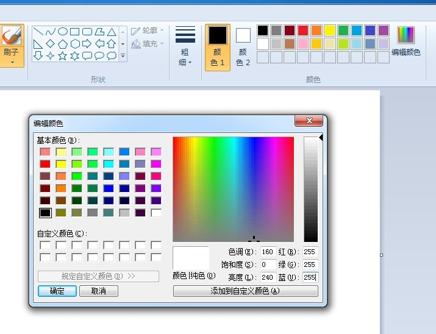

# 颜色传感器（TCS3200）

## 概述

OJ颜色传感器（TCS3200）是一款全彩的颜色检测器，TCS3200主芯片是TAOS公司推出的可编程光到频率的转换器，模块还集成了四个高亮白光LED，用于调节白平衡。TCS3200含有大量的光检测器，每个都有红绿蓝和清除4种滤光器。每6种颜色滤光器均匀地按数组分布来清除颜色中偏移位置的颜色分量。内置的振荡器能输出方波，其频率与所选择的光的强度成比例关系。

## 模块参数及特点

+ 模块尺寸：35mm*25mm

+ 宽工作电压：2.7V-5.5V

+ 接口：TTL数字接口

+ 特点：1、光强度的高精度分辨率转换成频率。2、可编程颜色和全面的输出频率。

## 引脚定义

+ S0，S1 	输出频率范围选择

+ S2，S3 	二极管类型选择

+ OUT 	输出频率

+ E0 	频率输出使能（低有效）

+ LED 	高亮LED控制引脚（高使能）

+ \+ 	VCC（2.7V-5.5V）

+ – 	GND

## 三原色的感应原理

通常所看到的物体的颜色，实际上是物体表面吸收了照射到它上面的白光(日光)中的一部分有色成分，而反射出的另一部分有色光在人眼中的反应。白色是由各种频率的可见光混合在一起构成的，也就是说白光中包含着各种颜色的色光(如红R、黄Y、绿G、青V、蓝B、紫P)。根据德国物理学家赫姆霍兹(Helinholtz)的三原色理论可知，各种颜色是由不同比例的三原色(红、绿、蓝)混合而成的。

## 颜色检测原理

由上面的三原色感应原理可知，如果知道构成各种颜色的三原色的值，就能够知道所测试物体的颜色。对于TCS3200 来说，当选定一个颜色滤波器时，它只允许某种特定的原色通过，阻止其它原色的通过。例如：当选择红色滤波器时，入射光中只有红色可以通过，蓝色和绿色都被阻止，这样就可以得到红色光的光强；同理，选择其它的滤波器，就可以得到蓝色光和绿色光的光强。通过这三个值，就可以分析投射到TCS3200 传感器上的光的颜色。

## 白平衡和颜色识别原理

白平衡就是告诉系统什么是白色。从理论上讲，白色是由等量的红色、绿色和蓝色混合而成的；但实际上，白色中的三原色并不完全相等，并且对于TCS3200 的光传感器来说，它对这三种基本色的敏感性是不相同的，导致TCS230 的RGB 输出并不相等，因此在测试前必须进行白平衡调整，使得TCS3200 对所检测的“白色”中的三原色是相等的。进行白平衡调整是为后续的颜色识别作准备。在本装置中，白平衡调整的具体步骤和方法如下：将空的试管放置在传感器的上方，试管的上方放置一个白色的光源，使入射光能够穿过试管照射到TCS3200 上；根据前面所介绍的方法，依次选通红色、绿色和蓝色滤波器，分别测得红色、绿色和蓝色的值，然后就可计算出需要的三个调整参数。

## TCS3200检测颜色原理

连接到TCS3200时，选择一种颜色过滤器，它可以允许只有一个特定的颜色，以获得通过，并防止其他颜色。例如，当选择红色滤波器，只有红色的入射光可以得到通过，蓝色和绿色将被阻止。因此，我们可以得到红光强度。同样，当选择其他过滤器，我们可以得到蓝色或绿色光。TCS3200有四个光电二极管类型。红色，蓝色，绿色和明确，入射光均匀的幅度大大减少，因此，提高精度和简化光学。轻项目的TCS3200，当我们可以选择在S2和S3的不同组合不同类型的光电二极管。形式如下所示。



## Arduino示例程序
```C++
    #include <TimerOne.h> 
    #define S0     3   // Please notice the Pin's define
    #define S1     4
    #define S2     5
    #define S3     6
    #define OUT    2

    int   g_count = 0;    // count the frequecy
    int   g_array[3];     // store the RGB value
    int   g_flag = 0;     // filter of RGB queue
    float g_SF[3];        // save the RGB Scale factor

     // Init TSC230 and setting Frequency.
    void TSC_Init()
    {
      pinMode(S0, OUTPUT);
      pinMode(S1, OUTPUT);
      pinMode(S2, OUTPUT);
      pinMode(S3, OUTPUT);
      pinMode(OUT, INPUT);

      digitalWrite(S0, LOW);  // OUTPUT FREQUENCY SCALING 2%
      digitalWrite(S1, HIGH); 
    }

    // Select the filter color 
    void TSC_FilterColor(int Level01, int Level02)
    {
      if(Level01 != 0)
        Level01 = HIGH;

      if(Level02 != 0)
        Level02 = HIGH;

      digitalWrite(S2, Level01); 
      digitalWrite(S3, Level02); 
    }

    void TSC_Count()
    {
      g_count ++ ;
    }

    void TSC_Callback()
    {
      switch(g_flag)
      {
        case 0: 
             TSC_WB(LOW, LOW);              //Filter without Red
             break;
        case 1:
               g_array[0] = g_count;
             TSC_WB(HIGH, HIGH);            //Filter without Green
             break;
        case 2:
             g_array[1] = g_count;
             TSC_WB(LOW, HIGH);             //Filter without Blue
             break;

        case 3:
             g_array[2] = g_count;
             TSC_WB(HIGH, LOW);             //Clear(no filter)   
             break;
       default:
             g_count = 0;
             break;
      }
    }

    void TSC_WB(int Level0, int Level1)      //White Balance
    {
      g_count = 0;
      g_flag ++;
      TSC_FilterColor(Level0, Level1);
      Timer1.setPeriod(1000000);             // set 1s period
    }

    void setup()
    {
      TSC_Init();
      Serial.begin(9600);
      Timer1.initialize();             // defaulte is 1s
      Timer1.attachInterrupt(TSC_Callback);  
      attachInterrupt(0, TSC_Count, RISING);  

      delay(4000);

      for(int i=0; i<3; i++)

      g_SF[0] = 255.0/ g_array[0];     //R Scale factor
      g_SF[1] = 255.0/ g_array[1] ;    //G Scale factor
      g_SF[2] = 255.0/ g_array[2] ;    //B Scale factor

    }

    void loop()
    {
       g_flag = 0;
       Serial.print("[");
       for(int i=0; i<2; i++){     
        Serial.print(int(g_array[i] * g_SF[i]));
        Serial.print(",");    
            }

            Serial.print(int(g_array[2] * g_SF[2]));
            Serial.println("]");
       delay(4000);

    }
```

**接线：**

安装库文件，下载程序，连接模块至Arduino，打开串口窗口



打开电脑画图工具，输入R、G、B值就可以看到你对应检测出的颜色



## 其他文档

[TCS3200-schematic](http://openjumper.cn/wp-content/uploads/2013/08/TCS3200-schematic.pdf)

[TCS3200-TCS3210](http://openjumper.cn/wp-content/uploads/2013/08/TCS3200-TCS3210.pdf)

[TimerOne](http://openjumper.cn/wp-content/uploads/2013/08/TimerOne.rar)

