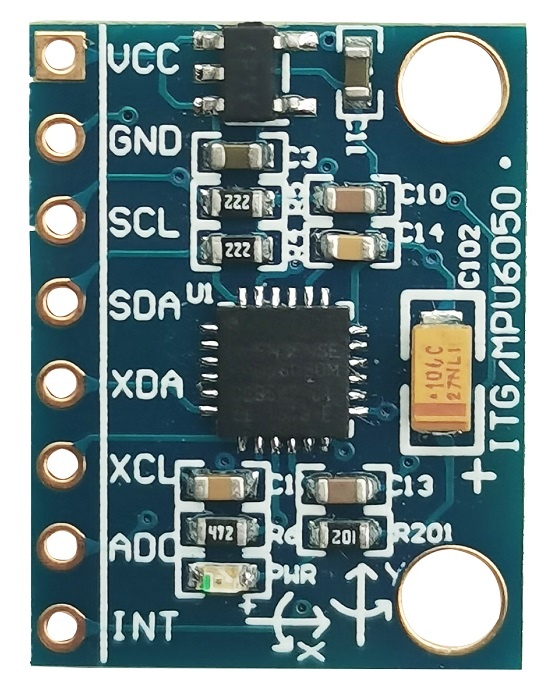
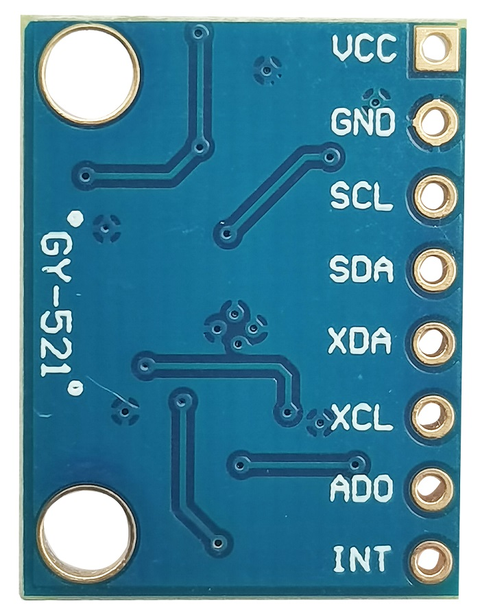
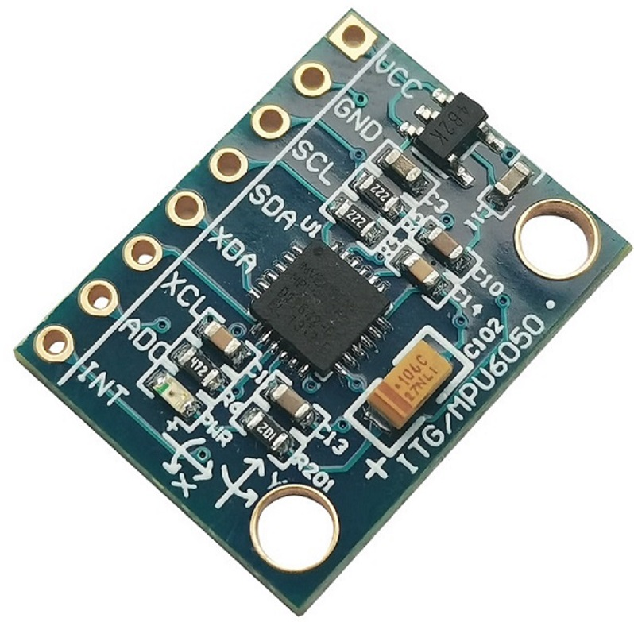

# MPU6050模块(六轴:陀螺仪+加速度传感器)

## 概述

MPU6050整合3轴陀螺仪和3轴加速度，MPU-6000是全球首例整合性6轴运动处理传感器。它集成了3轴陀螺仪，3轴速度计，以及一个可扩展的数字运动处理器DMP (Digital Motion Processor)，可用I2C接口连接一个第三方的数字传感器，比如磁力计。扩展之后就可以通过其I2C或SPI接口输出一个9轴的信号(SPI接口仅在MPU-6000可用)。MPU-6000也可以通过其I2C接口链接非惯性的数字传感器，比如压力传感器。

MPU-6000对陀螺仪和加速度计分别用了三个16位的ADC将其测量的模拟量转化为可输出的数字量。为了精确跟踪快速和慢速的运动，传感器的测量范围都是用户可控的，陀螺仪可测范围为±250，±500，±1000，±2000°/s，加速度计可测范围为±2g，±4g，±8g，±16g。

一个片上1024字节的FIFO，有助于降低系统功耗。和所有设备寄存器之间的通信采用400kHz的I2C接口或1MHz的SPI接口(SPI仅MPU-6000可用)。对于需要高速传输的应用，对寄存器的读取和中断可用20MHz的SPI。另外，片上还内嵌了一个温度传感器和在工作环境下仅有±1%变动的振荡器。


<table border="1">

<tr>
  <td align="center"></td>
  <td align="center"></td>
  <td align="center"></td>
</tr>
<tr>
  <td style="background-color:rgb(232,232,232,0.5) "colspan="3" align="center"> <a href="https://item.taobao.com/item.htm?id=702812619801"><font style="font-size:16px">MPU6050模块</font></a> </td>
</tr>
</table>

## 应用场景

+ 运动感测游戏

+ 现实增强

+ 电子稳像

+ 光学稳像

## 模块参数

+ 芯片：MPU-6050

+ 供电电源：3-5v（内部低压差稳压）

+ 通信方式：标准IIC通信协议

+ 芯片内置16bit AD转换器,16位数据输出

+ 陀螺仪范围：±250、±500、±1000、±2000°/s

+ 加速度范围：±2、±4、±8、±16g   

+ 采用沉金PCB,机器焊接工艺保证质量

+ 引脚间距：2.54mm

+ 尺寸：15mm*20mm


## 引脚定义

+ SDA：I2C 串行数据 (SDA)

+ SCL：I2C 串行时钟 (SCL)

+ VCC：+5V(连接跳帽，3.3V供电)

+ GND：– 接地引脚

+ XCL：I2C 主串行时钟, 用于连接外部传感器

+ XDA：I2C 主串行数据，用于连接外部传感器

+ AD0：I2C 地址选择

+ INT：中断数字输出（推挽或开漏）

## 使用示例

先下载 I2CdevLib

```C++
/*OJ mpu6050 Sensor
 www.openjumper.com
 */
// Arduino Wire library is required if I2Cdev I2CDEV_ARDUINO_WIRE implementation
// is used in I2Cdev.h
#include <Wire.h>

// I2Cdev and MPU6050 must be installed as libraries, or else the .cpp/.h files
// for both classes must be in the include path of your project
#include <I2Cdev.h>
#include <MPU6050.h>

// class default I2C address is 0x68
// specific I2C addresses may be passed as a parameter here
// AD0 low = 0x68 (default for InvenSense evaluation board)
// AD0 high = 0x69
MPU6050 accelgyro;

int16_t ax, ay, az;
int16_t gx, gy, gz;

#define LED_PIN 13
bool blinkState = false;

void setup() {
    // join I2C bus (I2Cdev library doesn't do this automatically)
    Wire.begin();

    // initialize serial communication
    // (38400 chosen because it works as well at 8MHz as it does at 16MHz, but
    // it's really up to you depending on your project)
    Serial.begin(38400);

    // initialize device
    Serial.println("Initializing I2C devices...");
    accelgyro.initialize();

    // verify connection
    Serial.println("Testing device connections...");
    Serial.println(accelgyro.testConnection() ? "MPU6050 connection successful" : "MPU6050 connection failed");

    // configure Arduino LED for
    pinMode(LED_PIN, OUTPUT);
}

void loop() {
    // read raw accel/gyro measurements from device
    accelgyro.getMotion6(&ax, &ay, &az, &gx, &gy, &gz);

    // these methods (and a few others) are also available
    //accelgyro.getAcceleration(&ax, &ay, &az);
    //accelgyro.getRotation(&gx, &gy, &gz);

    // display tab-separated accel/gyro x/y/z values
    Serial.print("a/g:t");
    Serial.print(ax); Serial.print("t");
    Serial.print(ay); Serial.print("t");
    Serial.print(az); Serial.print("t");
    Serial.print(gx); Serial.print("t");
    Serial.print(gy); Serial.print("t");
    Serial.println(gz);

    // blink LED to indicate activity
    blinkState = !blinkState;
    digitalWrite(LED_PIN, blinkState);
}
```
  
## 相关文档

+ [mixly程序下载](http://download.openjumper.cn/mixly/mpu6050.mix)

+ MP6050 schematic:[mpu6050-schematic](http://openjumper.cn/wp-content/uploads/2013/01/mpu6050-schematic.pdf)

+ i2cdevlib:<https://github.com/jrowberg/i2cdevlib>

+ MPU6050 lib:<https://github.com/jrowberg/i2cdevlib/tree/master/Arduino/MPU6050>

+ datasheet:<http://www.invensense.com/mems/gyro/mpu6050.html>
