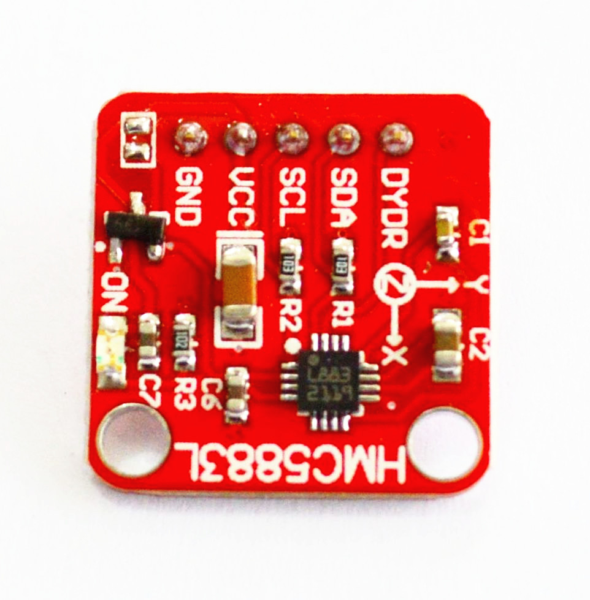

# HMC5883L电子罗盘模块

## 概述

HMC5883L  包括最先进的高分辨率HMC118X系列磁阻传感器，并附带霍尼韦尔专利的集成电路包括放大器、自动消磁驱动器、偏差校准、能使罗盘精度控制在1°~2°的12位模数转换器，同时模块可选择3.3v或者5V供电，简易的I2C 系列总线接口，更加方便与主控器的连接和驱动,检测出X,Y,Z三轴上的地磁场分量，并做出相关互动。



## 模块参数

+ 尺寸：20 X 20mm

+ 主要芯片：HMC5883L

+ 工作电压：3.3V或5V

+ 通信接口：IIC

+ 指示LED：模块上电状态指示

## 引脚定义

+ DYDR：数据准备，中断引脚

+ SDA：串行数据- I2C总线主/从数据

+ SCL：串行时钟- I2C总线主/从时钟

+ VCC：5V(跳帽短接，3.3v供电)

+ GND：电源接地

## 示例程序

```C++
// Arduino Wire library is required if I2Cdev I2CDEV_ARDUINO_WIRE implementation
// is used in I2Cdev.h
#include <Wire.h>
#include <I2Cdev.h>
#include <HMC5883L.h>

// class default I2C address is 0x1E
// specific I2C addresses may be passed as a parameter here
// this device only supports one I2C address (0x1E)
HMC5883L mag;

int16_t mx, my, mz;

#define LED_PIN 13
bool blinkState = false;

void setup() {
    // join I2C bus (I2Cdev library doesn't do this automatically)
    Wire.begin();

    // initialize serial communication
    // (38400 chosen because it works as well at 8MHz as it does at 16MHz, but
    // it's really up to you depending on your project)
    Serial.begin(38400);

    // initialize device
    Serial.println("Initializing I2C devices...");
    mag.initialize();

    // verify connection
    Serial.println("Testing device connections...");
    Serial.println(mag.testConnection() ? "HMC5883L connection successful" : "HMC5883L connection failed");

    // configure Arduino LED for
    pinMode(LED_PIN, OUTPUT);
}

void loop() {
    // read raw heading measurements from device
    mag.getHeading(&mx, &my, &mz);

    // display tab-separated gyro x/y/z values
    Serial.print("mag:\t");
    Serial.print(mx); Serial.print("\t");
    Serial.print(my); Serial.print("\t");
    Serial.println(mz);

    // blink LED to indicate activity
    blinkState = !blinkState;
    digitalWrite(LED_PIN, blinkState);
}
```
 

## 常见问答

问：电子罗盘的作用是什么？

>答：和传统罗盘作用一样，指示方向方向。

问：电子罗盘的原理是什么？

>答：传统罗盘用一根被磁化的磁针来感应地球磁场，地球磁场与磁针之间的磁力时磁针转动，直至磁针的两端分别指向地球的磁南极与磁北极。电子罗盘也一样，只不过把磁针换成了磁阻传感器，然后将感受到的地磁信息转换为数字信号输出给用户使用。

## 相关文档：

Datasheet：[HMC5883L1](http://www.openjumper.cn/wp-content/uploads/2013/01/HMC5883L1.pdf) 、[HMC5883L](http://www.openjumper.cn/wp-content/uploads/2013/01/HMC5883L.pdf)

lib：[HMC5883L](http://www.openjumper.cn/wp-content/uploads/2013/01/HMC5883L.zip) 、[I2Cdev](http://www.openjumper.cn/wp-content/uploads/2013/01/I2Cdev.zip)

Schematic：[HMC5883L-compass-schematic](http://www.openjumper.cn/wp-content/uploads/2013/01/HMC5883L-compass-schematic.pdf)
