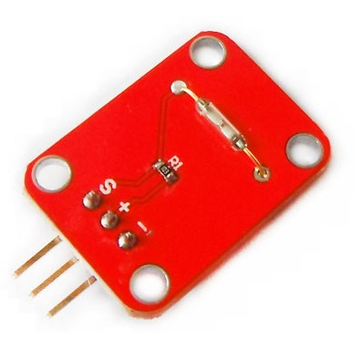

# 干簧管模块

## 概述

干簧管模块处于常开状态，当有磁铁靠近，干簧管闭合与GND导通，该模块输出数字信号，与Arduino专用传感器扩展板结合使用，可以非常容易实现互动



[点我购买](https://item.taobao.com/item.htm?id=579393295189)

## 模块参数

+ 尺寸：19*26mm

+ 输出信号：数字信号

+ 工作电压：5V

+ 检测距离：0~15mm

## 端口说明

+ s：信号输出

+ +：VCC

+ –：GND

## 示例程序
```C++
/*OJ Reed Switch module
www.openjumper.cn
*/

int Sensor_pin = 2;

void setup() {
  Serial.begin(9600);
}
void loop() {
  int sensorValue = digitalRead(Sensor_pin);
  Serial.println(sensorValue);
  delay(100);
}
```

## 其他文档
[Reed-Switch-schematic](http://www.openjumper.cn/wp-content/uploads/2012/08/Reed-Switch-schematic.pdf)

