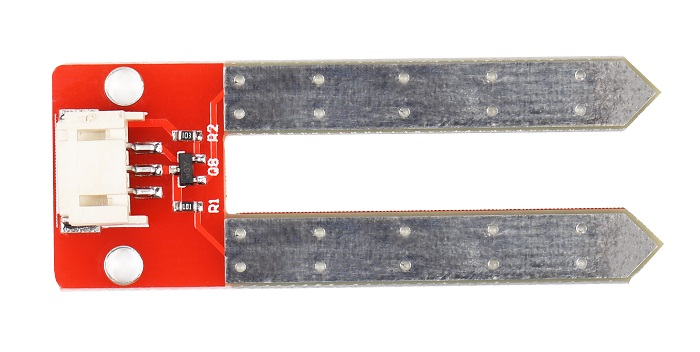
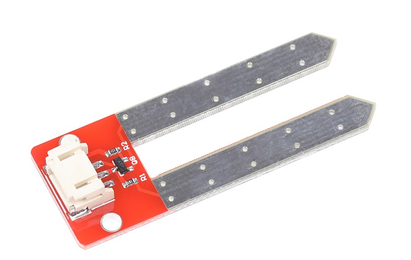

# 土壤湿度传感器

## 产品介绍

土壤湿度传感器是一个简易的水分传感器，可用于检测土壤的湿度，当土壤湿度低时，传感器的输出值将减小，反之将增大。使用这个传感器可以自动对菜园，花园自动浇水，家庭花盆土壤湿度的控制，各种电子比赛，电子积木，设计等。

该传感器可以提高导电性能，可防止接触土壤容易生锈的问题，可以延长它的使用寿命。将它插入土壤，然后使用AD转换器读取它。

<table border="1">

<tr>
  <td align="center"></td>
  <td align="center"></td>
  <td align="center"></td>
</tr>
 <tr>
  <td style="background-color:rgb(232,232,232,0.5) "colspan="3" align="center"> <a href="https://item.taobao.com/item.htm?id=667724974807"><font style="font-size:16px">土壤湿度传感器</font></a> </td>
</tr>

</table>

## 技术参数

+ 电源电压：5v

+ 输出电压：0~2.3v
  
+ 工作电流：最大20mA

+ 输出范围：0~1023

+ 信号方式：模拟量采集

## 端口说明

+ S: 信号输出

+ +：VCC

+ -：GND
  
  

## 工作原理

土壤湿度传感器是判断土壤中水分含量的多少来判定土壤的湿度大小。

当插入土壤中时由于土壤中水分含量不同，土壤的电阻值就不同，三极管的基极就提供了大小变化的导通电流，三极管集电极到发射极的导通电流受到基极控制，经过发射极的下拉电阻后转换成电压。

## 示例程序

```C++
/*
www.openjumper.com
*/
const int analogInPin = A0;
int sensorValue = 0;

void setup() {
Serial.begin(9600);
}
void loop() {
sensorValue = analogRead(analogInPin);
Serial.print("sensor = ");
Serial.print(sensorValue);
delay(100);
}
```
[mixly程序下载](http://download.openjumper.cn/mixly/ojff13.mix)
