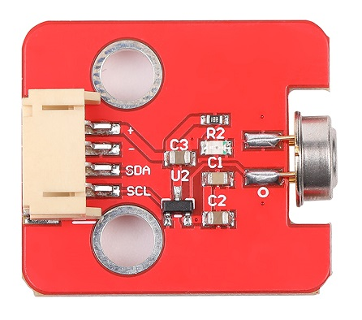
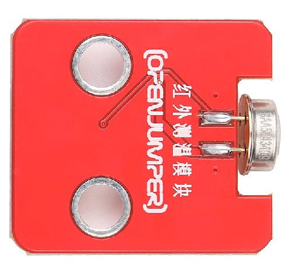
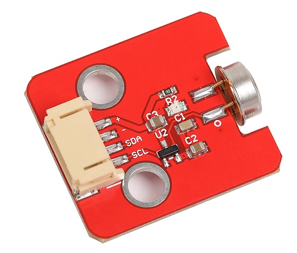

# 红外非接触温度测量传感器

## 产品介绍

<table border="1">

<tr>
  <td align="center"></td>
  <td align="center"></td>
  <td align="center"></td>
</tr>
<tr>
  <td style="background-color:rgb(232,232,232,0.5) "colspan="3" align="center"> <a href="https://item.taobao.com/item.htm?id=670982081870"><font style="font-size:16px">红外非接触温度测量模块</font></a> </td>
</tr>
</table>

MLX90614是一种用于非接触式的红外温度计。TO-39 金属封装里同时集成了红外感应热电堆探测器芯片和信号处理专用集成芯片


引脚可设置成热敏继电器(thermal relay)模式(输入为被测物体温度)，从而感应器也可用于温箱或者温度警报(冰点/沸点)等应用，而且成本低。 用户可自行设定温度阀值。

在SMBus系统应用中，此信号也可作为处理器的中断信号而触发处理器以读取测量结果。


MLX90614 是一款由Melexis研发并生产的测温器，它包括：

+ 红外热电堆感应器MLX81101

+ 专为适用于这款感应器输出而设计的信号处理芯片MLX90302

## 产品特点

+ 体积小，成本低

+ 易于集成

+ 宽温度范围出厂校准：
   
   + 传感器温度和温度为-40~+125˚C
  
   + 物体温度为-70~+380˚C。

+ 大温度范围下有0.5°C的高精度

   + 范围（Ta和To均为0~+50°C）

+ 0.02°C的测量分辨率

+ SMBus兼容数字接口

+ 兼容脉宽调制(PMW)输出方式

+ 节能工作模式

## 技术参数

+ 芯片：MLX90614

+ 电源电压 VDD(过压)：5V

+ 电源电压 VDD(工作)：3.6V

+ 工作温度范围 TA ：-40~+85℃

+ 储藏温度范围 TS：  -40~+125℃

+ 数字接口类型： IIC

## 引脚定义

+ SCL/Vz：2线通信协议的引脚名称功能SCL/Vz串行时钟输入。该引脚上的5.7V齐纳二极管用于连接外部双极晶体管，以便从外部接8~16V电源供应器件。

+ SDA/PWM：数字输入/输出。在正常模式下，测量的物体温度可在此引脚脉冲宽度调制时获得。在SMBus兼容模式下，引脚自动配置为开路NMOS。

+ VDD：外部电源电压。

+ VSS：接地，金属罐也连接到该引脚 。

## 应用场景

+ 用于移动式空调的热舒适传感器

+ 空调控制系统

+ 住宅用温度传感元件

+ 商业及工业楼宇空气质素

+ 挡风玻璃除雾

+ 汽车盲角检测

+ 运动部件的工业温度控制

+ 打印机和复印机的温度控制

+ 带温度控制的家用电器

+ 医疗保健

+ 牲畜监测

+ 运动检测

## arduino示例程序
```C++
#include <i2cmaster.h>


void setup(){
	Serial.begin(9600);
	Serial.println("Setup...");
	
	i2c_init(); //Initialise the i2c bus
	PORTC = (1 << PORTC4) | (1 << PORTC5);//enable pullups
}

void loop(){
    int dev = 0x5A<<1;
    int data_low = 0;
    int data_high = 0;
    int pec = 0;
    
    i2c_start_wait(dev+I2C_WRITE);
    i2c_write(0x07);
    
    // read
    i2c_rep_start(dev+I2C_READ);
    data_low = i2c_readAck(); //Read 1 byte and then send ack
    data_high = i2c_readAck(); //Read 1 byte and then send ack
    pec = i2c_readNak();
    i2c_stop();
    
    //This converts high and low bytes together and processes temperature, MSB is a error bit and is ignored for temps
    double tempFactor = 0.02; // 0.02 degrees per LSB (measurement resolution of the MLX90614)
    double tempData = 0x0000; // zero out the data
    int frac; // data past the decimal point
    
    // This masks off the error bit of the high byte, then moves it left 8 bits and adds the low byte.
    tempData = (double)(((data_high & 0x007F) << 8) + data_low);
    tempData = (tempData * tempFactor)-0.01;
    
    float celcius = tempData - 273.15;
    float fahrenheit = (celcius*1.8) + 32;

    Serial.print("Celcius: ");
    Serial.println(celcius);

    Serial.print("Fahrenheit: ");
    Serial.println(fahrenheit);

    delay(1000); // wait a second before printing again
}
```

## 其他资料

+ [mixly程序下载](http://download.openjumper.cn/mixly/mlx90614.mix)

+ [MLX90614 ARDUINO 程序下载](https://pan.baidu.com/s/1t1dpXSkNNs0AG_zQWv2_KA?pwd=x88g) 提取码: x88g

+ [MLX90614资料下载](https://pan.baidu.com/s/1SaHYBklHZV1y3z44sCeLPQ?pwd=xwcq)  提取码：xwcq 

+ [CJMCU-MLX90614原理图](https://pan.baidu.com/s/1RwIhlsMGOVPg9sl0EilO8w?pwd=u7a5) 提取码: u7a5