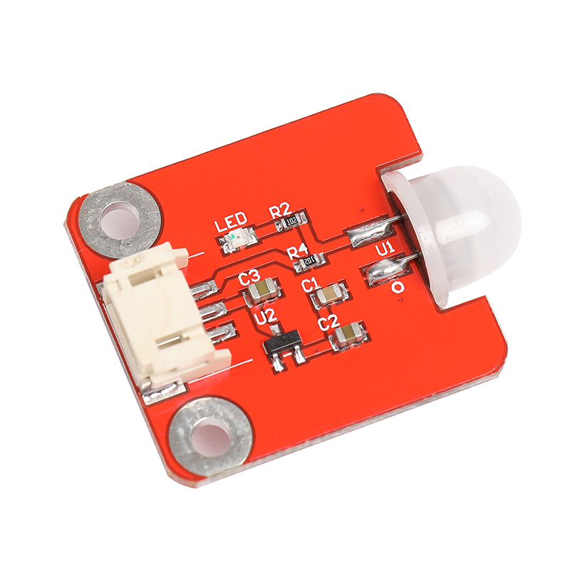

# AM412人体感应模块

## 产品概述

AM412人体检测模块是一款基于人体被动红外检测技术的数字智能自动控制产品，广泛应用于PIR运动检测、入侵检测 、占位检测、物联网传感器、智能灯等，同时兼容于Arduino和micro bit等开源硬件。

<table border="1">

<tr>
  <td align="center"></td>
  <td align="center"></td>
  <td align="center"></td>
</tr>
<tr>
  <td style="background-color:rgb(232,232,232,0.5) "colspan="3" align="center"> <a href="https://item.taobao.com/item.htm?id=600137767112"><font style="font-size:16px">AM412人体感应模块</font></a></td>
</tr>
</table>

## 产品参数

+ 静态电流：1.2uA

+ 触发方式：可重复触发

+ 输出延时：3-5s

+ 输出电平：3.3v/0v

+ 电路板尺寸：27mm*30mm

+ 感应角度：<100°

+ 工作温度：-20C°~80C°

## 端口说明

+ S : 信号输出

+ +：VCC

+ -：GND

## arduino示例程序
```C++
/*OJ PIR Motion Sensor
www.openjumper.cn
*/
const int ModulePin = 2;
const int ledPin = 13;
int buttonState = 0;
void setup() {
pinMode(ledPin, OUTPUT);
pinMode(ModulePin, INPUT);
}
void loop() {
ModulePinState = digitalRead(ModulePin);
if (ModulePinState == HIGH) {
digitalWrite(ledPin, HIGH);
}
else {
digitalWrite(ledPin, LOW);
}
}
```

[mixly程序下载](http://download.openjumper.cn/mixly/am412.mix)