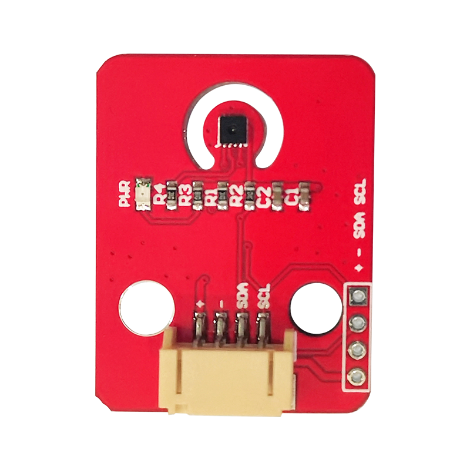
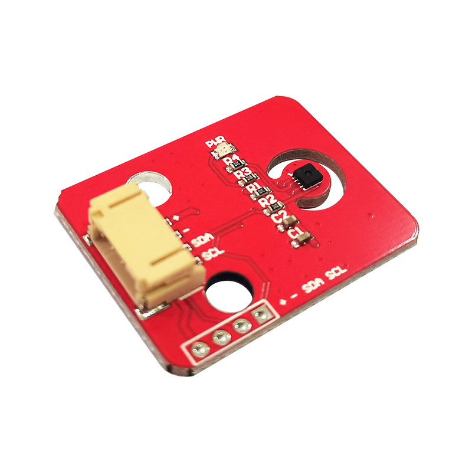
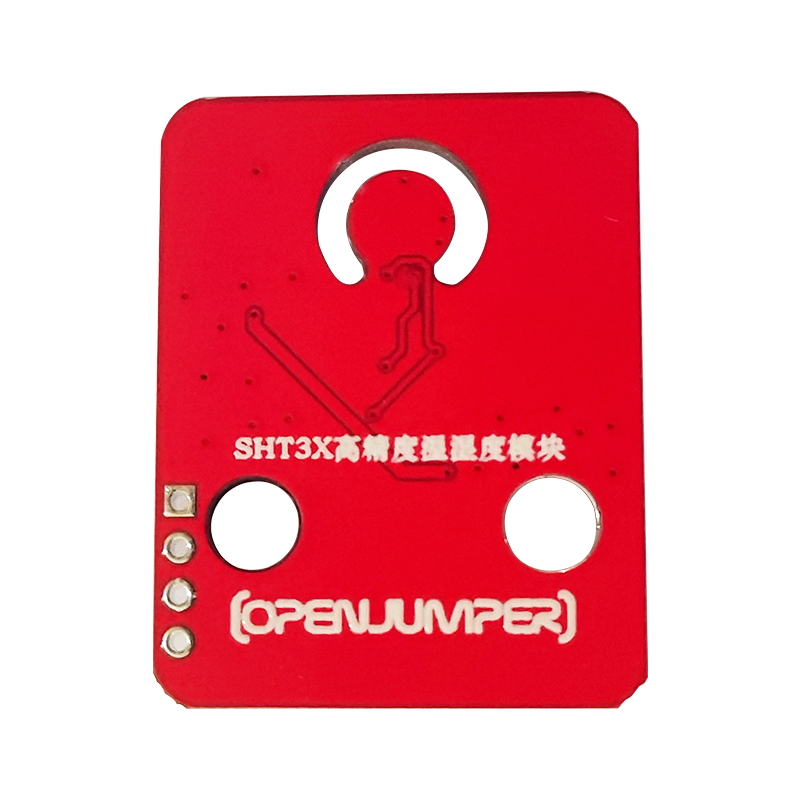

# OJ-SHT30温湿度传感器

## 产品简介

SHT3X系列的传感器包含性价比较高的SHT30、标准版本的SHT31和更高规格的SHT35，采用I2C的通讯方式。应用广泛，精度较高。

<table border="1">

<tr>
  <td align="center"></td>
  <td align="center"></td>
  <td align="center"></td>
</tr>
<tr>
  <td style="background-color:rgb(232,232,232,0.5) "colspan="3" align="center"> <a href="https://item.taobao.com/item.htm?id=674029188652"><font style="font-size:16px">OJ-SHT30温湿度传感器</font></a></td>
</tr>
</table>

## 产品参数

+ 温度测量范围：-40~125℃

+ 温度测量精度：±0.3℃

+ 湿度测量范围：0~100%RH

+ 湿度测量精度：±3%

+ 工作电压：2.4~5.5VDC

+ 通讯接口：I2C

+ 固定孔：乐高孔（间隔两个乐高单位）

+ 尺寸：26*34mm

## arduino示例程序

```C++
#include <Wire.h>
#include <Adafruit_SHT31.h>

Adafruit_SHT31 sht31 = Adafruit_SHT31();

void setup() {
Serial.begin(9600);

  Serial.println("SHT31 test");
  if (! sht31.begin(0x44)) { // Set to 0x45 for alternate i2c addr
    Serial.println("Couldn't find SHT31");
    while (1) delay(1);
  }
}

void loop() {
float t = sht31.readTemperature();
float h = sht31.readHumidity();

if (! isnan(t)) { // check if 'is not a number'
  Serial.print("Temp *C = "); 
  Serial.println(t);
}
else {
  Serial.println("Failed to read temperature");
}

if (! isnan(h)) { // check if 'is not a number'
  Serial.print("Hum. % = "); 
  Serial.println(h);
}
else {
  Serial.println("Failed to read humidity");
}
Serial.println();
delay(1000);
}
```

## 其他资料

+ [mixly程序下载](http://download.openjumper.cn/mixly/sht30.mix)

+ [示例程序](http://download.openjumper.cn/%E7%A4%BA%E4%BE%8B%E7%A8%8B%E5%BA%8F.rar)

+ [mixly图形化编程库](http://download.openjumper.cn/Openjumper.rar)

+ [SHT31库](http://download.openjumper.cn/Adafruit_SHT31-master.zip)