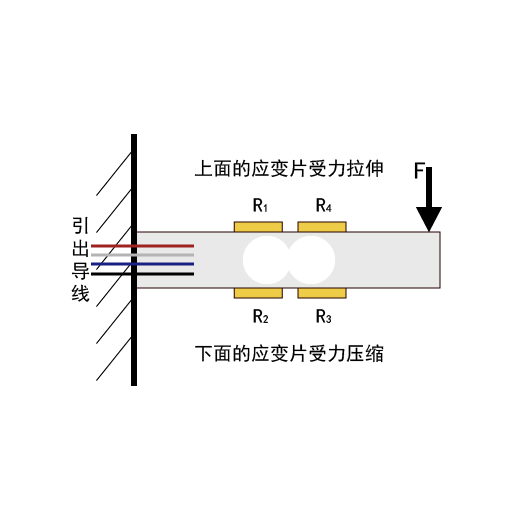
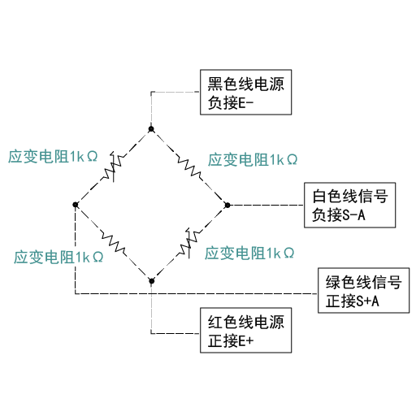
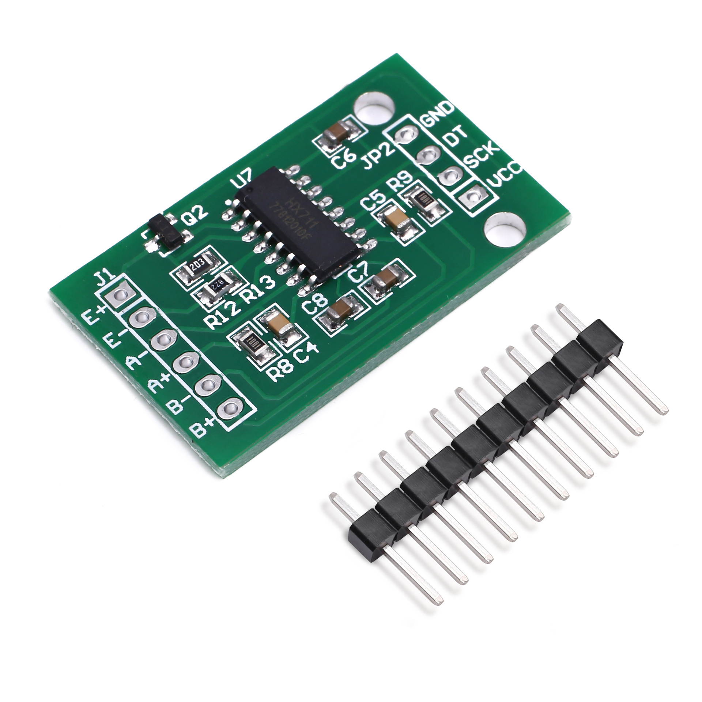
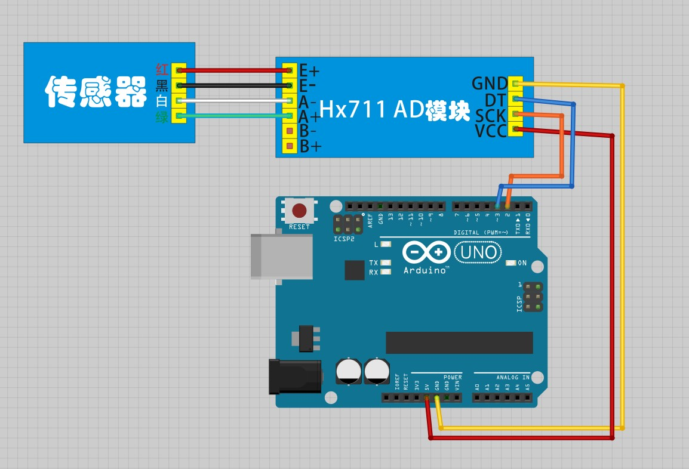

# HX711称重传感器

## 产品介绍

本模块采用24位高精度的A/D转换器芯片HX711，是一款专为高精度电子秤而设计的，具有两路模拟通道输入，内部集成128倍增益可编程放大器。输入电路可配置为提供桥压的电桥式(如压力、称重)传感器模式。


[点我购买](https://item.taobao.com/item.htm?id=679299066926)

### 压力传感器

上下表面各有一个应变片，每个应变片内有2个压力电阻。一共为4个压力电阻，组成的全桥式电路。全桥电路可以提高所测的精度。




### HX711AD模块

两个IO口， 分别对应SCK,DOUT。当DOUT=1, 说明ad转换器还没准备好输出数据。当DOUT=0,说明准备好了，然后就得对SCK输入脉冲，且输入一次脉冲，DOUT就输出一位数据（二进制，数据从最高位到最低位依次输出），24个脉冲后，再根据SCK的脉冲数对下次工作方式进行选择。



HX711AD模块有三种工作模式，A通道128增益、B通道32增益、A通道64增益。对应不同的增益，其满额度差分输入信号幅值也不同。


## 技术参数

|综合误差|0.02%F.S|绝缘电阻|≥5000MQ(100VDC)|
|:--|:--|:--|:--|
|灵敏度|1.0±0.1mv/v|激励电压|5VDC~ 12VDC|
|非线性|0.02%F.S|温度补偿范围|10°C~+40°C|
|滞后|0.02%F.S|使用温度范围|-20°C~+60°C|
|重要性|0.02%F.S|零点温度影响|0.03%F. S/10°C .|
|蠕变|0.02%F. S/10min|灵敏度温度影响|0.02%F. S/10°C|
|零点输出|±2%F.S|安全过载范围|120%|
|输入阻抗|405±10Ω|限过载范围|150%|
|输出阻抗|350±3Ω|防护等级|IP65|


+ 秤架尺寸：圆直径10cm

+ 亚克力厚度：3.5mm

+ 传感器尺寸：75 * 12.5 * 12.5mm

+ 传感器线长：18cm左右

+ 秤架上传感器接口为：XH2.54-4P插头

+ HX711模块尺寸：34mm*20mm

## 引脚说明

压力传感器和HX711AD模块接线

红————电源+（E+）

黑————电源-（E+）

绿————信号+（A+）

白————信号-（A-）

HX711AD模块与arduino主板接线

VCC————5V

SCK————D2

DT————D3

GND————GND



## 示例程序

5kg传感器+HX711ad模块 arduino编程

```C++
#include <HX711.h>
float Weight = 0;

void setup()
{
	Init_Hx711();				//初始化HX711模块连接的IO设置

	Serial.begin(9600);
	Serial.print("Welcome to use!\n");

	delay(3000);
	Get_Maopi();		//获取毛皮
}

void loop()
{
	Weight = Get_Weight();	//计算放在传感器上的重物重量
	Serial.print(float(Weight/1000),3);	//串口显示重量
	Serial.print(" kg\n");	//显示单位
	Serial.print("\n");		//显示单位
	delay(1000);				//延时1s

}
```


## 计算原理

+ **如何计算传感器供电电压**

HX711 可以在产生 VAVDD 和 AGND 电压，即模块上的 E+和 E-电压。

该电压通过 VAVDD=VBG(R1 +R2)/R2 计算。

VBG 为模块基准电压 1.25v

R1=20K,R2=8.2K

因此得出 VAVDD = 4.3V

（为了降低功耗，该电压只在采样时刻才有输出，因此用万用表读取的值可能低于4.3v，因为万用表测量的是有效值）

+ **如何计算 AD 输出最大值**

在 4.3V 的供电电压下 5Kg 的传感器最大输出电压是 4.3v*1mv/V = 4.3mV

经过 128 倍放大后，最大电压为 4.3mV*128 = 550.4mV

经过 AD 转换后输出的24bit数字值最大为：550.4mV*2^24/4.3V ≈ 2147483

+ **程序中数据如何转换**

程序中通过HX711_Buffer = HX711_Read(); 获取当前采样的 AD 值，最大 2147483 ，存放在 long 型变量 HX711_Buffer 中，因 long 型变量计算速率和存放空间占用资源太多，固除以100 ，缩放为 int 型，便于后续计算。

Weight_Shiwu = HX711_Buffer/100;

Weight_Shiwu 最大为 21474 。

+ **如何将AD值反向转换为重力值**

假设重力为 x Kg（x<5Kg）,测量出来的 AD 值为 y。

传感器输出，发送给 AD 模块的电压为 x Kg * 4.3mV / 5Kg = 0.86A mV

经过 128 倍增益后为 128 * 0.86A = 110.08A mV

转换为 24bit 数字信号为 110.08A mV * 2^24 / 4.3V = 429496.7296A

所以 y = 429496.7296A

因此得出 x = y / 429496.7296

所以得出程序中计算公式

**Weight_Shiwu = (unsigned long)((float)Weight_Shiwu/429.5);**

**特别注意：**

因为不同的传感器斜率特性曲线不是完全一样，因此，每一个传感器需要矫正这里的 429.5这个除数，才能达到精度很高。

修改以下部分代码用于校准

	#define GapValue 430

Gapvalue是一个中间量， 重物质量 = 传感器读取数值/Gapvalue

当发现测试出来的重量偏大时，增加该数值。

如果测试出来的重量偏小时，减小改数值。该值可以为小数，例如 429.5 等。

## 其他资料

[mixly程序下载](http://download.openjumper.cn/mixly/hx711.mix)

[库文件及原理图下载](https://pan.baidu.com/s/1CVqWdvX6Ax_72lh1CEfxfg?pwd=cwzu )   提取码cwzu
