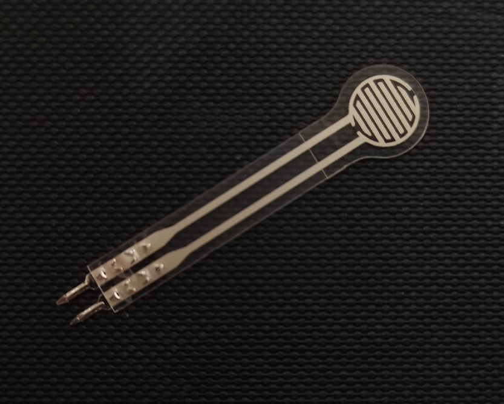

# 电阻式压力传感器

## 产品介绍

柔性压力传感技术在柔韧轻薄材料上印刷附着力强、耐弯折、灵敏度高的柔性纳米功能材料,使其实现对压力的高灵敏度检测。

柔性薄膜压力传感器是一种电阻式传感器,输出电阻随施加在传感器表面压力的增大而减小，通过特定的压力-电阻关系，可测量出压力大小。适用于柔性面的压力测量场景，可广泛应用于智能家居、消费电子、汽车电子、医疗设备、工业控制、智能机器人等领域。

[点我购买]()

## 产品特点

+ 超薄，厚度小于0.3mm

+ 响应速度快

+ 寿命长,通过100万次以上按压测试

+ 检测电路简单， 易于集成

+ 可定制传感器外形

+ 可定制传感器量程参数

## 规格参数

|标识|尺寸(mm)|
|--|--|
|长度|40.0|
|敏感区外径|10.0|
|敏感区内径|7.5|
|Pin脚距离|2.54|
|公差|0.2|

+ 工作电压：DC 3.3V- -5V

+ 量程：0-5KG

+ 厚度：<0.3mm

+ 响应点：<150g

+ 重复性：<±9.7%(60%负载)

+ 控制信号：模拟信号

+ 一致性：±10% (同一型号批次)

+ 迟滞：+10%（RF+-RF-）/RF+

+ 精度：±2.5%(85%量程区间) 

+ 耐久性：>100万次

+ 初始电阻：>100MQ(无负载)

+ 响应时间：<1ms

+ 恢复时间：<15ms

+ 工作温度：-20°C——60°C

## 注意事项

+ 传感器使用时尽量使所受负载均匀,避免尖锐物体直接接触传感器;

+ 超量程使用会降低传感器性能甚至破坏传感器;

+ 传感器端子为铜镀锡材质, 可根据需求自行焊接引线。需注意,焊接温度不宜太高，建议不超过
300°C，接触时间不超过1秒,以免高温使薄膜衬底融化变形。
