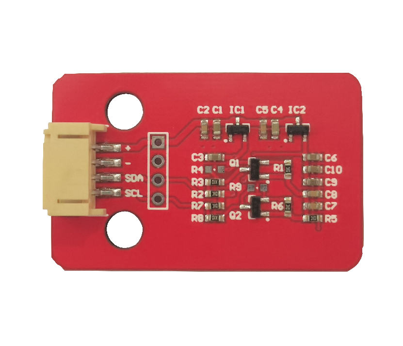
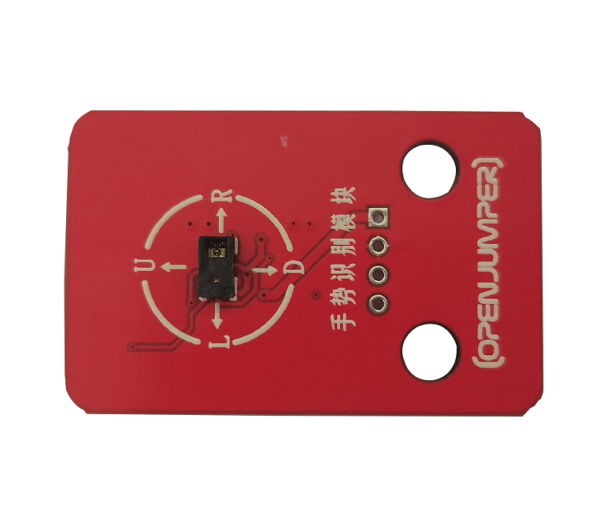
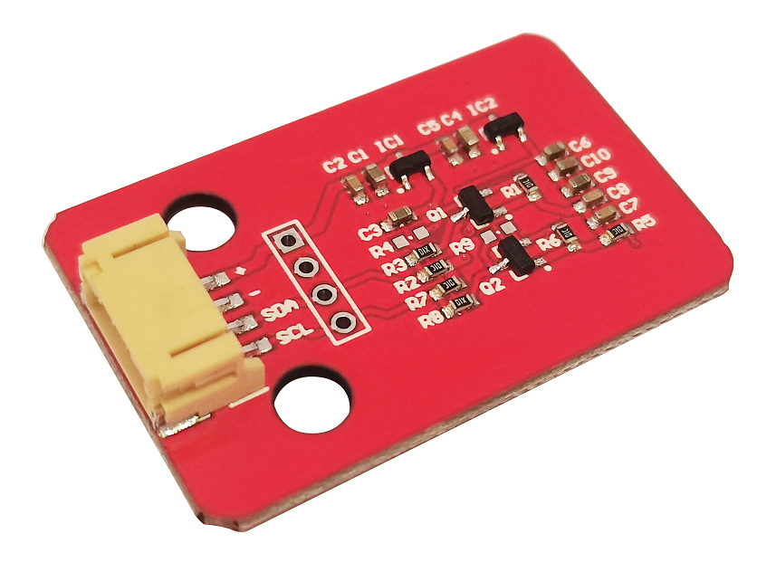

# 手势识别模块

## 产品介绍

手势识别模块具有尺寸小、功能多、反应块、抗干扰等优点。测量频率最高可达每秒240次。

<table border="1">

<tr>
  <td align="center"></td>
  <td align="center"></td>
  <td align="center"></td>
</tr>
<tr>
  <td style="background-color:rgb(232,232,232,0.5) "colspan="3" align="center"> <a href="https://item.taobao.com/item.htm?id=680255115335 "><font style="font-size:16px">手势识别模块</font></a></td>
</tr>
</table>

## 技术参数

+ 工作电压：5V

+ 工作电流：3~10mA

+ 工作温度：-40~85℃

+ 通讯方式：I2C（5V默认/3.3V）

+ 识别范围：5~15（cm）

+ 识别速率：240Hz（最高）

+ 模块尺寸：42.3*27.3（mm）

+ 识别动作：向上、 向 下、 向 左、 向 右、 向 前、 向 后、顺时针旋转、逆时针旋转和挥动（共9种）。

## 引脚说明

+ GND 接地引脚

+ VCC 输出5V

+ SDA 串行数据线

+ SCL 串行时钟线

## 示例程序

```C++
/*
 * Copyright (c) 2015 seeed technology inc.
 * Website    : www.seeed.cc
 * Author     : Wuruibin
 * Modified Time: June 2015
 * Description: This demo can recognize 9 gestures and output the result, including move up, move down, move left, move right,
 * 				move forward, move backward, circle-clockwise, circle-counter clockwise, and wave.
 * 
 * The MIT License (MIT)
 *
 * Permission is hereby granted, free of charge, to any person obtaining a copy
 * of this software and associated documentation files (the "Software"), to deal
 * in the Software without restriction, including without limitation the rights
 * to use, copy, modify, merge, publish, distribute, sublicense, and/or sell
 * copies of the Software, and to permit persons to whom the Software is
 * furnished to do so, subject to the following conditions:
 *
 * The above copyright notice and this permission notice shall be included in
 * all copies or substantial portions of the Software.
 *
 * THE SOFTWARE IS PROVIDED "AS IS", WITHOUT WARRANTY OF ANY KIND, EXPRESS OR
 * IMPLIED, INCLUDING BUT NOT LIMITED TO THE WARRANTIES OF MERCHANTABILITY,
 * FITNESS FOR A PARTICULAR PURPOSE AND NONINFRINGEMENT. IN NO EVENT SHALL THE
 * AUTHORS OR COPYRIGHT HOLDERS BE LIABLE FOR ANY CLAIM, DAMAGES OR OTHER
 * LIABILITY, WHETHER IN AN ACTION OF CONTRACT, TORT OR OTHERWISE, ARISING FROM,
 * OUT OF OR IN CONNECTION WITH THE SOFTWARE OR THE USE OR OTHER DEALINGS IN
 * THE SOFTWARE.
 */

#include <Wire.h>
#include <paj7620.h>

/* 
Notice: When you want to recognize the Forward/Backward gestures, your gestures' reaction time must less than GES_ENTRY_TIME(0.8s). 
        You also can adjust the reaction time according to the actual circumstance.
*/
#define GES_REACTION_TIME		500				// You can adjust the reaction time according to the actual circumstance.
#define GES_ENTRY_TIME			800				// When you want to recognize the Forward/Backward gestures, your gestures' reaction time must less than GES_ENTRY_TIME(0.8s). 
#define GES_QUIT_TIME			1000

void setup()
{
	uint8_t error = 0;

	Serial.begin(9600);
	Serial.println("\nPAJ7620U2 TEST DEMO: Recognize 9 gestures.");

	error = paj7620Init();			// initialize Paj7620 registers
	if (error) 
	{
		Serial.print("INIT ERROR,CODE:");
		Serial.println(error);
	}
	else
	{
		Serial.println("INIT OK");
	}
	Serial.println("Please input your gestures:\n");
}

void loop()
{
	uint8_t data = 0, data1 = 0, error;
	
	error = paj7620ReadReg(0x43, 1, &data);				// Read Bank_0_Reg_0x43/0x44 for gesture result.
	if (!error) 
	{
		switch (data) 									// When different gestures be detected, the variable 'data' will be set to different values by paj7620ReadReg(0x43, 1, &data).
		{
			case GES_RIGHT_FLAG:
				delay(GES_ENTRY_TIME);
				paj7620ReadReg(0x43, 1, &data);
				if(data == GES_FORWARD_FLAG) 
				{
					Serial.println("Forward");
					delay(GES_QUIT_TIME);
				}
				else if(data == GES_BACKWARD_FLAG) 
				{
					Serial.println("Backward");
					delay(GES_QUIT_TIME);
				}
				else
				{
					Serial.println("Right");
				}          
				break;
			case GES_LEFT_FLAG: 
				delay(GES_ENTRY_TIME);
				paj7620ReadReg(0x43, 1, &data);
				if(data == GES_FORWARD_FLAG) 
				{
					Serial.println("Forward");
					delay(GES_QUIT_TIME);
				}
				else if(data == GES_BACKWARD_FLAG) 
				{
					Serial.println("Backward");
					delay(GES_QUIT_TIME);
				}
				else
				{
					Serial.println("Left");
				}          
				break;
			case GES_UP_FLAG:
				delay(GES_ENTRY_TIME);
				paj7620ReadReg(0x43, 1, &data);
				if(data == GES_FORWARD_FLAG) 
				{
					Serial.println("Forward");
					delay(GES_QUIT_TIME);
				}
				else if(data == GES_BACKWARD_FLAG) 
				{
					Serial.println("Backward");
					delay(GES_QUIT_TIME);
				}
				else
				{
					Serial.println("Up");
				}          
				break;
			case GES_DOWN_FLAG:
				delay(GES_ENTRY_TIME);
				paj7620ReadReg(0x43, 1, &data);
				if(data == GES_FORWARD_FLAG) 
				{
					Serial.println("Forward");
					delay(GES_QUIT_TIME);
				}
				else if(data == GES_BACKWARD_FLAG) 
				{
					Serial.println("Backward");
					delay(GES_QUIT_TIME);
				}
				else
				{
					Serial.println("Down");
				}          
				break;
			case GES_FORWARD_FLAG:
				Serial.println("Forward");
				delay(GES_QUIT_TIME);
				break;
			case GES_BACKWARD_FLAG:		  
				Serial.println("Backward");
				delay(GES_QUIT_TIME);
				break;
			case GES_CLOCKWISE_FLAG:
				Serial.println("Clockwise");
				break;
			case GES_COUNT_CLOCKWISE_FLAG:
				Serial.println("anti-clockwise");
				break;  
			default:
				paj7620ReadReg(0x44, 1, &data1);
				if (data1 == GES_WAVE_FLAG) 
				{
					Serial.println("wave");
				}
				break;
		}
	}
	delay(100);
}
```

## 其他资料

[mixly程序下载](http://download.openjumper.cn/mixly/gesture.mix)

[库文件下载](http://download.openjumper.cn/paj7620_9gestures.rar)