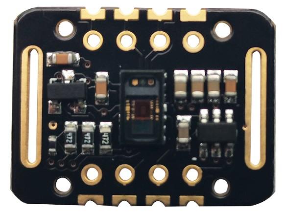
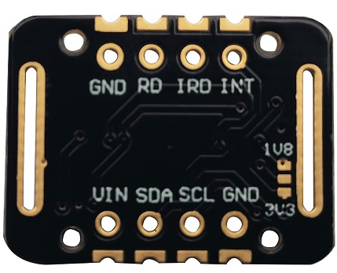
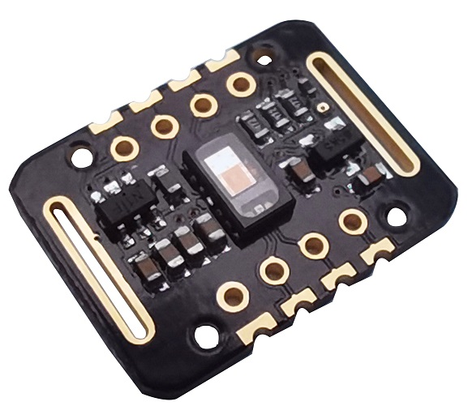
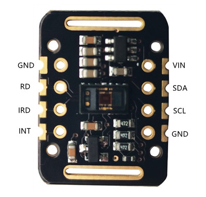
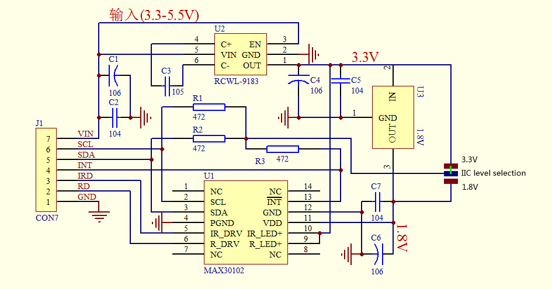

# MAX30102心率血氧传感器

## 产品介绍

MAX30102心率血氧传感器模块搭载了美信(maxim)的MAX30102心率血氧芯片和一颗集成心率血氧算法的微控制器，可以直接输出心率血氧数值。

MAX30102是一款集成脉搏血氧仪和心率监测模块。它包括内部LED、 光电探测器、光学元件和具有环境光抑制功能的低噪声电子设备。MAX30102 提供完整的系统解决方案，简化移动和可穿戴设备的设计过程。MAX30102采用1.8V单电源和用于内部LED的独立5.0V电源供电。通过标准的I2C兼容接口进行通信。此外，该芯片还可通过软件关断模块，待机电流接近为零，使电源始终保持供电状态。

<table border="1">

<tr>
  <td align="center"></td>
  <td align="center"></td>
  <td align="center"></td>
</tr>
<tr>
  <td style="background-color:rgb(232,232,232,0.5) "colspan="3" align="center"> <a href="https://item.taobao.com/item.htm?id=697764091267">MAX30102心率血氧传感器</a></td>
</tr>
</table>

## 工作原理

MAX30102采用PPG光电容积脉搏波描记法(PhotoPlethysmoGraphy)测量数据，微控制器对这些数据进行处理运算过后得到心率血氧数值，再通过I2C或UART接口输出，大大降低了传感器的使用难度和对主控的资源占用。同时该传感器还配备有对应的上位机，可通过电脑直接读取数据。

## 应用场景

+ 可穿戴设备

+ 健身辅助设备

## 芯片优点和特点

+ LED反射解决方案中的心率监测器和脉搏血氧计传感器

+ 微型5.6mm x 3.3mm x 1.55mm 14针光学模块

    + 集成盖玻片以实现最佳、稳健的性能

+ 移动设备的超低功耗运行

    + 用于节能的可编程采样率和LED电流

    + 低功耗心率监测器（< 1mW)

    + 超低关断电流(0.7μA, 典型值)

+ 快速数据输出能力

    + 高采样率

+ 鲁棒运动伪影弹性

    + 高信噪比

+ -40°C 至+85°C工作温度范围

## 产品参数

+ 产品名称：MAX30102心率血氧传感器

+ LED峰值波长：660nm/880nm

+ LED供电电压：3.3~5V

+ 检测信号类型:光反射信号(PPG)

+ 输出信号接口：I2C接口

+ 通信接口电压：1.8~5V(可选)

## 引脚说明

|名称|功能|
|:--:|:--|
|GND|模拟接地|
|SCL|I2C时钟输入|
|SDA|I2C数据，双向(漏极开路)|
|VIN|主电源电源输入端,1.8V-5V|
|GND|模拟接地|
|RD|红色LED驱动器|
|IRD|红外LED驱动器|
|INT|低电平有效中断(漏极开路)。使用上拉电阻连接到外部电压。|

## 详细说明

MAX30102是完整的脉搏血氧仪和心率传感器系统解决方案模块，专为满足可穿戴设备的严苛要求而设计。该器件在不牺牲光学或电气性能的情况下保持了非常小的解决方案尺寸。集成到可穿戴系统中需要最少的外部硬件组件。MAX30102可通过软件寄存器完全调节，数字输出数据可存储在IC内部32位深的FIF0中。FIFO 允许MAX30102 连接到共享总线上的微控制器或处理器，数据不会从MAX30102的寄存器中连续读取。

### LED驱动器

MAX30102集成了红色和红外LED 驱动器来调制用于Sp02和HR测量的LED脉冲。LED电流可在0至50mA的范围内进行编程，并提供适当的电源电压。LED脉冲宽度可在69μs 至411μs 范围内编程，以允许算法根据用例优化Sp02和HR精度以及功耗。

### 温度感应器
MAX30102具有片内温度传感器，用于校准Sp02子系统的温度依赖性。温度传感器的固有分辨率为0.06259C。设备输出数据对红外LED的波长相对不敏感，而红色LED的波长对于正确解释数据至关重要。与MAX30102输出信号-起使用的Sp02 算法可以补偿与环境温度变化相关的Sp02误差。

### LED驱动器

MAX30102集成了红色和红外LED驱动器来调制用于Sp02 和HR测量的LED脉冲。LED电流可在0至50mA的范围内进行编程，并提供适当的电源电压。LED脉冲宽度可在69μs 至411μs 范围内编程，以允许算法
根据用例优化Sp02和HR精度以及功耗。

### 接近功能

该设备包括接近功能，可在用户手指不在传感器.上时节省电量并减少可见光发射。当启动Sp02或HR功能时(通过写入MODE 寄存器)，红外LED在接近模式下激活，驱动电流由PILOT PA寄存器设置。当通过超过IR ADC计数阈值(在PROX_ INT. THRESH寄存器中设置)检测到对象时，该部件会自动转换到正常Sp02/HR 模式。要重新进入接近模式，必须重写MIODE 寄存器(即使值相同)。可以通过将PROX_INT_EN重置为0来禁用接近功能。在这种情况下，Sp02或HR模式会立即开始。

## 原理图参考

## 其他资料下载

+ [示例程序下载](http://download.openjumper.cn/MAX30102%E5%BF%83%E7%8E%87%E8%A1%80%E6%B0%A7%E4%BC%A0%E6%84%9F%E5%99%A8%E7%A4%BA%E4%BE%8B%E7%A8%8B%E5%BA%8F.zip)

+ [芯片数据手册下载](http://download.openjumper.cn/MAX30102%E8%8A%AF%E7%89%87%E6%95%B0%E6%8D%AE%E6%89%8B%E5%86%8C.zip)