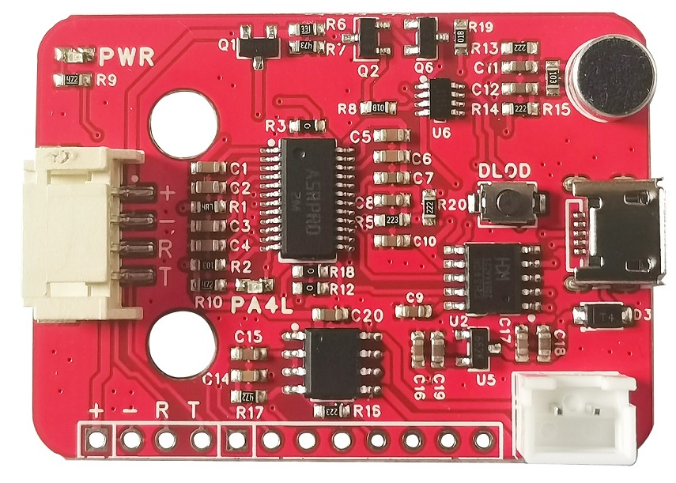
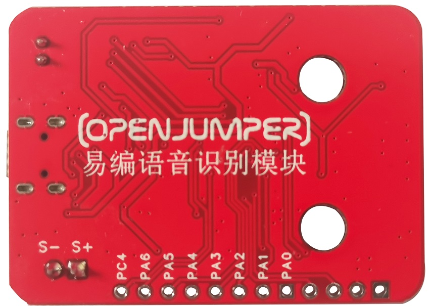
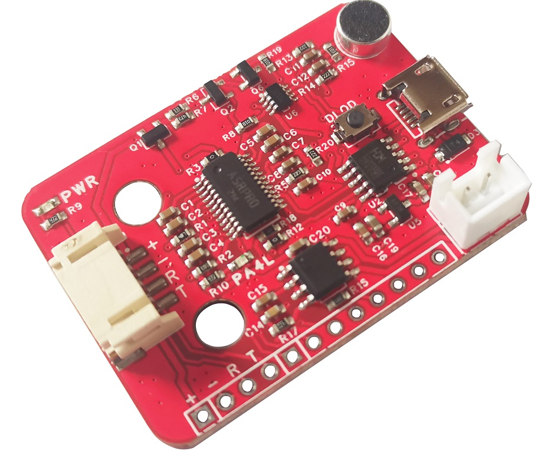
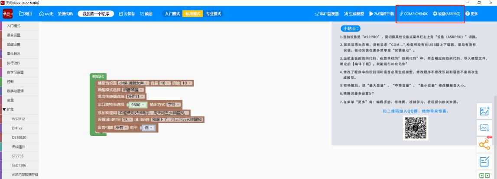
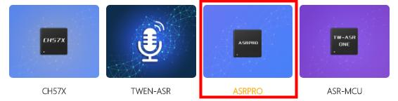
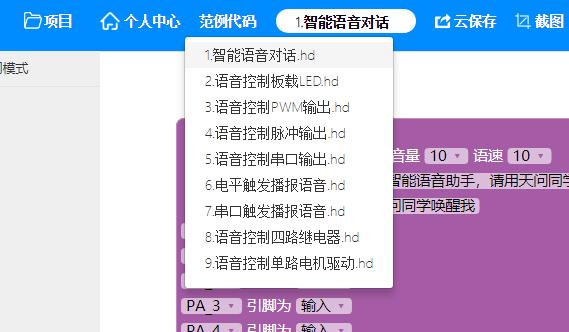
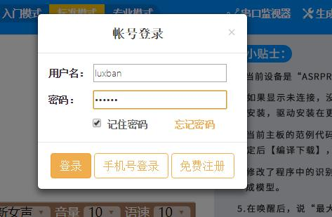
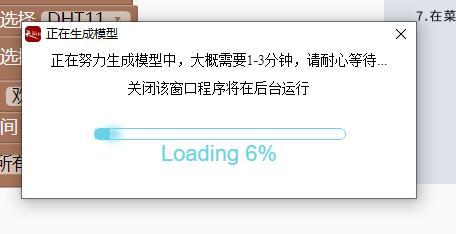
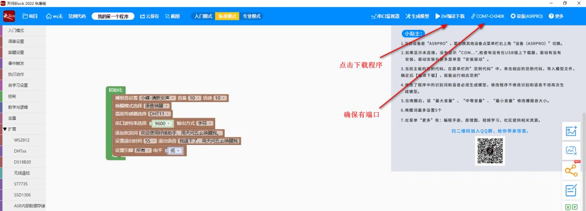
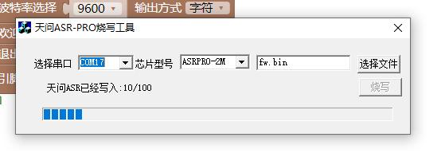

# 易编语音识别模块

<table border="1">

<tr>
  <td align="center"></td>
  <td align="center"></td>
  <td align="center"></td>
</tr>
<tr>
  <td style="background-color:rgb(232,232,232,0.5) "colspan="3" align="center"> <a href="https://item.taobao.com/item.htm?id=714414525887"><font style="font-size:16px">易编语音识别模块</font></a></td>
</tr>
</table>

## 产品特点


+ 内置脑神经网络处理器

+ 支持DNN\TDNNARNN等神经网络及卷积运算硬件运算，非软件运算

+ 支持语音识别、语音增强、语音检测、单麦克风降噪增强单麦克风回
声消除、360度全方位拾音等功能

## 模块基本参数

+ 电源电压：5V（大于 500mA）

+ 串口电平：3.3V

+ 工作温度：-40℃~85℃

+ 模块尺寸：45.2 \* 27（mm）

+ 固定孔：标准乐高孔

+ 固定孔中心间距：16mm（两个乐高单位）

+ 串口连接方式：PH2.0\*4P 或 XH2.54\*4P（两个同一个串口不同连接方式）

+ 喇叭接口：XH2.54\*2P

+ 驱动的喇叭参数：3.3W/4Ω或 5.4W/2Ω（推荐使用 4Ω3W 左右的喇叭）

+ PWR：电源指示灯

+ STE：板载指示灯

+ DLOD：手动下载按键（未自动下载时使用）

## 天问 Block 软件安装与使用

### 一、软件安装准备

软件安装包下载可以通过下文的“其他资料”中的下载链接下载

方式 1：找到“天问 Block 软件秋季版”中两个压缩包，将两个压缩包解压即可得到软件安
装包。首先安装“天问 Block 2022 秋季版.exe”，然后安装“天问 Block 2022 秋季版 范例代
码更新补丁.exe”。

方式 2：使用浏览器打开天问官方网站 <http://twen51.com/>，下载软件并安装；

从官网获取安装包解压后运行 exe 文件进行安装，根据提示默认安装，安装过程中会自
动安装驱动，点击允许即可。

第一次打开软件，会让你选择主板，请选择 ASRPRO。

使用 USB 数据线连接语音识别模块到电脑。


### 二、新建项目

1.双击打开天问 Block 软件，选择设备为“ASRPRO”。





2.选择开发模式


根据自己专业水平和喜好选择对应的开发模式。

3.选择范例代码




4.点击 2M 编译下载


它会自动下载，等待下载完成即可。

**注意：** 在上述第 3 步中，如果自己对图形内容进行了修改。则在点击 2M编译下载前，需要点击 生成模型（注意在此期间电脑需要能正常联网）。这是实现语音识别的关键一步。范例代码没有这步操作是因为其模型已经提前生成好了。


生成模型及编译时请先注册用户，注册后登录即可生成模型，每次修改识别词和语音都需要重新生成模型。





模型生成后点击“2M 编译下载”即可将程序下载到语音识别模块。





下载完成后开发板会播报欢迎词。点击范例或者更多栏目，可以查看各种应用案例、编程手册、视频资料等。

## 唤醒识别内容

|命令词|	编号	|输出值（十六进制）	|命令词	|编号	|输出值（十六进制）|	命令词|	编号	|输出值（十六进制）|	命令词	|编号	|输出值（十六进制）|
|--|--|--|--|--|--|--|--|--|--|--|--|
|语音管家（唤醒词）	|0 |0|二十七度|30|1E|	关门|60|3C|右转|90|5A|
|打开空调|1|1|二十八度|31|1F|打开热水器|61|3D|左前进|91|5B|
|关闭空调|2|2|打开风扇|32|20|关闭热水器|62|3E|右前进|92|5C|
|上下摆风|3|3	|关闭风扇|33|21|黄光|63|3F|左后退|93|5D|
|左右摆风|4|4|风扇摇头|34|22|红光|64|40|右后退|94|5E|
|制冷模式|5|5|停止摇头|35|23|蓝光|65|41|抬起云台|95|5F|
|加热模式|6|6|自然风|36|24|绿光|66 |42|放下云台|96|60|
|调高温度|7|7|睡眠风|37|25|彩光|67|43|抬高一点|97|61|
|调低温度|8|8|正常风|3 |26|白光|68|44|放低一点|98|62|
|半小时后关闭	|9|9|打开客厅灯|39|27|暖光|69|45|夹取物体|99 |63|
|一小时后关闭|10|A|关闭客厅灯|40|28|亮一点|70|46|放下物体|100|	64|
|两小时后关闭	|11|B|打开卧室灯|41|29|	暗一点|71|47|夹紧一点	|101|65|
|三小时后关闭|12|C|关闭卧室灯|42|2A|启动小车|72|48|放松一点|102|66|
|十度|13|D|打开厨房灯|43|2B|关闭小车|73 |49|打开窗帘|103|67||十一度|14|E|关闭厨房灯|44|2C|视觉模式|74|4A|关闭窗帘	|104 |68|
|十二度|15|F|打开台灯|45 |2D|巡线模式	|75|4B|打开一点|105|69|
|十三度|16|10|关闭台灯|46|2E|跟随模式|76 |4C|关闭一点|106|6A|
|十四度|17|11|打开灭蚊器|47|2F|避障模式|77|4D|观影模式|107|6B|
|十五度|18|12|关闭灭蚊器|48|30|网络模式|78|4E|普通模式|108|6C|
|十六度|19|13|打开加湿器|49|31|红外模式|79|4F|娱乐模式|109|6D|
|十七度|20|14|关闭加湿器|50|32|无线模式|80|50|工作模式|110|6E|
|十八度|21|15|打开净化器|51|33|蓝牙模式|81|51|我上班啦|111|6F|
|十九度|22|16|关闭净化器|52|34|手柄模式|82|52|我回来啦|112|70|
|二十度|23|17|打开氛围灯|53|35|快一点|83|53|早上好|113|71|
|二十一度|24|18|关闭氛围灯|54|36|慢一点|84|54|晚安|114|72|
|二十二度|25|19|打开电视|55|37|打开小车灯|85|55|打开晾衣架|115|73|
|二十三度|26|1A|关闭电视|56|38|关闭小车灯|86 |56	|收起晾衣架|116 |	74|
|二十四度|27|1B|打开插座|57|39|	前进|87|57|打开投影仪|117|75|
|二十五度|28|1C|关闭插座|58|3A|	后退|88|58|关闭投影仪|118|6|
|二十六度|29|1D|开门|59|3B|左转|89|59|		


|模型名|	模型ID|	命令词|	命令词ID|	命令词语义ID	|置信度	|唤醒词	|组合词	|期望词|	不期望词|	特殊词计数|播报音类型|播报音0ID|
|--|--|--|--|--|--|--|--|--|--|--|--|--|
|DNN ID|	0	|语音管家|	501	|0x00	|35	|YES|	NO|	NO	|NO	|0|	自定义|	501		|
|ASR ID|	1|	\<welcome>|	10001	|0x00	|0|	NO|	NO	|NO	|NO|	0|	自定义|	10001	|	
|||\<inactivate>	|10002|	0x00|	0	|NO	|NO	|NO	|NO	|0|	自定义|	10002		|
|||\<beep>|	10003	|0x00	|0|	NO|	NO	|NO	|NO	|0|	自定义	|10003		|

## 模块测试程序说明

1、易编语音识别模块需要烧录固件，但默认带出厂固件。只有当默认固件无法满足您的使用要求时才需要进行修改；

2、将测试程序下载到 Arduino UNO 开发板中；

3、将易编语音识别模块连接到 Arduino UNO 开发板串口，，指示灯连接到 Arduino UNO 开发板 13 号引脚，点击 Arduino UNO 开发板的复位按键。此时易编语音识别模块会播报“我是您的语音管家，我会按照您的指令服务哦”。这是易编语音识别模块的语音播报功能。即向模块发送指令码，播放对应的声音。注意：这里的指令码和其对应的声音都是写在固件中的。同样，若无法满足您的使用要求时需要进行修改。

4、对易编语音识别模块说“打开空调”时，它会以语音回复“空调开”；对易编语音识别模块说“关闭空调”时，它会以语音回复“空调关”等。

同时，模块会通过串口向 Arduino UNO 开发板返回识别码；Arduino UNO 开发板通过接收并分析接收到的识别码，即可知道易编语音识别模块识别到的语音指令。即当识别到“打开空调”时，指示灯会打开，以此类推。

**识别测试程序**

```C++
/* company:OpenJumper
 * time:2022/11/23
 * K2L
*/

#define D3 13
#define D4 4

void setup() {

Serial.begin(115200);//调试输出信息

pinMode(D3,OUTPUT);
pinMode(D4,OUTPUT);
delay(5000);
Serial.write(0x01);
delay(1000);

}

void loop() {
    if(Serial.available() > 0){
      byte SerialNowData = 0;
      SerialNowData = Serial.read();
      delay(10);
      if(SerialNowData == 0x01)//识别到打开空调
          digitalWrite(D3,HIGH);
      else if(SerialNowData == 0x02)//识别到关闭空调
          digitalWrite(D3,LOW);
      else if(SerialNowData == 0x7C)//识别到打开投影仪
          digitalWrite(D4,HIGH);
      else if(SerialNowData == 0x7D)//识别到关闭投影仪
          digitalWrite(D4,LOW);    
   }
}
```

## 其他资料

+ [天问 Block 软件和模块默认固件下载](http://download.openjumper.cn/speech-recognition-module.zip)