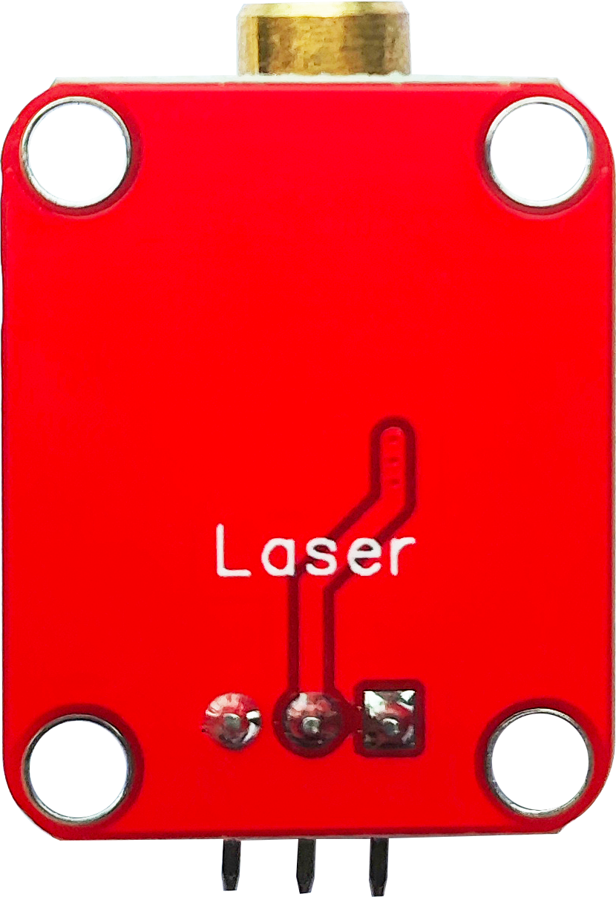
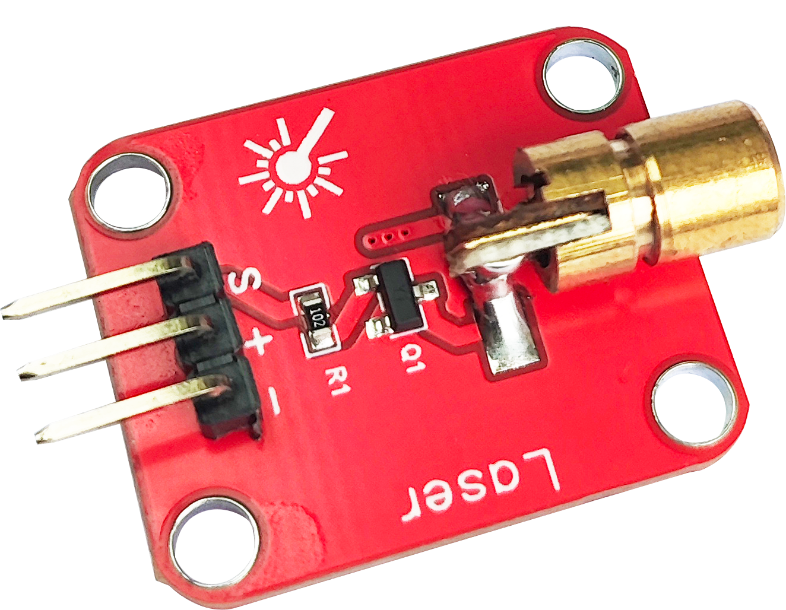
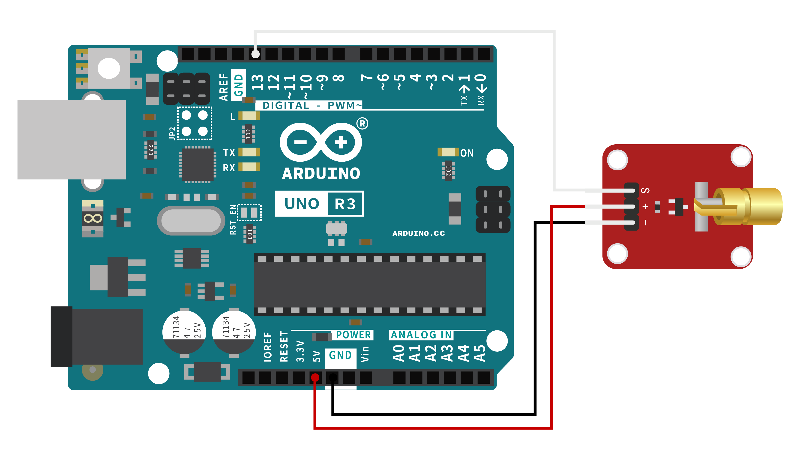

# 激光发射模块


<table border="1">

<tr>
  <td align="center"></td>
  <td align="center"></td>
  <td align="center"></td>
</tr>
<tr>
  <td style="background-color:rgb(232,232,232,0.5) "colspan="3" align="center"> <a href="https://item.taobao.com/item.htm?id=859571500861"><font style="font-size:16px">激光发射模块</font></a></td>
</tr>
</table>


## 概述：

激光模块是一种常见的激光发射器模块，常常用于 pico、Arduino 等开发板上。


## 产品参数：

------

-   尺寸：20*25mm

-   固定孔：15mm

-   工作电压：5V

-   光源波长：650nm

-   排针距离：2.54mm


## 端口说明：

-   S:数字信号输入
-   +：VCC
-   – :  GND

## Arduino示例：

-   接线示意图

 

```c
/*
********
Function：通过数字引脚13输出信号
********
*/
void setup()
{
	pinMode(13, OUTPUT); //定义13脚为数字输出接口
}
void loop() {
	digitalWrite(13, HIGH);//打开激光头
	delay(1000);//延时一秒
	digitalWrite(13, LOW);//关闭激光头
	delay(1000);//延时一秒
}
```


