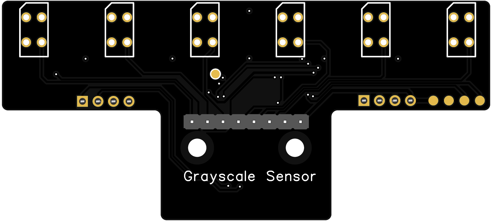
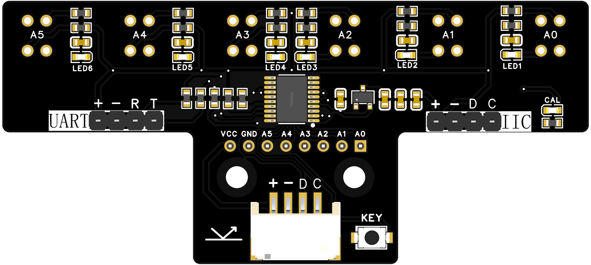
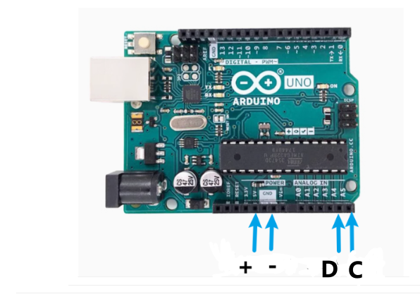
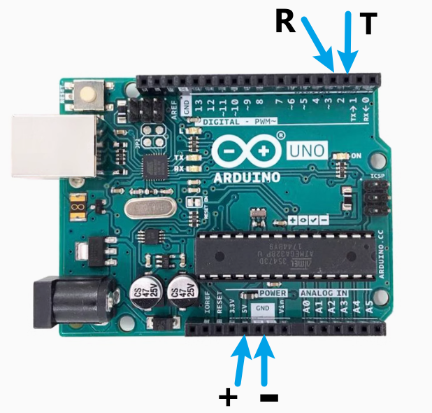

# 六路巡线传感器


<table border="1">

<tr>
  <td align="center"></td>
  <td align="center"></td>
  <td align="center"></td>
</tr>
<tr>
  <td style="background-color:rgb(232,232,232,0.5) "colspan="3" align="center"> <a href="https://item.taobao.com/item.htm?id=859571500861"><font style="font-size:16px">六路巡线传感器</font></a></td>
</tr>
</table>

## 概述：

------

红外巡线传感器模块的原理是利用红外对管检测自己发出的红外线对反射光（深色反射弱，浅色反射强）。寻线传感器可以帮助你的机器人进行白线或者黑线的跟踪，可以检测白底中的黑线，也可以检测黑底中的白线，检测到黑线返回低电平。是光电寻线机器人的必备传感器。


## 产品参数：

------

-   尺寸：80*34mm
-   固定孔: 15mm
-   通信方式：标准IIC通信协议与串口通信
-   从机地址：0x02
-   串口通信波特率：9600
-   数据格式 ：0(白线)、1(黑线)
-   数据顺序：A5 A4 A3 A2 A4 A1 A0(从左至右)
-   接口引脚间距：2.54mm
-   工作电压: 3.3-5V
-   模块安装高度：8mm-12mm

## 端口说明：

------

- +:   VCC（支持3.3V-5V）
- –：GND
- D: I2C 串行数据 (SDA)
- C: I2C 串行时钟 (SCL)
- R:串行接收数据
- T:串行发送数据

## 注意事项：

------

- [x] +与–不可接反，无保护电路，严重可损坏模块
- [x] 巡线校准：1.将传感器放置在黑线上（对应指示灯全亮）2.长按按键，LED闪烁 3.LED常亮，松开按键，校准完成
- [x] 使用IIC与UART时，需保证模块与控制器同时上电

## Arduino I2C接线示例：

##  

## Arduino I2C程序

```c
/*
************
Function：主机iic接收从机数据六路传感器程序进行处理  master_receive
iic： 默认iic引脚  A4(SDA)  A5(SCL)
************
*/
#include <Wire.h>  
char receive_Buff[7]; // 数据接收区  
uint8_t flag = 0;  

void setup() {  
    receive_Buff[6] = '\0'; // 确保最后一个字节为0  
    delay(2000);  
    Wire.begin();  
    Serial.begin(9600);  
    Serial.print("uart1 is normal\r\n");  // 调试串口1  
}  

void loop() {  
    Wire.requestFrom(2, 6); // 请求从机发送6个字节  
    delay(20);
    if (Wire.available()) { // 检查是否有可用字节  
        char *p = receive_Buff; // 重置指针  
        while (Wire.available() > 0 && p < &receive_Buff[6]) { // 读取可用字节同时检查指针是否超出范围  
            *p = Wire.read(); // 读取一个字节到缓冲区  
            p++;   
        }  
        // 确保缓冲区最后一个字节为'\0'  
        if (p == &receive_Buff[6]) {  
            *p = '\0'; // 确保最后一个字节为结束符  
            Serial.print(receive_Buff);   
            Serial.println(); // 打印收到的数据  
        }  
    }  
    delay(100); // 控制循环频率  
}  


```


## Arduino UART接线示例：

 

## Arduino UART程序

```C
/*
************
Function：主机UART接收从机数据六路传感器程序进行处理  master_receive
UART： RX:2  TX:3
************
*/
#include <SoftwareSerial.h>  
const int numBytes = 6;   // 预期接收的数据字节数  
char receivedData[numBytes]; // 用于存储接收的数据  
SoftwareSerial mySerial(2, 3); // RX, TX  

void setup() {  
  Serial.begin(9600); // 设置串口监视器  
  mySerial.begin(9600); // 设置软件串口  
}  

void loop() {  
  // 检查是否有足够的数据可用  
  if (mySerial.available() >= numBytes) {  
    // 读取数据并存储到数组中  
    for (int i = 0; i < numBytes; i++) {  
      receivedData[i] = mySerial.read(); // 读取每个字节  
    }  
    // 打印接收到的数据  
    Serial.print("接收到的数据: ");  
    for (int i = 0; i < numBytes; i++) {  
      Serial.print(receivedData[i]); 
      Serial.print(" "); // 输出空格分隔  
    }  
    Serial.println(); // 换行  
  } else {  
    Serial.println("正在等待数据...");  
  }  

  delay(100); // 非阻塞延迟，防止过载  
}  

```


