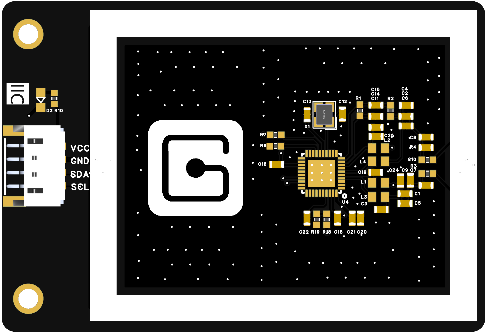
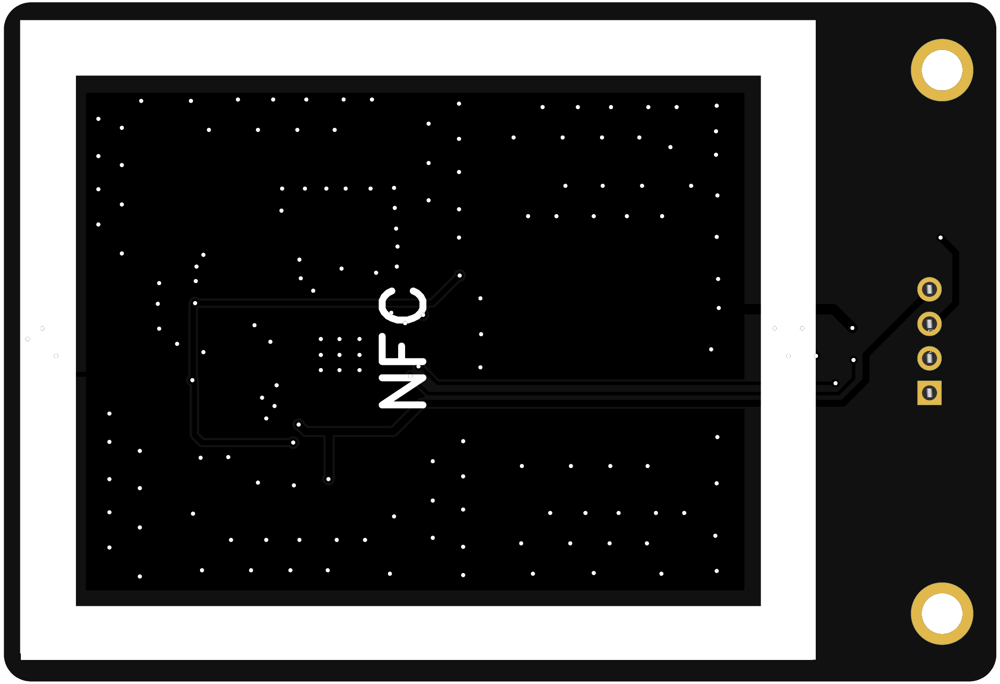
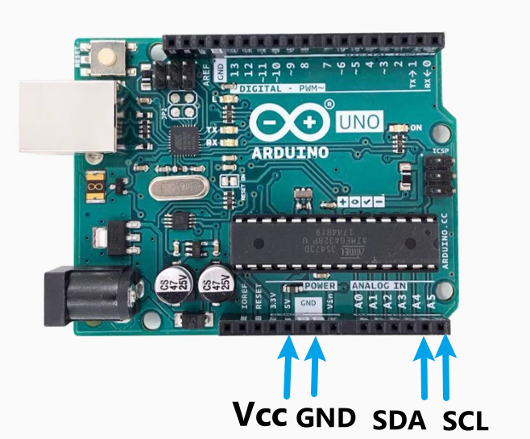

# NFC模块


<table border="1">

<tr>
  <td align="center"></td>
  <td align="center"></td>
  <td align="center"></td>
</tr>
<tr>
  <td style="background-color:rgb(232,232,232,0.5) "colspan="3" align="center"> <a href="https://item.taobao.com/item.htm?id=859571500861"><font style="font-size:16px">NFC模块</font></a></td>
</tr>
</table>

## 产品参数：

------

- 主芯片：NXP PN532
- 供电电压：3.3V ~ 5.5V
- 通信接口：I2C(PH2.0与2.54，逻辑电平0-3.3V)
- 串口波特率：115200 bps
- I2C地址：0x48
- 通信频率：13.56MHz
- 最大通信距离：不低于10mm，实际视标签大小而定
- 读写器模式：支持ISO/IEC 14443A、ISO/IEC 14443B、MIFARE协议、FeliCa协议
- 卡仿真模式：支持ISO 14443A、MIFARE Classic 1K或4K、FeliCa协议
- 点对点通信：ISO/IEC18092，ECM340
- 尺寸：73×50 mm
- 固定孔：40mm

## 端口说明：

------

- VCC:VCC

- GND:GND
- SDA:IIC数据引脚
- SCL:IIC时钟引脚

## Arduino示例:

------



```c
/** include library */
#include "nfc.h"

/** define a nfc class */
NFC_Module nfc;

void setup(void)
{
  Serial.begin(9600);
  nfc.begin();
  Serial.println("MF1S50 Reader Demo From Elechouse!");
  
  uint32_t versiondata = nfc.get_version();
  if (! versiondata) {
    Serial.print("Didn't find PN53x board");
    while (1); // halt
  }
  
  // Got ok data, print it out!
  Serial.print("Found chip PN5"); Serial.println((versiondata>>24) & 0xFF, HEX); 
  Serial.print("Firmware ver. "); Serial.print((versiondata>>16) & 0xFF, DEC); 
  Serial.print('.'); Serial.println((versiondata>>8) & 0xFF, DEC);
  
  /** Set normal mode, and disable SAM */
  nfc.SAMConfiguration();
}

void loop(void)
{
  u8 buf[32],sta;
  
  
  /** Polling the mifar card, buf[0] is the length of the UID */
  sta = nfc.InListPassiveTarget(buf);
  
  /** check state and UID length */
  if(sta && buf[0] == 4){
    /** the card may be Mifare Classic card, try to read the block */  
    Serial.print("UUID length:");
    Serial.print(buf[0], DEC);
    Serial.println();
    Serial.print("UUID:");
    nfc.puthex(buf+1, buf[0]);
    Serial.println();
    /** factory default KeyA: 0xFF 0xFF 0xFF 0xFF 0xFF 0xFF */
    u8 key[6] = {0xFF, 0xFF, 0xFF, 0xFF, 0xFF, 0xFF};
    u8 blocknum = 4;
    /** Authentication blok 4 */
    sta = nfc.MifareAuthentication(0, blocknum, buf+1, buf[0], key);
    if(sta){
      /** save read block data */
      u8 block[16];
      Serial.println("Authentication success.");
      
      // uncomment following lines for writing data to blok 4
/*      
      strcpy((char*)block, "Elechoues - NFC");
      sta = nfc.MifareWriteBlock(blocknum, block);
      if(sta){
        Serial.println("Write block successfully:");
      }
*/  

      /** read block 4 */
      sta = nfc.MifareReadBlock(blocknum, block);
      if(sta){
        Serial.println("Read block successfully:");
        
        nfc.puthex(block, 16);
        Serial.println();
      }
      
      /** read block 5 */
      sta = nfc.MifareReadBlock(blocknum+1, block);
      if(sta){
        Serial.println("Read block successfully:");
        
        nfc.puthex(block, 16);
        Serial.println();
      }
      
      /** read block 6 */
      sta = nfc.MifareReadBlock(blocknum+2, block);
      if(sta){
        Serial.println("Read block successfully:");
        
        nfc.puthex(block, 16);
        Serial.println();
      }
      
      /** read block 7 */
      sta = nfc.MifareReadBlock(blocknum+3, block);
      if(sta){
        Serial.println("Read block successfully:");
        
        nfc.puthex(block, 16);
        Serial.println();
      }
    }  
  }
}

```

资料链接：.......