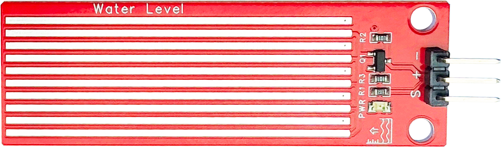
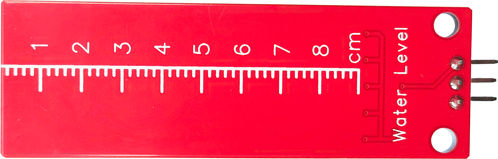
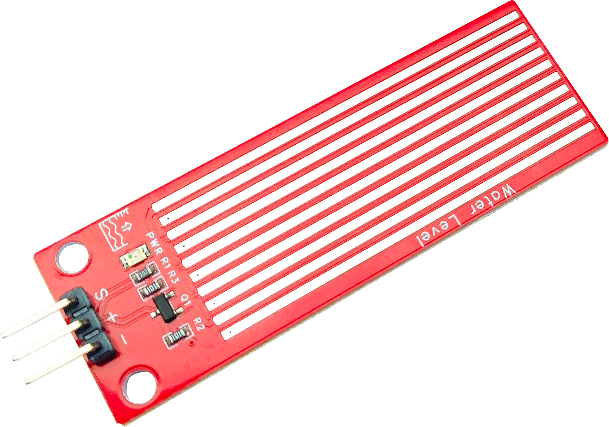
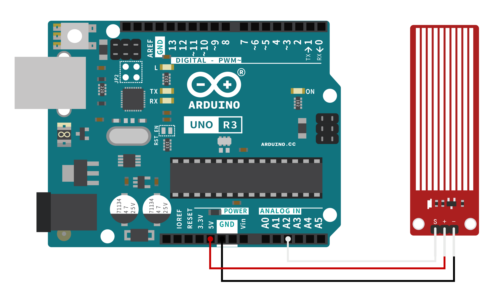

# 水位模块

<table border="1">

<tr>
  <td align="center"></td>
  <td align="center"></td>
  <td align="center"></td>
</tr>
<tr>
  <td style="background-color:rgb(232,232,232,0.5) "colspan="3" align="center"> <a href="https://item.taobao.com/item.htm?id=859571500861"><font style="font-size:16px">六路巡线传感器</font></a></td>
</tr>
</table>


## 概述：

------

水位传感器是一款简单易用、性价比较高的水位/水滴识别检测传感器，其是通过具有一系列的暴露的平行导线线圈测量其水滴/水量大小从而判断水位。上电成功电源指示灯会亮起，完成水量到模拟信号的转换输出的模拟值可以直接被单片机读取，达到水位报警的功效。


## 产品参数：

------

-   尺寸：59.76*20mm
-   固定孔: 15mm
-   排针接口：2.54mm
-   工作电压: 3~5V

## 端口说明：

------

-    S:   模拟输出

-   +：VCC
-   –：GND

## Arduino示例：

- 接线示意图

## 


------

```c
/*
********
Function：通过引脚A2读模拟信号并通过串口打印
********
*/
void setup() {
  Serial.begin(9600);
}
void loop() {
  int Value = analogRead(A2);
  Serial.println(Value);
  delay(100);
}
```


## 使用注意事项：


水质：要确保水中含有足够的导电性，以确保传感器正常工作。

电源：请确认模块所需电压匹配，以避免损坏模块。

环境：对于强腐蚀性液体，请选择合适材料的传感器。


