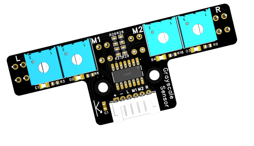

# 4路数字循迹模块

<table border="1" align="center">

<tr>
  <td align="center"></td>
  <td align="center"></td>
  <td align="center"></td>
</tr>
<tr>
  <td style="background-color:rgb(232,232,232,0.5) "colspan="3" align="center"> <a href="https://item.taobao.com/item.htm?id=667746818635"><font style="font-size:16px"> 四路数字循迹</font></a> </td>
</tr>
</table>


## 概述：

------

这款4路数字巡线传感器专为智能小车巡线应用设计，采用PH2.0-6P接口，提供高灵敏度的巡线检测能力。每个传感器通道均配备可调节电位器，用户可以根据实际需求调整灵敏度，以确保最佳的巡线效果。


## 产品参数：


- 工作电压：3.3V~5V
- 传感器路数：4路
- 传感器类型：数字传感器
- 输出电平：TTL电平(黑线为低电平、白线为高电平)
- 检测黑线高度：3-15mm（推荐8mm左右）
- 板子尺寸：69*27mm
- 固定孔间距：16mm （孔大小3.1mm）

## 端口说明：


- 接口类型: PH2.0-6P
- 引脚顺序：
- +: 电源正极
- -: 电源负极
- L: 传感器1输出
- M1: 传感器2输出
- M2: 传感器3输出
- R: 传感器4输出

## 使用说明：

- 1、连接电源: 将传感器模块的电源引脚（+和-）连接到相应的电源供应。
- 2、调整灵敏度:将传感器置于黑色巡线轨道上方，探头最底面距离地面推荐8mm距离。
- 3、使用小一字螺丝刀调整每个传感器通道的电位器，直到传感器指示灯刚好从灭到亮的状态。
- 4、编程信号读取:通过4个引脚读取每个传感器的输出信号。输出信号为数字信号，表示传感器是否检测到黑线。


## Arduino示例：

-    接线示意图

##   

------

```c
void setup(){
  Serial.begin(9600);
  pinMode(4, INPUT);
  pinMode(5, INPUT);
  pinMode(6, INPUT);
  pinMode(7, INPUT);
}

void loop(){
  Serial.print(digitalRead(4));
  Serial.print("-");
  Serial.print(digitalRead(5));
  Serial.print("-");
  Serial.print(digitalRead(6));
  Serial.print("-");
  Serial.println(digitalRead(7));

}
```

## mixly示例程序

##   


## mind+示例程序

##   


## 应用场景

- 智能小车巡线: 通过调整传感器的灵敏度，确保小车能够沿着预设的黑线轨道行驶。
- 自动化导航系统: 用于需要精确路径跟踪的自动化设备。

## 注意事项 

- 确保传感器与黑线之间的距离适中，以避免误检测。
- 调整电位器时，请轻轻旋转，以防止损坏。
- 使用过程中，避免传感器受到强光直射，以免影响检测效果。