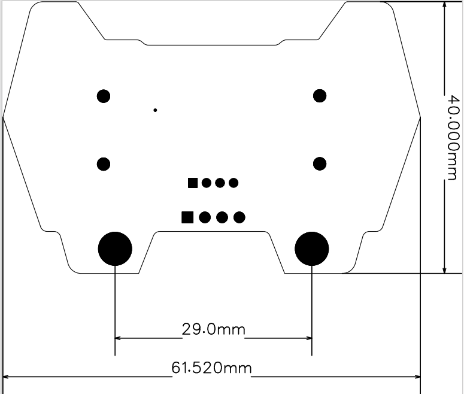
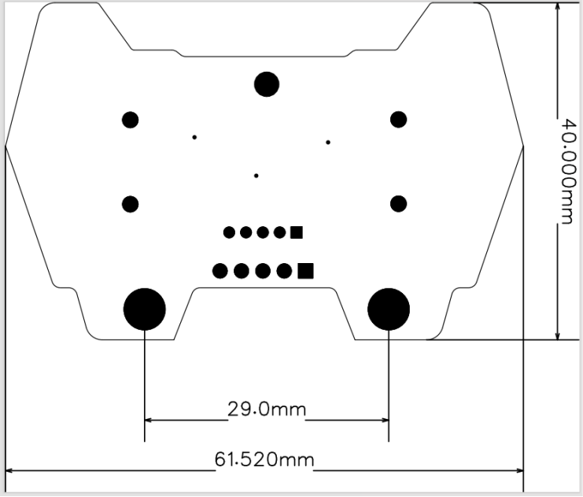
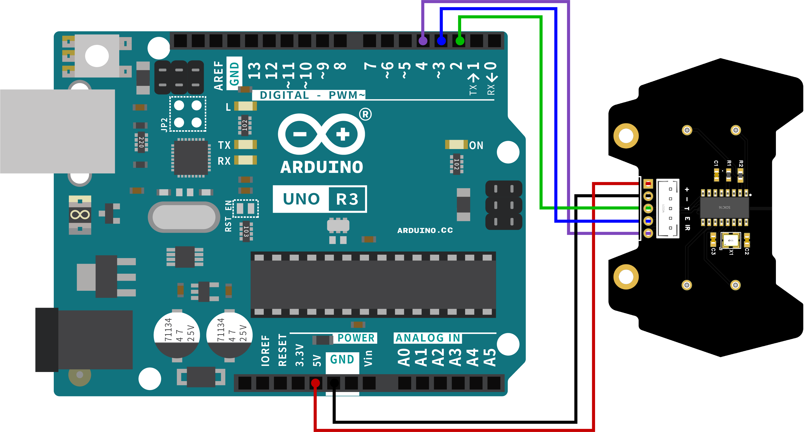
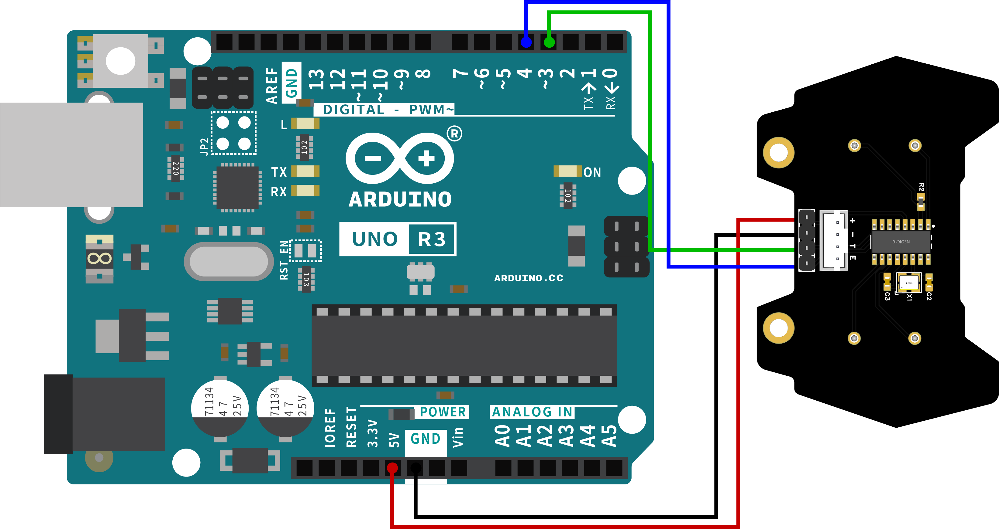
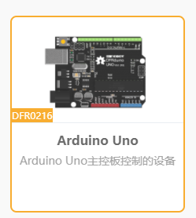
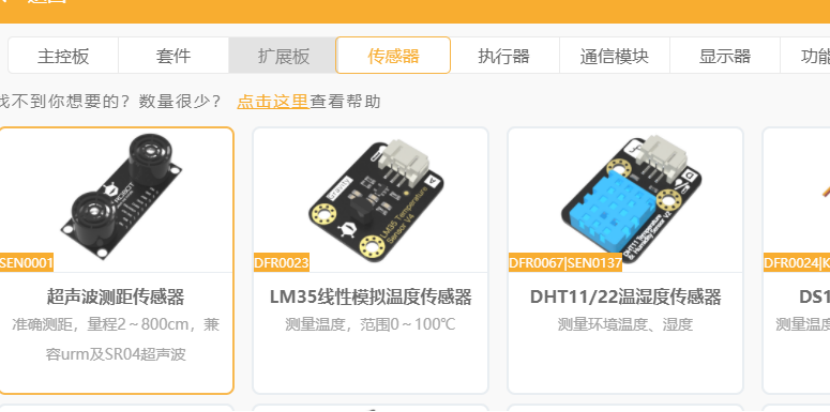
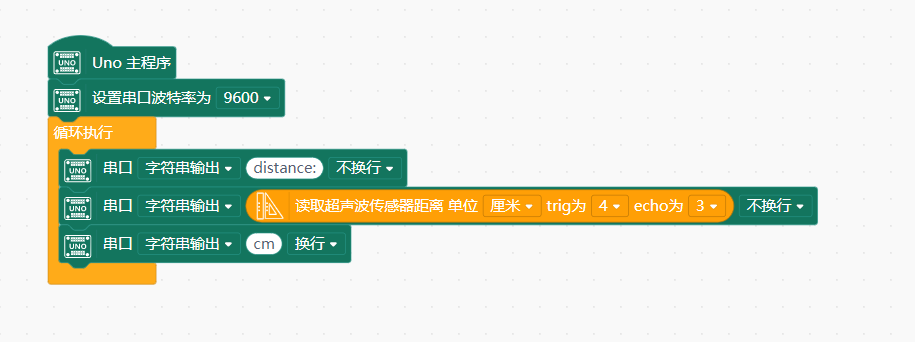
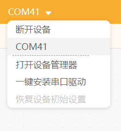
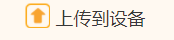

# 猫耳超声波模块

<table border="1" align="center">

<tr>
  <td align="center"></td>
  <td align="center"></td>
</tr>
<tr>
  <td style="background-color:rgb(232,232,232,0.5) "colspan="3" align="center"> <a href="https://item.taobao.com/item.htm?id=667746818635"><font style="font-size:16px"> 四路数字循迹</font></a> </td>
</tr>
</table>

## 简介
oj猫耳超声波模块是一款基于CS100芯片的高性能超声波模块，适用于Arduino平台，支持Mixly等图形化编程软件，使得编程更加直观和便捷。该超声波模块具有使用简单、易于控制的特点，适用于各种测距项目。

## 基本参数

1.电源电压：3V-5.V

2.驱动：CS100

3.接口：PH2.0-4P/PH2.0-5P（适用于Arduino的接口）

4.模块尺寸：61.5mmx40mm


## 模块尺寸图






## 硬件接线

供电：将点阵屏板子的+和-连接到Arduino主板的5V和GND。

数据线：将T和E引脚分别连接到Arduino的3和4端口。





## 使用教程

### arduino示例程序

1、打开例程下载后，接线测试
```c
float checkdistance() {
  digitalWrite(4, LOW);
  delayMicroseconds(2);
  digitalWrite(4, HIGH);
  delayMicroseconds(10);
  digitalWrite(4, LOW);
  float distance = pulseIn(3, HIGH) / 58.00;
  delay(10);
  return distance;
}

void setup(){
  Serial.begin(9600);
  pinMode(4, OUTPUT);
  pinMode(3, INPUT);
}

void loop(){
  Serial.println(checkdistance());

}
```
### mind+示例

1、使用mind+安装模块用户库

点击左下角扩展图标


主控板选择Arduino UNO



点击传感器，选择超声波测距传感器




这样就可以在左边图形块看到了。


2、上传例程接线测试



点击设备连接



最后点击上传到设备即可



## 注意事项

请勿超出额定电压范围，以免损坏设备。

使用时注意防水防尘，保持电路板清洁。

确保正确连接T(trig)和E(echo)引脚以避免通讯故障。


## 常见问题解答
问：连接后无数据或数据跳变太大？

答：检查电源线及数据线连接是否正确；确认Mnd+配置的Arduino型号是否正确。

