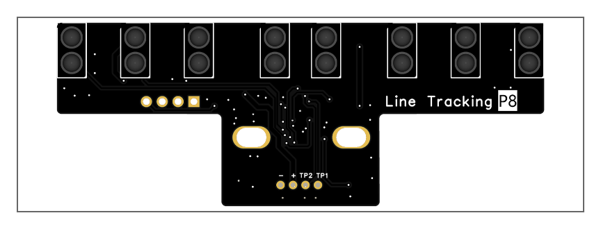
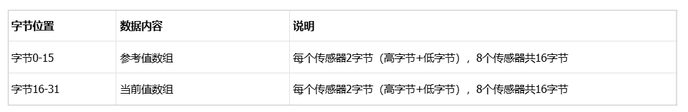
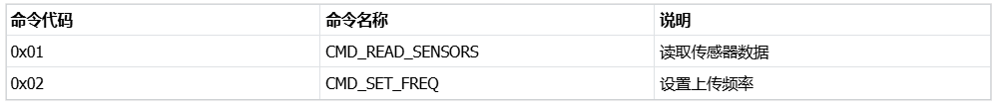
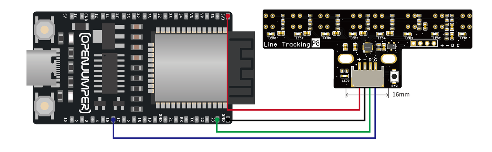
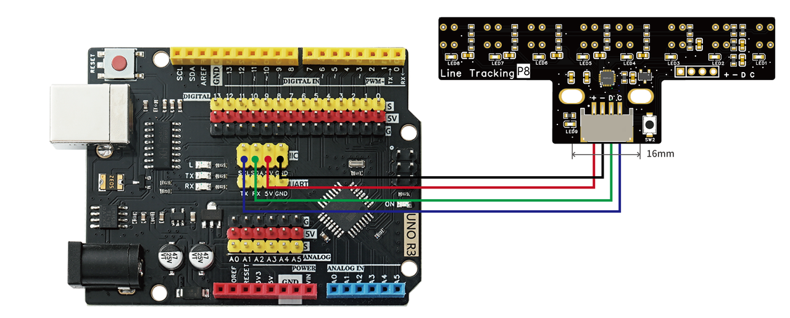
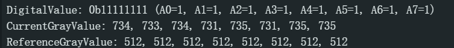

# 八路巡线传感器




## 概述

红外巡线传感器模块的原理是利用红外对管检测自己发出的红外线对反射光（深色反射弱，浅色反射强）。寻线传感器可以帮助你的机器人进行白线或者黑线的跟踪，可以检测白底中的黑线，也可以检测黑底中的白线，检测到黑线返回低电平。是光电寻线机器人的必备传感器。

## 产品参数

- **尺寸**：78.2*29.5mm  
- **固定孔**：16mm  
- **通信方式**：标准IIC通信协议(100KHZ)  
- **ADC分辨率**：10位(0-1023)  
- **响应频率**：默认100ms(可配置，最快可达10ms左右)  
- **从机地址**：0x27  
- **数据格式**：33字节（1字节数字+16字节参考值+16字节当前值）  
- **数据顺序**：A0 A1 A2 A3 A4 A5 A6 A7（从左至右）  
- **接口引脚间距**：2.54mm  
- **工作电压**：3.3-5V  
- **模块安装高度**：8mm-12mm  

## 端口说明

- **+**：VCC电源（支持3.3V-5V）  
- **-**：GND接地  
- **D**：I2C串行数据（SDA，MCU内部引脚P25）  
- **C**：I2C串行时钟（SCL，MCU内部引脚P36）  

## 功能特性

### 1. 硬件特性

- **8路传感器**：P01(A0)、P02(A1)、P24(A2)、P26(A3)、P32(A4)、P33(A5)、P34(A6)、P35(A7)  
- **状态指示灯**：P23引脚控制LED，常亮表示系统正常工作  
- **校准按键**：P03引脚，支持现场快速校准  
- **高速采样**：定时器中断触发批量ADC采样，采样周期8ms  
- **智能算法**：基于参考值的动态阈值判断  

### 2. 数据格式

#### 2.1 传感器数据包（32字节）



**点击图片可查看完整电子表格**

#### 2.2 数据示例
参考值: [512, 512, 512, 512, 512, 512, 512, 512] (A0-A7)
当前值: [234, 678, 543, 210, 589, 445, 712, 301] (A0-A7)

text

### 3. I2C命令协议

#### 3.1 命令类型




#### 3.2 读取传感器数据（0x01）

**请求格式**：
主机 -> 从机: [0x01]

text

**响应格式**（33字节）：
从机 -> 主机:

[参考值0高位][参考值0低位]...[参考值7高位][参考值7低位]  
[当前值0高位][当前值0低位]...[当前值7高位][当前值7低位]  

text

**注意**：为提升特定场合效率模块仅传输原始模拟数据，数字状态值由主机端计算。

#### 3.3 设置上传频率（0x02）

**请求格式**：
主机 -> 从机: [0x02][频率高位][频率低位]

text

频率单位：毫秒  
频率=0：禁用自动上传  
频率>0：启用自动上传，按设定间隔上传数据  

**示例**：
设置500ms上传间隔: [0x02][0x01][0xF4] // 0x01F4 = 500

text

## 使用说明

### 1. 硬件连接

1. 将模块的VCC和GND连接到控制器的电源（3.3V或5V）  
2. 将模块的D（SDA）连接到控制器的I2C数据线（SDA）  
3. 将模块的C（SCL）连接到控制器的I2C时钟线（SCL）  
4. 确保模块和控制器共地  

### 2. 传感器校准

**自动校准流程**：
1. 将传感器模块放置在目标巡线表面上（黑线或白线上）  
2. 长按校准按键（P03引脚）  
3. LED指示灯闪烁5次，表示正在校准  
4. LED恢复常亮，松开按键，校准完成  

**校准原理**：
- 校准时将当前8个传感器的模拟读数作为新的参考值  
- 后续数字状态判断由主机计算：当前值 >= 参考值 → bit=1（黑线）  
- 否则：当前值 < 参考值 → bit=0（白线）  

### 3. 数据读取

#### 3.1 ESP32示例

**ESP32 I2C接线示例**：
- \+ ---> 3.3/5V  
- \- ---> GND  
- D ---> GPIO23  
- C ---> GPIO16  



**ESP32 I2C程序**：

```cpp
#include <Wire.h>

/***************************************************************
 * ESP32控制指令说明：
 * 1. noupload - 禁用自动接收数据模式
 ***************************************************************/
// I2C设备地址
#define SENSOR_DRIVER_ADDR 0x27

// 命令类型定义
#define CMD_READ_SENSORS 0x01 // 读取传感器数据命令
#define CMD_SET_FREQ 0x02 // 设置上传频率命令

// 自动上传频率设置（毫秒）
#define UPLOAD_INTERVAL 100 // 默认100ms，根据需要修改此值

// 自动上传状态
bool autoUploadEnabled = true; // 默认启用自动上传
unsigned long lastI2CCheckTime = 0;
bool waitingForData = false; // 是否已发送请求并等待数据

// 传感器数据结构
struct SensorData {
  uint8_t digital; // 数字状态（8位二进制值，由ESP32根据参考值和当前值计算）
  uint16_t reference[8]; // 参考值（每个传感器的阈值，0-1023）
  uint16_t current[8]; // 当前值（当前的传感器读数，0-1023）
};

// 串口命令缓冲区
String inputString = "";
bool stringComplete = false;

// 提前声明函数，避免编译错误
void processSensorData(SensorData &data);
void checkAutoUploadData();

void setup() {
  // 初始化串口
  Serial.begin(115200);
  while (!Serial); // 等待串口就绪

  Serial.println("\n初始化ESP32 I2C循迹传感器读取系统...");

  // 初始化I2C, 指定SDA为GPIO4，SCL为GPIO5
  Wire.begin(23,16);
  Serial.println("I2C总线初始化完成 (SDA:GPIO4, SCL:GPIO5)");

  // 设置传感器模块的上传频率
  setModuleFrequency();
  Serial.print("上传频率设置为 ");
  Serial.print(UPLOAD_INTERVAL);
  Serial.println(" 毫秒");
  Serial.println("系统就绪！");

  // 初始化串口输入
  inputString.reserve(64);
}

void loop() {
  // 处理串口命令
  if (stringComplete) {
    processCommand(inputString);

    // 清空命令缓冲区
    inputString = "";
    stringComplete = false;
  }

  // 检查I2C总线是否有自动上传的数据
  unsigned long currentTime = millis();
  if (autoUploadEnabled && (currentTime - lastI2CCheckTime >= UPLOAD_INTERVAL)) {
    lastI2CCheckTime = currentTime;
    checkAutoUploadData();
  }

  // 最小延时，便于快速响应
  delay(100);
}

// 串口事件处理
void serialEvent() {
  while (Serial.available()) {
    char inChar = (char)Serial.read();

    // 如果收到换行符，则完成命令输入
    if (inChar == '\n') {
      stringComplete = true;
    } else {
      // 将收到的字符添加到命令字符串
      inputString += inChar;
    }
  }
}

// 计算数字状态值（根据参考值和当前值）
uint8_t calculateDigitalValue(SensorData &data) {
  uint8_t digital = 0;
  for (int i = 0; i < 8; i++) {
    // 如果当前值 >= 参考值，设置对应位为1（黑线）
    if (data.current[i] >= data.reference[i]) {
      digital |= (1 << i);
    }
  }
  return digital;
}

// 处理接收到的传感器数据
void processSensorData(SensorData &data) {
  // 计算数字状态值
  data.digital = calculateDigitalValue(data);

  // 打印数字状态
  Serial.print("DigitalValue: 0b");
  for (int i = 7; i >= 0; i--) {
    Serial.print((data.digital >> i) & 1);
  }
  Serial.print(" (");
  for (int i = 0; i < 8; i++) {
    Serial.print("A");
    Serial.print(i);
    Serial.print("=");
    Serial.print((data.digital >> i) & 1);
    if (i < 7) Serial.print(", ");
  }
  Serial.println(")");

  // 打印当前值
  Serial.print("CurrentGrayValue: ");
  for (int i = 0; i < 8; i++) {
    Serial.print(data.current[i]);
    if (i < 7) Serial.print(", ");
  }
  Serial.println();

  // 打印参考值
  Serial.print("ReferenceGrayValue: ");
  for (int i = 0; i < 8; i++) {
    Serial.print(data.reference[i]);
    if (i < 7) Serial.print(", ");
  }
  Serial.println();

  Serial.println();
}

// 检查并接收自动上传的数据
void checkAutoUploadData() {
  SensorData sensorData;

  // 单周期完成数据读取过程

  // 第一步：发送请求
  Wire.beginTransmission(SENSOR_DRIVER_ADDR);
  Wire.write(CMD_READ_SENSORS); // 发送读取传感器命令
  byte error = Wire.endTransmission();

  if (error != 0) {
    Serial.print("请求数据失败, 错误码: ");
    Serial.println(error);
    return; // 如果出错，退出
  }

  // 第二步：等待从机准备好数据
  delay(2);

  // 第三步：读取数据（32字节：16字节参考值 + 16字节当前值）
  int bytesReceived = Wire.requestFrom(SENSOR_DRIVER_ADDR, 32);

  if (bytesReceived == 32) {
    // 读取参考值（每个传感器占用2个字节）
    for (int i = 0; i < 8; i++) {
      uint8_t highByte = Wire.read();
      uint8_t lowByte = Wire.read();
      sensorData.reference[i] = (highByte << 8) | lowByte; // 组合高低字节为10位数值
    }

    // 读取当前值（每个传感器占用2个字节）
    for (int i = 0; i < 8; i++) {
      uint8_t highByte = Wire.read();
      uint8_t lowByte = Wire.read();
      sensorData.current[i] = (highByte << 8) | lowByte; // 组合高低字节为10位数值
    }

    // 处理接收到的传感器数据（内部会计算数字值）
    processSensorData(sensorData);
  } else if (bytesReceived > 0) {
    Serial.print("接收数据不完整，实际接收: ");
    Serial.print(bytesReceived);
    Serial.println("/32 字节");

    // 清空缓冲区
    while (Wire.available()) Wire.read();
  } else {
    Serial.println("未接收到数据");
  }
}

// 发送频率设置到传感器模块
void setModuleFrequency() {
  Wire.beginTransmission(SENSOR_DRIVER_ADDR);
  Wire.write(CMD_SET_FREQ); // 发送设置频率命令
  Wire.write((uint8_t)(UPLOAD_INTERVAL >> 8)); // 高字节
  Wire.write((uint8_t)(UPLOAD_INTERVAL & 0xFF)); // 低字节
  byte error = Wire.endTransmission();

  if (error != 0) {
    Serial.print("设置上传频率失败，错误码: ");
    Serial.println(error);
  } else {
    Serial.print("上传频率设置成功，间隔: ");
    Serial.print(UPLOAD_INTERVAL);
    Serial.println(" ms");
  }
}

// 处理串口命令
void processCommand(String command) {
  command.trim(); // 移除首尾空格

  // 禁用自动上传
  if (command == "noupload") {
    autoUploadEnabled = false;
    Serial.println("已禁用自动接收数据模式");
    return;
  } else if (command == "upload") {
    // 重新启用自动上传
    autoUploadEnabled = true;
    Serial.println("已启用自动接收数据模式");
    return;
  }

  // 未识别的命令
  Serial.println("未识别的命令，只支持'noupload'和'upload'");
}
```
3.2 Arduino UNO示例

Arduino UNO I2C接线示例：

﹢ ---> 3.3/5V

﹣ ---> GND

D ---> SCL/A4

C ---> SCL/A5



Arduino UNO I2C程序：

```cpp
#include <Wire.h>

/*******************************************************************
 * Arduino Uno I2C循迹传感器读取程序
 *
 * 硬件连接：
 * - SDA: A4 (Arduino Uno默认)
 * - SCL: A5 (Arduino Uno默认)
 * - VCC: 5V
 * - GND: GND
 *
 * 串口命令：
 * - noupload - 禁用自动接收数据模式
 * - upload - 启用自动接收数据模式
 *******************************************************************/

// I2C设备地址
#define SENSOR_DRIVER_ADDR 0x27

// 命令类型定义
#define CMD_READ_SENSORS 0x01 // 读取传感器数据命令
#define CMD_SET_FREQ 0x02 // 设置上传频率命令

// 自动上传频率设置（毫秒）
#define UPLOAD_INTERVAL 100 // 默认100ms，可根据需要修改

// 自动上传状态
bool autoUploadEnabled = true; // 默认启用自动上传
unsigned long lastI2CCheckTime = 0;

// 传感器数据结构
struct SensorData {
  uint8_t digital; // 数字状态（8位二进制值，由Arduino根据参考值和当前值计算）
  uint16_t reference[8]; // 参考值（每个传感器的阈值，0-1023）
  uint16_t current[8]; // 当前值（当前的传感器读数，0-1023）
};

// 串口命令缓冲区
String inputString = "";
bool stringComplete = false;

// 提前声明函数
void processSensorData(SensorData &data);
void checkAutoUploadData();
void setModuleFrequency();
void processCommand(String command);
uint8_t calculateDigitalValue(SensorData &data);

void setup() {
  // 初始化串口
  Serial.begin(115200);

  // 等待串口准备就绪
  delay(1000);

  Serial.println(F("\n========================================"));
  Serial.println(F("Arduino Uno I2C循迹传感器读取系统"));
  Serial.println(F("========================================"));

  // 初始化I2C (Arduino Uno: SDA=A4, SCL=A5)
  Wire.begin();
  Wire.setClock(100000); // 设置I2C时钟频率为100kHz
  Serial.println(F("I2C总线初始化完成"));
  Serial.println(F(" SDA: A4"));
  Serial.println(F(" SCL: A5"));
  Serial.println(F(" 频率: 100kHz"));

  // 设置传感器模块的上传频率
  setModuleFrequency();
  Serial.print(F("上传频率设置为 "));
  Serial.print(UPLOAD_INTERVAL);
  Serial.println(F(" 毫秒"));

  Serial.println(F("\n系统就绪！"));
  Serial.println(F("串口命令:"));
  Serial.println(F(" noupload - 禁用自动接收"));
  Serial.println(F(" upload - 启用自动接收"));
  Serial.println(F("========================================\n"));

  // 预留串口缓冲区
  inputString.reserve(64);
}

void loop() {
  // 处理串口命令
  if (stringComplete) {
    processCommand(inputString);

    // 清空命令缓冲区
    inputString = "";
    stringComplete = false;
  }

  // 检查I2C总线是否有自动上传的数据
  unsigned long currentTime = millis();
  if (autoUploadEnabled && (currentTime - lastI2CCheckTime >= UPLOAD_INTERVAL)) {
    lastI2CCheckTime = currentTime;
    checkAutoUploadData();
  }

  // 最小延时，便于快速响应
  delay(10);
}

// 串口事件处理
void serialEvent() {
  while (Serial.available()) {
    char inChar = (char)Serial.read();

    // 如果收到换行符，则完成命令输入
    if (inChar == '\n' || inChar == '\r') {
      if (inputString.length() > 0) {
        stringComplete = true;
      }
    } else {
      // 将收到的字符添加到命令字符串
      inputString += inChar;
    }
  }
}

// 计算数字状态值（根据参考值和当前值）
uint8_t calculateDigitalValue(SensorData &data) {
  uint8_t digital = 0;
  for (int i = 0; i < 8; i++) {
    // 如果当前值 >= 参考值，设置对应位为1（黑线）
    if (data.current[i] >= data.reference[i]) {
      digital |= (1 << i);
    }
  }
  return digital;
}

// 处理接收到的传感器数据
void processSensorData(SensorData &data) {
  // 计算数字状态值
  data.digital = calculateDigitalValue(data);

  // 打印数字状态 (二进制表示)
  Serial.print(F("DigitalValue: 0b"));
  for (int i = 7; i >= 0; i--) {
    Serial.print((data.digital >> i) & 1);
  }
  Serial.print(F(" ("));

  // 打印每个传感器的数字状态
  for (int i = 0; i < 8; i++) {
    Serial.print(F("A"));
    Serial.print(i);
    Serial.print(F("="));
    Serial.print((data.digital >> i) & 1);
    if (i < 7) Serial.print(F(", "));
  }
  Serial.println(F(")"));

  // 打印当前值 (A0-A7顺序)
  Serial.print(F("CurrentGrayValue: "));
  for (int i = 0; i < 8; i++) {
    Serial.print(data.current[i]);
    if (i < 7) Serial.print(F(", "));
  }
  Serial.println();

  // 打印参考值 (A0-A7顺序)
  Serial.print(F("ReferenceGrayValue: "));
  for (int i = 0; i < 8; i++) {
    Serial.print(data.reference[i]);
    if (i < 7) Serial.print(F(", "));
  }
  Serial.println();

  Serial.println();
}

// 检查并接收自动上传的数据
void checkAutoUploadData() {
  SensorData sensorData;

  // 第一步：发送读取传感器命令
  Wire.beginTransmission(SENSOR_DRIVER_ADDR);
  Wire.write(CMD_READ_SENSORS);
  byte error = Wire.endTransmission();

  if (error != 0) {
    Serial.print(F("请求数据失败, 错误码: "));
    Serial.println(error);
    if (error == 2) {
      Serial.println(F(" -> 从机地址无响应，请检查连接"));
    } else if (error == 3) {
      Serial.println(F(" -> 数据传输NACK错误"));
    }
    return;
  }

  // 第二步：等待从机准备好数据
  delay(2);

  // 第三步：读取数据（32字节：16字节参考值 + 16字节当前值）
  int bytesReceived = Wire.requestFrom(SENSOR_DRIVER_ADDR, 32);

  if (bytesReceived == 32) {
    // 读取参考值（每个传感器占用2个字节，大端序）
    for (int i = 0; i < 8; i++) {
      uint8_t highByte = Wire.read();
      uint8_t lowByte = Wire.read();
      sensorData.reference[i] = (highByte << 8) | lowByte;
    }

    // 读取当前值（每个传感器占用2个字节，大端序）
    for (int i = 0; i < 8; i++) {
      uint8_t highByte = Wire.read();
      uint8_t lowByte = Wire.read();
      sensorData.current[i] = (highByte << 8) | lowByte;
    }

    // 处理接收到的传感器数据（内部会计算数字值）
    processSensorData(sensorData);

  } else if (bytesReceived > 0) {
    Serial.print(F("接收数据不完整，实际接收: "));
    Serial.print(bytesReceived);
    Serial.println(F("/32 字节"));

    // 清空缓冲区
    while (Wire.available()) {
      Wire.read();
    }
  } else {
    Serial.println(F("未接收到数据"));
  }
}

// 发送频率设置到传感器模块
void setModuleFrequency() {
  Wire.beginTransmission(SENSOR_DRIVER_ADDR);
  Wire.write(CMD_SET_FREQ); // 发送设置频率命令
  Wire.write((uint8_t)(UPLOAD_INTERVAL >> 8)); // 高字节
  Wire.write((uint8_t)(UPLOAD_INTERVAL & 0xFF)); // 低字节
  byte error = Wire.endTransmission();

  if (error != 0) {
    Serial.print(F("设置上传频率失败，错误码: "));
    Serial.println(error);
  } else {
    Serial.print(F("上传频率设置成功，间隔: "));
    Serial.print(UPLOAD_INTERVAL);
    Serial.println(F(" ms"));
  }
}

// 处理串口命令
void processCommand(String command) {
  command.trim(); // 移除首尾空格
  command.toLowerCase(); // 转换为小写

  if (command == "noupload") {
    // 禁用自动上传
    autoUploadEnabled = false;
    Serial.println(F("\n[命令] 已禁用自动接收数据模式\n"));
  }
  else if (command == "upload") {
    // 重新启用自动上传
    autoUploadEnabled = true;
    Serial.println(F("\n[命令] 已启用自动接收数据模式\n"));
  }
  else if (command == "help" || command == "?") {
    // 帮助信息
    Serial.println(F("\n========================================"));
    Serial.println(F("可用命令:"));
    Serial.println(F(" noupload - 禁用自动接收数据"));
    Serial.println(F(" upload - 启用自动接收数据"));
    Serial.println(F(" help - 显示此帮助信息"));
    Serial.println(F("========================================\n"));
  }
  else {
    // 未识别的命令
    Serial.print(F("\n[错误] 未识别的命令: "));
    Serial.println(command);
    Serial.println(F("输入 'help' 查看可用命令\n"));
  }
}
```
3.3 数据打印展示



### 注意事项  
⚠️ 电源连接
+与--不可接反，模块无保护电路，接反严重可损坏模块

推荐使用稳定的5V电源供电

确保电源能够提供足够的电流（建议≥200mA）

⚠️ I2C通信
使用I2C通信时，需保证模块与控制器同时上电

I2C总线建议添加4.7KΩ上拉电阻（部分开发板已内置）

I2C地址0x27不可与总线上其他设备冲突

读取数据前需发送2ms延时，确保从机数据准备完成

⚠️ 传感器使用
模块安装高度：距离地面8mm-12mm为最佳检测距离

环境光干扰：强光环境下可能影响检测精度，建议在室内或遮光条件下使用

表面要求：检测表面需平整，黑白对比度需明显

初次使用：建议先进行校准，确保模块适应当前环境

⚠️ LED指示说明
常亮：系统正常工作

熄灭：系统错误或未上电

闪烁5次：正在进行校准

⚠️ 数据解析
数字状态值位定义：bit0=A0（最左传感器），bit7=A7（最右传感器）

物理排列顺序：从左到右为 A0 → A1 → A2 → A3 → A4 → A5 → A6 → A7

16位模拟值：采用大端序（高字节在前，低字节在后）

数据数组顺序：参考值和当前值数组按A0-A7顺序排列

取值范围：参考值和当前值均为0-1023（10位ADC）

### 常见问题

Q1: 模块上电后LED不亮？
A: 检查电源连接是否正确，确认+和--没有接反，测量电源电压是否在3.3V-5V范围内。

Q2: I2C通信失败，无法读取数据？
A:

检查I2C地址是否正确（0x27）

确认SDA和SCL连接正确且没有接反

检查I2C上拉电阻是否存在

确保模块与控制器同时上电

Q3: 传感器读数不准确或不稳定？
A:

检查安装高度是否在8-12mm范围内

确认检测表面平整且黑白对比明显

检查环境光是否过强

Q4: 数字状态值与预期不符？
A:

理解数据格式：1=黑线，0=白线

检查参考值是否合理（默认512）

重新校准传感器

查看模拟值判断传感器是否工作正常

---

免责声明：本文档仅供参考，实际使用中请根据具体情况调整参数。使用不当造成的损失，本公司概不负责。