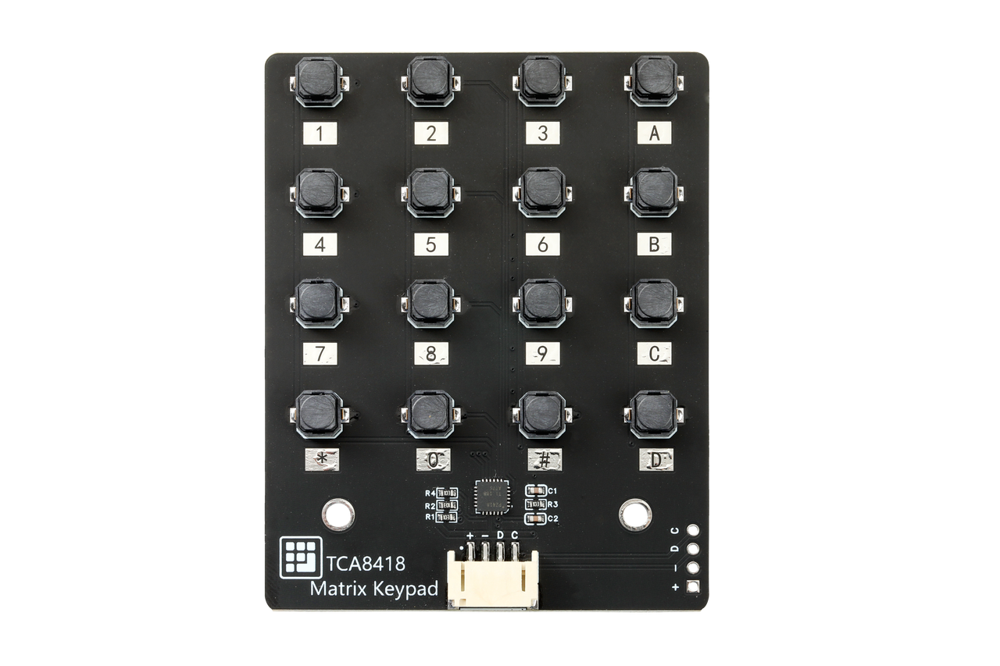
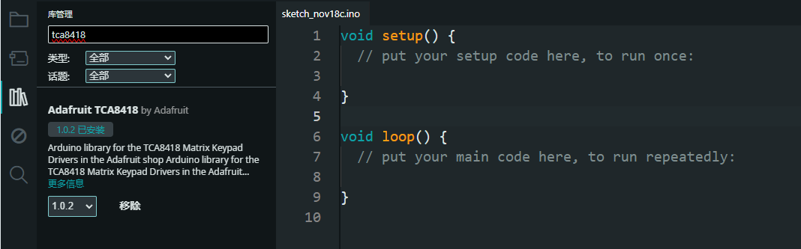
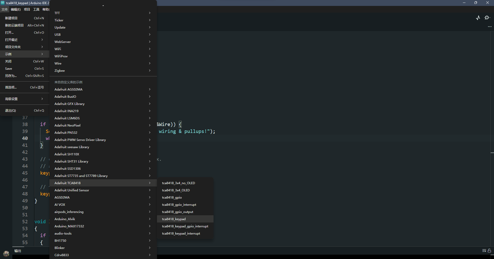
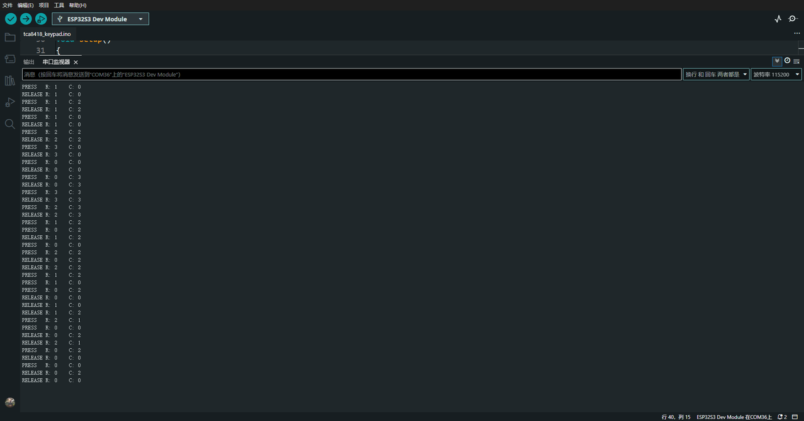
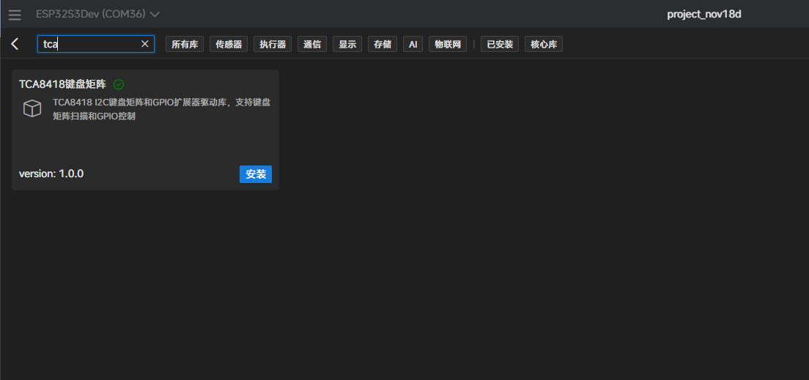
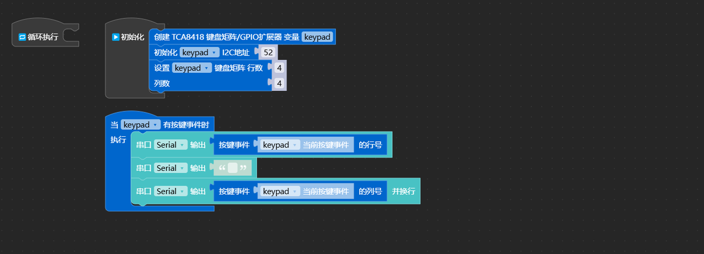
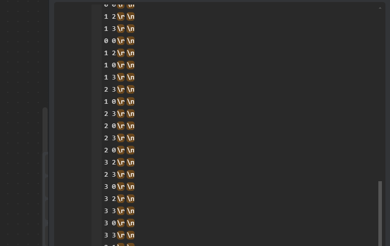

# TCA8418矩阵键盘

## 简介

TCA8418 是一款具有集成 ESD 保护的键盘扫描器件。它能够在 1.65V 至 3.6V 电源电压下运行，具有 18 个 GPIO。这些 GPIO 可通过 I 2C 接口支持多达 80 个按键。按键控制器可对输入进行消抖以及保持用于存储按键按压和释放事件的 10 字节 FIFO。该 FIFO 借助溢出绕回功能可存储多达 10 个按键事件。中断 (INT) 输出可配置为在发生按键按压和按键释放事件时，或这些事件达到最大速率时报警。

## 产品参数

- **类型**：键盘接口/按键控制扩展芯片
- **通用输入输出接口**：18 个 GPIO，可支持最多 80 个按键
- **支持键盘形式**：QWERTY 键盘及通用 GPIO 扩展
- **工作电源电压范围**：1.65V ~ 3.6V
- **待机电流**：3 μA（空闲模式）
- **通信接口**：I²C（支持 Fast-mode Plus，最高 1MHz）
- **FIFO 缓冲**：10 字节（可记录 10 次按下与释放事件）
- **中断输出**：开漏输出，低电平有效
- **消抖时间**：集成 50 μs 消抖
- **输入保护与抗干扰**：SCL/SDA 支持施密特触发，1.8V 时典型 Vhys=0.18V
- **锁断性能**：>200mA（符合 JESD78 II 类要求）
- **ESD 保护**：满足并超过 JESD22 标准
  - 人体放电模型 HBM：±2000V
  - 器件充电模型 CDM：±1000V

## 引脚说明

- **+**：VCC（3V3）
- **-**：GND
- **D**：IIC------SDA
- **C**：IIC------SCL

## 示例程序

### 1.Arduino（esp32）

1. 安装库 tca8418。

2. 选择下图所示的示例。

3. 编译下载程序打开串口后按下键盘任何按钮后串口会打印按钮坐标。

### 2.Aily Block(esp32)

1. 新建项目安装 tca8418 图形库。

2. 编写下图所示代码。

3. 编译下载代码打开串口后按下键盘任意按键后串口会打印按键坐标。

## 资料下载

[**\[tca8418.pdf\]**](https://ucnvly56m0g3.feishu.cn/wiki/SdMcwM28qiQhG1kkBtQcyBEjnsf)