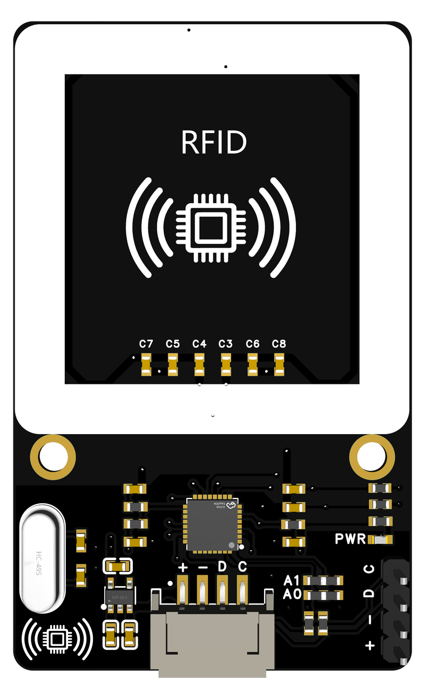
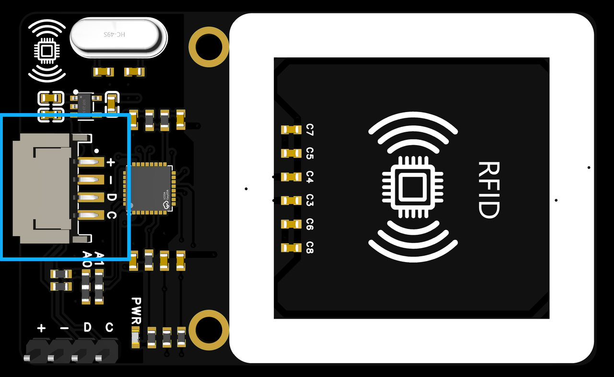
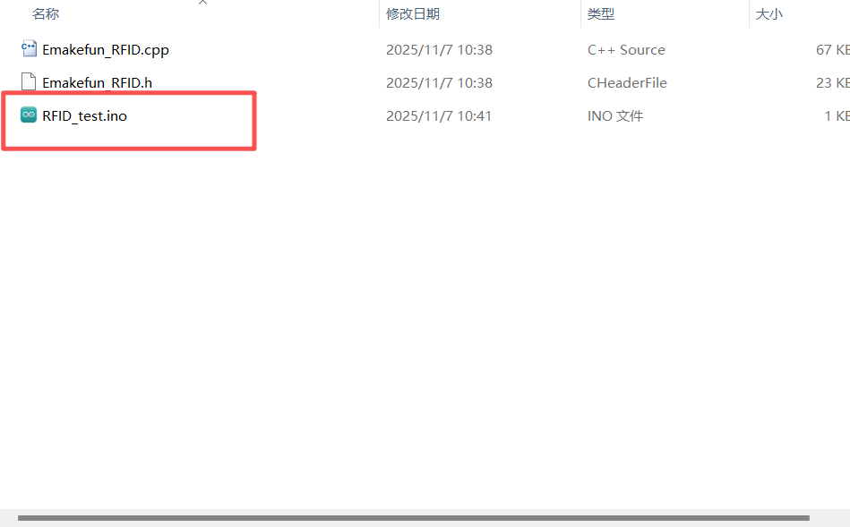
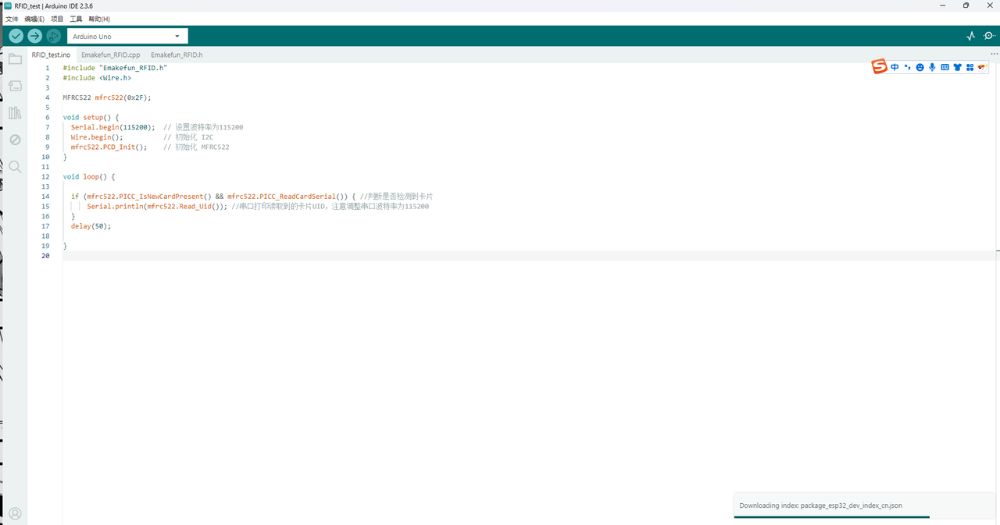
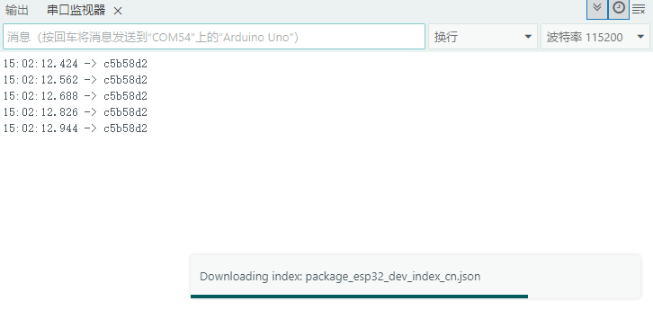
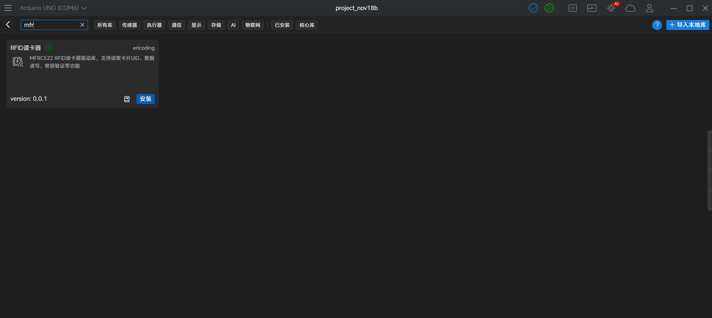
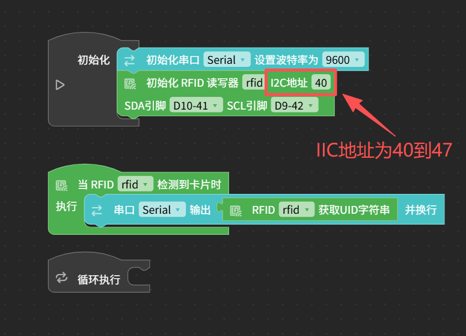
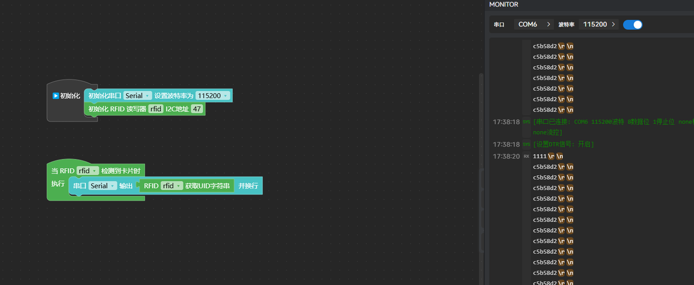

# RFID_522射频模块

## 简介
RFID射频模块，采用MFRC522芯片设计制作。通过I2C总线接口通信，可读取射频卡信息并输出，读卡距离约1cm，工作稳定可靠。可应用于智能门锁、刷卡系统等项目中。

RFID简介：射频识别即RFID（Radio Frequency IDentification）技术，又称无线射频识别，是一种通信技术，可通过无线电讯号识别特定目标并读写相关数据，而无需识别系统与特定目标之间建立机械或光学接触。常用的有低频（125k~134.2K）、高频（13.56Mhz）、超高频，微波等技术。RFID读写器也分移动式的和固定式的，目前 RFID技术应用很广，如：图书馆，门禁系统，食品安全溯源等。

RFID技术的基本工作原理并不复杂：标签进入磁场后，接收解读器发出的射频信号，凭借感应电流所获得的能量发送出存储在芯片中的产品信息（PassiveTag，无源标签或被动标签），或者由标签主动发送某一频率的信号（ActiveTag，有源标签或主动标签），解读器读取信息并解码后，送至中央信息系统进行有关数据处理。

一套完整的RFID系统，是由阅读器（Reader）与电子标签（TAG）也就是所谓的应答器（Transponder）及应用软件系统三个部份所组成，其工作原理是Reader发射一特定频率的无线电波能量给Transponder，用以驱动Transponder电路将内部的数据送出，此时Reader便依序接收解读数据，送给应用程序做相应的处理。

MFRC522是高度集成的非接触式(13.56MHz）读写卡芯片。此发送模块利用调制和解调的原理，并将它们完全集成到各种非接触式通信方法和协议中。

## 产品参数
读写器支持：ISO 14443A/MIFARE

支持加密：MIFARE Classic加密

通信速率：支持ISO 14443 212kbit/s和424kbit/s的更高传输速率

接口：支持I2C接口，快速模式的速率为400kbit/s

缓冲区：64字节的发送和接收FIFO缓冲区

中断模式：灵活的中断模式

复位功能：低功耗的硬复位功能

工作电压：3.3V-5V

通信接口：I2C(可改变)

读取距离：0-1cm

主控IC：RC522

## 引脚说明
+：VCC（3V3~5V）

-：GND

D：IIC------SDA

C：IIC------SCL

## 示例程序
1. Arduino示例程序
将资料中的Arduino示例代码解压至相应目录。

打开RFID_test.ino文件。

选择好开发板型号，并将程序上传到开发板。（以Arduino Uno为例）

打开串口，将卡片放置在RFID模块上，把波特率设置为115200，串口会输出卡片的ID信息。

2. Aily Blockly示例程序
新建arduino uno项目，安装如下图示图形库。

编写下图所示代码。（如果IIC地址不正确，请使用IIC扫描程序查看实际地址）

编译下载，打开串口后使用卡片触碰rfid并且观察串口信息。

资料下载
[\[C2760772_射频卡芯片_MFRC522_规格书_射频卡芯片_MFRC522_中文规格书.PDF\]](https://ucnvly56m0g3.feishu.cn/docx/B61udrMKCo7Sd4x3IgucTvdbnHb)