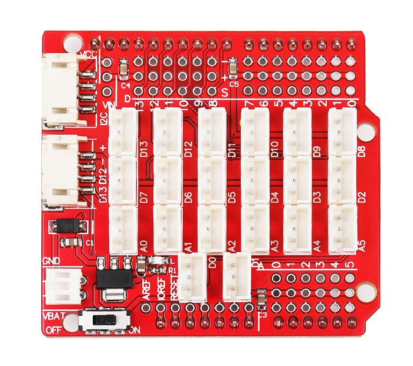
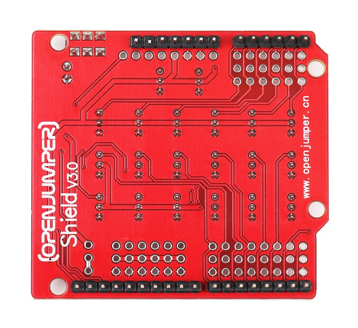
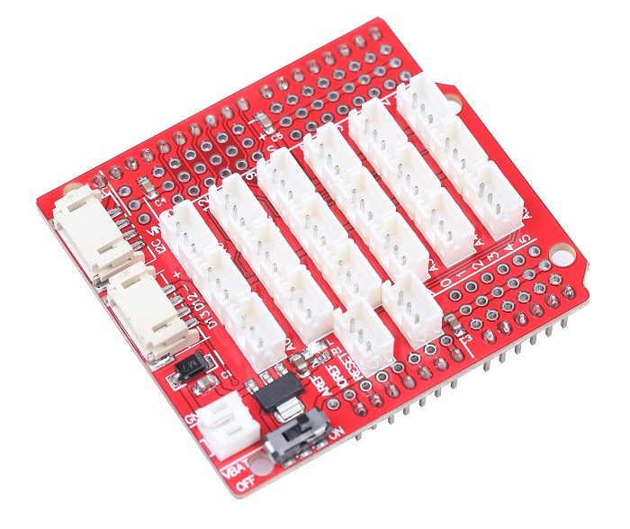

# arduino传感器扩展板（防呆口shieldV3）
## 简介

OPENJUMPER Shield V3.0 全新升级，提供了标准的锂电池接口，方便外部供电，同时提供了开关，接入12v的锂电池。预留4P的串口放反接口和I2C总线，且 为防止其他电子传感器与Arduino连接时由于插反导致的短路烧毁Arduino主板。  

为了兼顾以往的2.54mm间距3p接头，扩展板同时也预留了孔洞，可以随时兼容不同类型的传感器模块接口。然后传感器可以像电子积木一样连接在扩展板上实现具体的项目及应用。  

<table border="1">

<tr>
  <td align="center"></td>
  <td align="center"></td>
  <td align="center"></td>
</tr>
<tr>
  <td style="background-color:rgb(232,232,232,0.5) "colspan="3" align="center"> <a href="https://item.taobao.com/item.htm?id=586553871202">arduino传感器扩展板</a> </td>
</tr>
</table>

## 规格参数

+ 尺寸（长×宽×高）：54mm×60mm×16mm（含插针）  

+ 工作电压：5V  

+ 外部电源接口电压：7~9V（推荐）   

+ 兼容控制器：arduino UNO

##  接口说明

+  **数字IO接口：**

     D2/D3/D4/D5/D6/D7/D8/D9/D10/D11/D12/D13  
     每一路接口包含三个引脚 S(信号) 、+（VCC）、-（GND）

*  **模拟IO接口：**

     A0/A1/A2/A3/A4/A5  
     每一路接口包含三个引脚 S(信号) 、+（VCC）、-（GND）

* **IIC接口：**

    连接在A4（SDA）、A5（SCL）、-、+ 四个引脚上

*  **UART接口：**

      连接在接口0、 1、-、+ 四个引脚上  （注意：新版本去掉UART接口，将四个引脚连接在D13、D12、-、+上）

* **外部供电接口：**

     XH2.54接口，可连接相同型号的电源（如电池），供电范围为6~12V（推荐），电源输入口经过稳压芯片输出5V给所有IO接口的VCC和GND供电

*  **拨动开关：**

    选择外部供电或者主板供电（来自于下端主板的5V供电）

*  **外部供电指示灯：**

     当拨动开关选择外部供电时会亮起，如果选择内部（主板）供电，指示灯会熄灭。