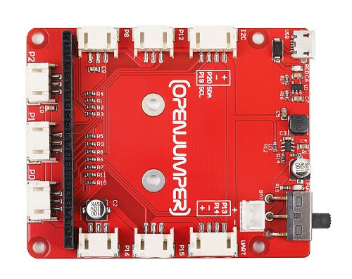
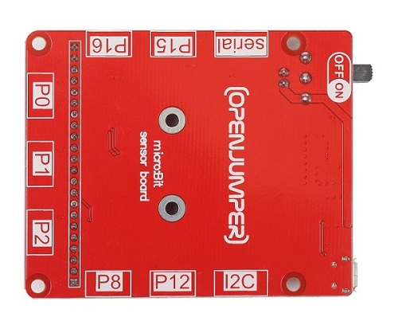
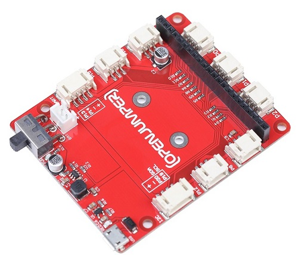
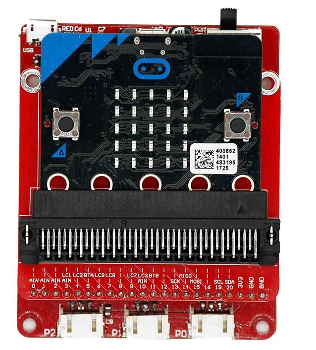
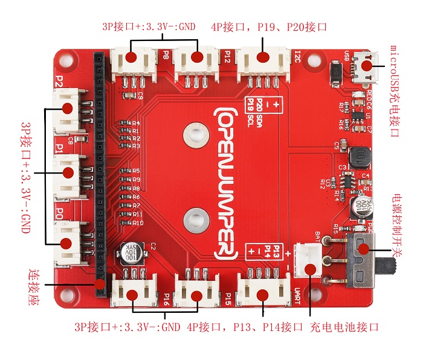
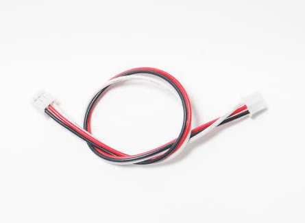
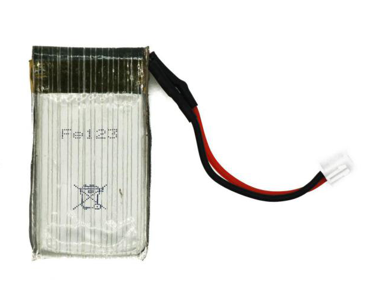

# microbit 传感器扩展板（microbit sensor board ）

<table border="1">

<tr>
  <td align="center"></td>
  <td align="center"></td>
  <td align="center"></td>
</tr>
<tr>
  <td style="background-color:rgb(232,232,232,0.5) "colspan="3" align="center"><a href="https://item.taobao.com/item.htm?id=586318430755">  microbit 传感器扩展板</a> </td>
</tr>
</table>

## 概述

使用micro:bit主板我们可以学习一系列的编程及游戏制作，但在很多应用中，我们可能会使用一些电子器件来搭建各种电路，我们可以使用面包板和一些插件器件来搭建起电路， 但在面包板上接插元件固然方便，但你需要有一定的电子知识来搭建各种电路。而使用传感器扩展板，你只需要通过连接线，把各种模块接插到扩展板上即可。使用传感器扩展板，你可以更快速的搭建出你自己的项目。Micro:bit传感器扩展板是最常用的micro:bit外围硬件之一。正如micro:bit软件图形化编程一样，我们使用搭建好的模块，通过我们的拼装，以实现我们想要的的功能。  

## 接口说明   

 

### 3P座子

通过扩展板转换，各个引脚的排座变为更方便接插的座子，每一个3针的引脚。每个3P的引脚包含一个信号引脚，一个正极3.3V，一个GND。 

如果使用面板板搭建电路时，VCC与GND插接反可能会导致电路板甚至micro:bit主板烧坏。但在使用这种3P连线时，不用担心反接问题。在出厂前，传感器与扩展板上线的顺序是一一对应，而且不易接反。  
在模块上同样也有一个3P的座子，我们通过3P的连接线将传感器与扩展板连接。通常我们习惯用红色代表电源（VCC），黑色代表地（GND），其他颜色代表信号（signal）。  

   

### 4P座子

在扩展板上还留有两个4P的座子  

**I2C接口**
+ 引脚分别是+、-、P20、P19。
+ 这个接口只适用于I2C设备的连接。但对于其他非I2C设备连接于该接口上，不一定能正常驱动，因为接口被固定成了I2C接口。

**串口（serial）接口**
+ 引脚分别是+、-、P13、P14。
+ 接口还可以用于连接其他输入输出设备。  
  
### 电源输入接口

传感器扩展板上提供一个2P的座子，这里可以连接3.7V的电池，使用外部电池给传感器和micro:bit供电。同时扩展板还带了充电功能，使用microUSB数据线将扩展板与电源适配器（5V 1A）或者电脑的USB口相连接，这样就给连接在电源输入接口上的可充电电池充电。

   

### 电源控制开关

拨动开关在ON这一档时，使用外部电源给传感器扩展板和micro:bit供电。当开关拨动到OFF挡时，外部电源断开供电，这时候通过扩展板上的microUSB接口可以给电池充电。

### 连接座

连接micro：bit转接板