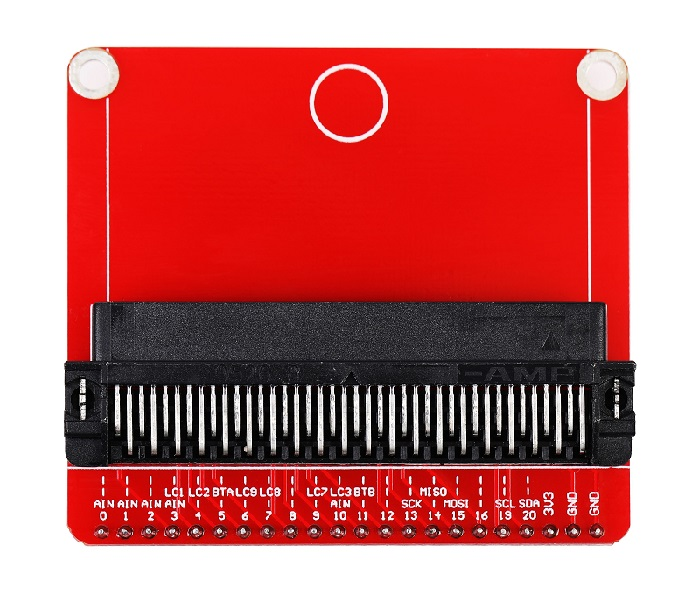
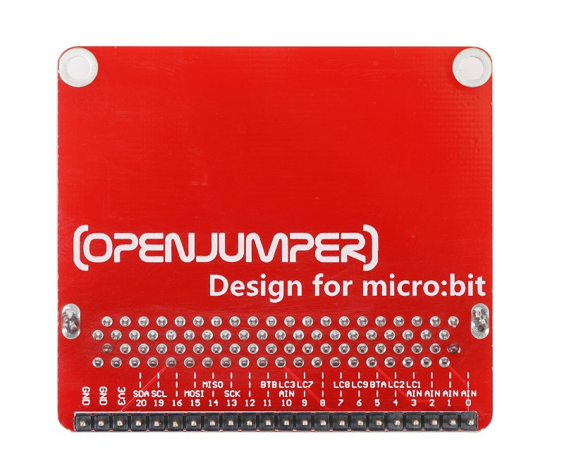
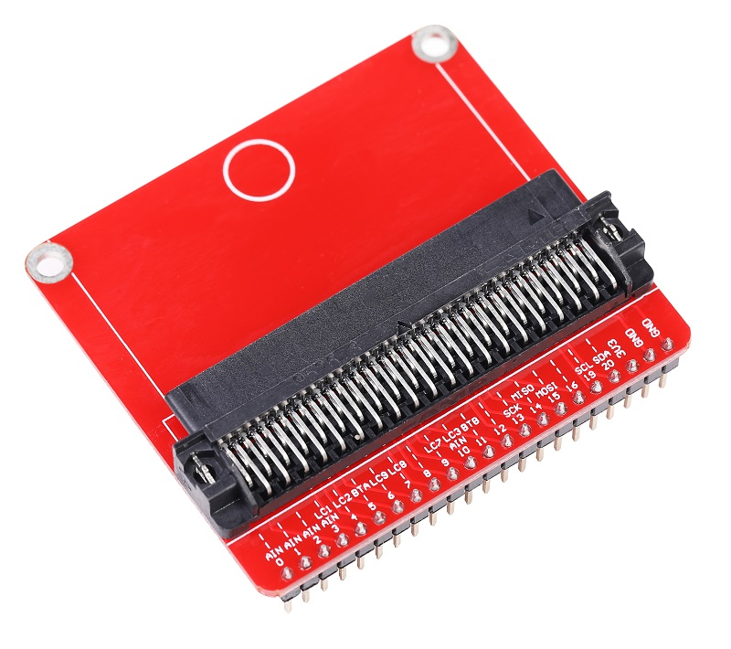

# micro:bit转接板

## 简介

micro:bit转接板设计是为将micro:bit的所有接口引出，并且为micro:bit扩展出2.54mm间距的排针接口，方便进行各种实验。 可插在面包板上，连接不同的电子元器件进行实验，也可以堆叠在openjumper的micro:bit传感器扩展板，连接驱动不同的电子模块。

<table border="1">

<tr>
  <td align="center"></td>
  <td align="center"></td>
  <td align="center"></td>
</tr>
<tr>
  <td style="background-color:rgb(232,232,232,0.5) "colspan="3" align="center"> <a href="https://item.taobao.com/item.htm?id=586468367944"> micro:bit转接板</a> </td>
</tr>
</table>

## 参数
+ 产品尺寸：
+ 固定孔直径：3mm