# 多功能电机驱动扩展板

## 产品介绍

多功能电机驱动扩展板是 IIC-电机/舵机驱动模块的升级款。是一款兼容Arduino UNO主控器的电机驱动扩展板。将它与主控板堆叠连接好，主控板通过IIC的通讯方式控制电机及舵机，这样可以大大减少主控芯片引脚的占用。  
其余未使用到的引脚也全部通过排针引出，为方便外接更多传感器或显示器等硬件模块（如OLED 超声波模块 蓝牙模块  串口语音识别模块等等）使用。
模块自带一个DC-DC转换电路，为舵机提供5V电压，输出电流最大能够达到5A，足以同时驱动4路大舵机（如MG995）。 模块还集成一个无源蜂鸣器、红外接收头和PS2手柄座，同时还保留了两路带编码器的电机驱动接口，方便智能小车平台使用。
多功能电机驱动扩展板具有占用IO数量少、功能强大、驱动能力强、不易发热等诸多优点。常用于智能机器人小车的多路直流电机或者多路舵机的驱动中。 

<table border="1" align="center">

<tr>
  <td align="center">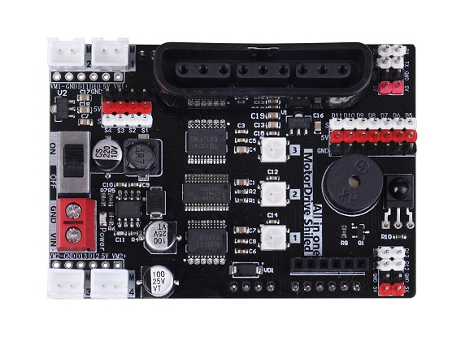</td>
  <td align="center">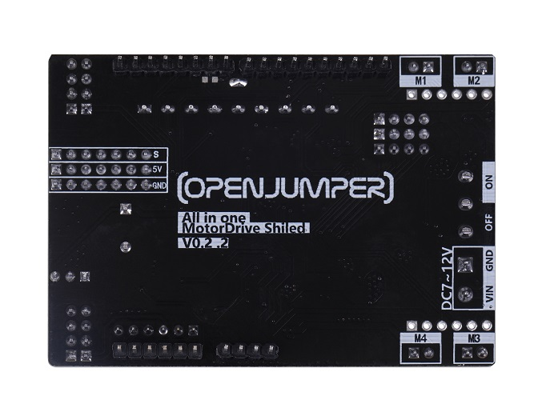</td>
  <td align="center">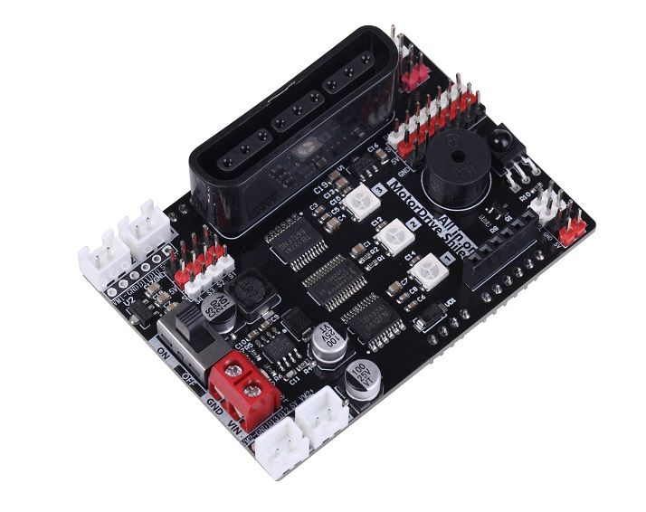</td>
</tr>
<tr>
  <td style="background-color:rgb(232,232,232,0.5) "colspan="3" align="center"> <a href="https://item.taobao.com/item.htm?id=664667956664"><font style="font-size:16px"> 多功能电机驱动扩展板</font></a> </td>
</tr>
</table>

## 产品亮点

+ 可以同时驱动四个直流电机和四个舵机

+ 自带DCDC转换电路，可为舵机提供5V电压，输出电流最大达到5A

+ 未使用的引脚引出作为传感器接口，可连接更多外设

+ 自带蜂鸣器、红外接收、PS2手柄座，使用更加方便
  


## 模块参数

|          名称           |                         参数                          |
| :--------------------- | :---------------------------------------------------|
|       电机驱动通信方式    |                          IIC                          |
| 建议电源电压（VIN,GND） |                        7V-9V                         |
|    舵机驱动部分电压     |                5V（板载DCDC电源芯片）                 |
|  舵机驱动部分峰值电流   |             5A（建议持续工作电流小于3A）              |
| 单路电机驱动电流平均值  |                         1.2A                          |
|  单路电机驱动电流峰值   |                         1.6A                          |
|      驱动的舵机数       |                          4路                          |
|   驱动的直流电机数量    |            4路（带正反转和12位高精度调速）            |
|      电机接口类型       | 4\*2.54防反接端口（或两个2.54*6排针带编码器电机接口） |
|        尺寸         |                      76mm*53mm                       |

 

## 引脚说明

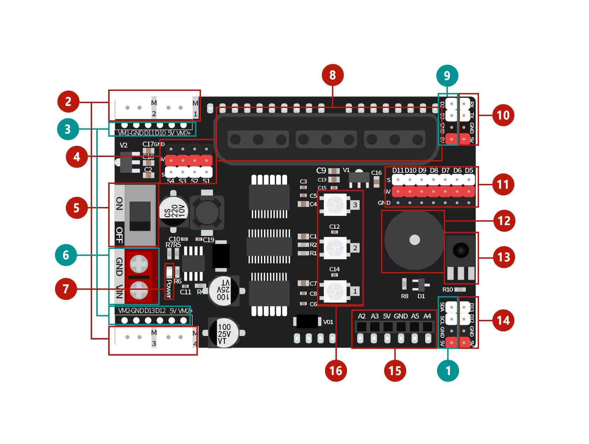

**1.IIC信号输入接口：** 与IIC通信模块进行连接通信

**2.直流电机接口：** M1、M2、M3、M4，连接直流电机，可支持4路直流电机

**3.两路编码器接口** 不与直流电机接口同时使用

**4.舵机接口：** S1、S2、S3、S4，连接舵机，可支持4路舵机

**5.电源开关：** 控制整个扩展板电源通断

**6.外部供电接口：** 用于外接电池或其他电源，推荐电压6~12V

**7.电源指示灯Power** 

**8.PS2手柄座：** 可连接遥控器、手柄，在智能小车中，可以通过连接遥控器控制小车

**9.4P排针接口：** 可作为软串口使用、也可作为4P传感器接口

**10.串口接口：** 可进行串口通信，与arduino的硬件串口连接

**11.传感器接口：** D5~D11，将主板未使用到的引脚全部引出，作为传感器接口使用，扩展出更多的功能

**12.蜂鸣器：** 发出提示声或警报声，播放声音，默认连接arduino的A0引脚

**13.红外接收器：** 可用于产品所需的红外控制，默认连接arduino的D4引脚

**14.4P排针接口：** 默认连接arduino的D12 D13引脚，可以用于连接超声波等模块

**15.模拟排母接口：** 从左到右分别为  A2 A3 5V GND A5 A4，靠右可接OLED模块

**16.ws2812指示灯：** 默认连接arduino的A1接口


## 接口测试

### 电机舵机接口测试

电机驱动扩展板可以同时支持驱动四个直流电机和四个舵机，并且能实现直流电机的正反转和电机调速控制。外部供电接口可以用于外接电池或其他电源，推荐电压6~12V

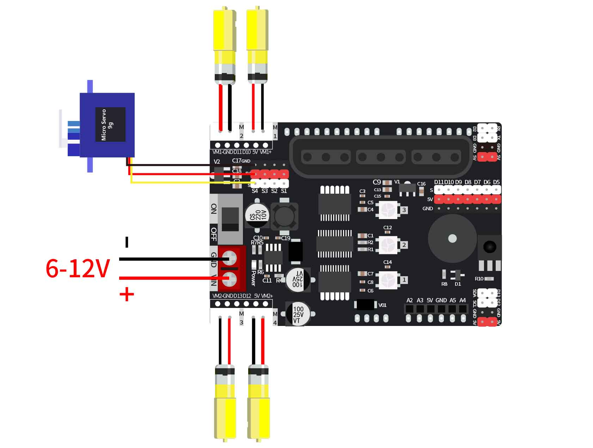

**Arduino IDE程序**
```C++
/*电机驱动扩展板测试程序，电机+舵机
OpenJumper
*/
#include <Openjumper_IICMotorDriver.h>

Openjumper_IICMotorDriver pwm = Openjumper_IICMotorDriver();

#define SERVOMIN 100 // 舵机角度最小值
#define SERVOMAX 400 // 舵机角度最大值

#define Server1  1//分别对应板子上的S1-S4的4个舵机接口
#define Server2  2
#define Server3  3
#define Server4  4
  
void setup() {
  Serial.begin(9600);
  Serial.println("Car test!");
  pwm.begin();//初始化
  
  pwm.motorConfig(DIRP,DIRP,DIRP,DIRP);//设置电机正方向，参数：DIRN,DIRP
}
  
void loop() {
  /*控制单个电机M3转动，速度1000
  M3：电机编号，包括M1，M2，M3，M4
  1000：速度值，取值范围在-4096-4096，负数表示反转，正数表示正转，绝对值越大表示速度越快
  */
  pwm.setMotor(M3, 1000);
  delay(500);
  
  /*控制所有电机转动，速度3000
  1000：速度值，取值范围在-4096-4096，负数表示反转，正数表示正转，绝对值越大表示速度越快
  */
  pwm.setAllMotor(3000);
  delay(500);
  
  /*分别控制所有电机转动，速度1000，速度值可不同
  1000：速度值，取值范围在-4096-4096，负数表示反转，正数表示正转，绝对值越大表示速度越快
  */
  pwm.setAllMotor(1000, 1000, 1000, 100);
  delay(500);
  
  /*控制所有电机停止
  */
  pwm.stopMotor(MAll);
  delay(500);
  
  /*控制S2号引脚输出高电平
  2：引脚编号，包括1，2，3，4或S1,S2,S3,S4分别对应板子上的S1,S2,S3,S4
  HIGH：高低电平；HIGH表示高电平，LOW表示低电平
  */
  pwm.digitalWrite(2,HIGH);
  
  /*驱动S1端口的舵机转到200的位置
  1：引脚编号，包括1，2，3，4或S1,S2,S3,S4分别对应板子上的S1,S2,S3,S4
  200：舵机转动的位置，范围在100-400，对应0度到180度
  */
  pwm.setServoPulse(1, 200);
  delay(1500);

}
```
### OLED显示屏测试

电机驱动扩展板将未使用的模拟引脚用排母引出，靠右可用作OLED接口连接OLED屏。

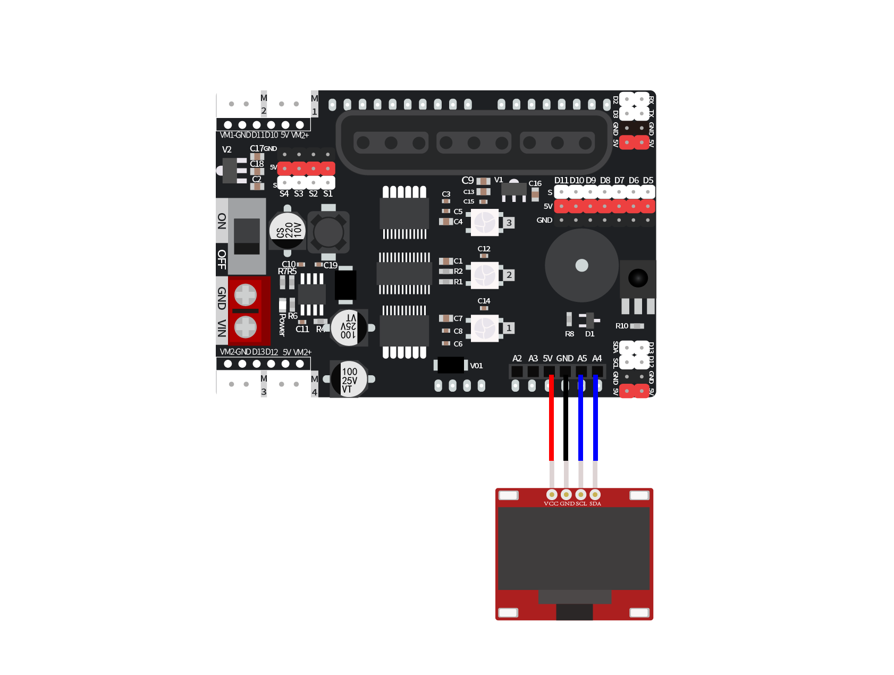

**Arduino IDE程序**

```C++
#include <U8g2lib.h>
#include <Wire.h>

U8G2_SSD1306_128X64_NONAME_1_HW_I2C u8g2(U8G2_R0, U8X8_PIN_NONE);

void page1() {
  u8g2.setFont(u8g2_font_timR14_tf);
  u8g2.setFontPosTop();
  u8g2.setCursor(0,20);
  u8g2.print("OPENJUMPER");
  u8g2.setCursor(7,34);
  u8g2.print("OLED  TEST");
}

void setup(){
  u8g2.setI2CAddress(0x3C*2);
  u8g2.begin();
  u8g2.enableUTF8Print();

}

void loop(){
  u8g2.firstPage();
  do
  {
    page1();
  }while(u8g2.nextPage());

}
```

**Mixly图形化程序**

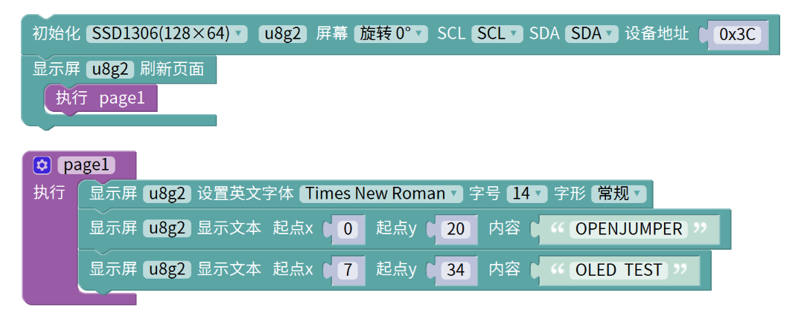

[mixly程序下载](http://download.openjumper.cn/mixly/ojxm34-oled.mix)

### PS2手柄插座测试
***
**Arduino IDE程序**
```C++
#include <Emakefun_MotorDriver.h>
Emakefun_MotorDriver mMotorDriver = Emakefun_MotorDriver(0x60, MOTOR_DRIVER_BOARD_V5);;
PS2X *ps2x;
RGBLed *rgb;

void setup()
{
    Serial.begin(9600);
    ps2x = mMotorDriver.getSensor(E_PS2X);
    rgb = mMotorDriver.getSensor(E_RGB);
}

void loop()
{
  static int vibrate = 0;
  byte PSS_X = 0, PSS_Y = 0;
  ps2x->read_gamepad(false, vibrate); // read controller and set large motor to spin at 'vibrate' speed
  if (ps2x->ButtonDataByte()) {
    if (ps2x->Button(PSB_PAD_UP)) {     //will be TRUE as long as button is pressed
      rgb->SetRgbColor(E_RGB_ALL, RGB_WHITE);
      Serial.println("PSB_PAD_UP");
    }
    if (ps2x->Button(PSB_PAD_RIGHT)) {
      Serial.println("PSB_PAD_RIGHT");
      rgb->SetRgbColor(E_RGB_RIGHT, RGB_WHITE);
    }
    if (ps2x->Button(PSB_PAD_LEFT)) {
      rgb->SetRgbColor(E_RGB_LEFT, RGB_WHITE);
      Serial.println("PSB_PAD_LEFT");
    }
    if (ps2x->Button(PSB_PAD_DOWN)) {
      rgb->SetRgbColor(E_RGB_ALL, RGB_RED);
      Serial.println("PSB_PAD_DOWN");
    }
    vibrate = ps2x->Analog(PSAB_CROSS);  //this will set the large motor vibrate speed based on how hard you press the blue (X) button
    if (ps2x->Button(PSB_CROSS)) {             //will be TRUE if button was JUST pressed OR released
      rgb->SetRgbColor(E_RGB_LEFT, RGB_GREEN);
      Serial.println("PSB_CROSS");
    }
    if (ps2x->Button(PSB_TRIANGLE)) {
      rgb->SetRgbColor(E_RGB_RIGHT, RGB_GREEN);
      Serial.println("PSB_TRIANGLE");
    }
    if (ps2x->Button(PSB_CIRCLE)) {
      rgb->SetRgbColor(E_RGB_LEFT, RGB_BLUE);
      Serial.println("PSB_CIRCLE");
    }
    if (ps2x->Button(PSB_SQUARE)) {
      rgb->SetRgbColor(E_RGB_RIGHT, RGB_BLUE);
      Serial.println("PSB_SQUARE");
    }
    if (ps2x->Button(PSB_L1) || ps2x->Button(PSB_R1)) {
      Serial.print("Stick Values:");
      Serial.print(ps2x->Analog(PSS_LY), DEC); //Left stick, Y axis. Other options: LX, RY, RX  
      Serial.print(",");
      Serial.print(ps2x->Analog(PSS_LX), DEC); 
      Serial.print(",");
      Serial.print(ps2x->Analog(PSS_RY), DEC); 
      Serial.print(",");
      Serial.println(ps2x->Analog(PSS_RX), DEC); 
    }
  } 
  delay(50);
}
```

### 蜂鸣器测试

**Arduino IDE程序**
```C++
#include <NewTone.h>

void setup(){
  pinMode(A0, OUTPUT);
}

void loop(){
  tone(A0,220);
  delay(600);
  tone(A0,880);
  delay(600);
  noTone(A0);
  NewTone(A0,131,600);
  NewTone(A0,262,600);
  NewTone(A0,440,600);

}
```

**Mixly图形化程序**

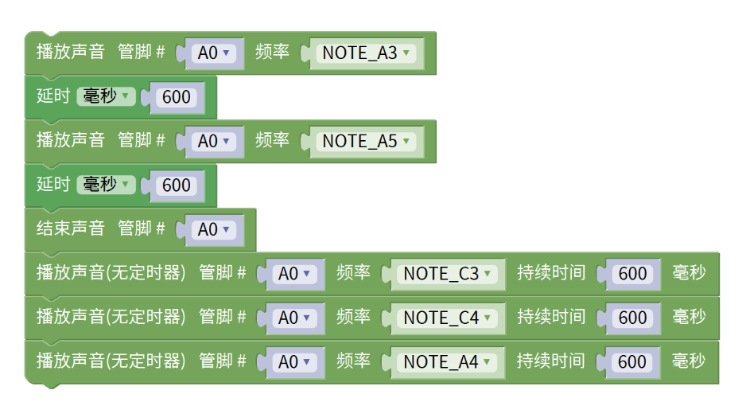

[mixly程序下载](http://download.openjumper.cn/mixly/ojxm34-buzzer.mix)

### 红外接收测试

**Arduino IDE程序**
```C++
//程序上传完成后，点击右上角串口监视器，使用红外遥控器对准板子红外接收头按下，即可看到打印出的键值数据
#include <IRremote.h>

long ir_item;
IRrecv irrecv_4(4);
decode_results results_4;

void setup(){
  Serial.begin(9600);
  irrecv_4.enableIRIn();
}

void loop(){
  if (irrecv_4.decode(&results_4)) {
    ir_item=results_4.value;
    String type="UNKNOWN";
    String typelist[18]={"UNUSED", "RC5", "RC6", "NEC", "SONY", "PANASONIC", "JVC", "SAMSUNG", "WHYNTER", "AIWA_RC_T501", "LG", "SANYO", "MITSUBISHI", "DISH", "SHARP", "DENON", "PRONTO", "LEGO_PF"};
    if(results_4.decode_type>=1&&results_4.decode_type<=17){
      type=typelist[results_4.decode_type];
    }
    Serial.println("IR TYPE:"+type+"  ");
    Serial.println(ir_item,HEX);
    irrecv_4.resume();
  } else {
  }

}
```

**Mixly图形化程序**

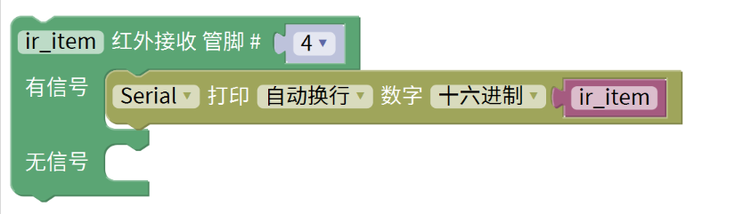

[mixly程序下载](http://download.openjumper.cn/mixly/ojxm34-ir.mix)

### WS2812灯测试

**Arduino IDE程序**

```C++
#include <Adafruit_NeoPixel.h>

Adafruit_NeoPixel rgb_display_A1 = Adafruit_NeoPixel(3,A1,NEO_GRB + NEO_KHZ800);//声明一个RGB灯对象

uint32_t Wheel(byte WheelPos){
  if(WheelPos < 85){
    return rgb_display_A1.Color(WheelPos * 3, 255 - WheelPos * 3, 0);
  }
  else if(WheelPos < 170){
    WheelPos -= 85;
    return rgb_display_A1.Color(255 - WheelPos * 3, 0, WheelPos * 3);
  }
   else{
    WheelPos -= 170;
    return rgb_display_A1.Color(0, WheelPos * 3, 255 - WheelPos * 3);
  }
}

void rainbow(uint8_t wait){
  uint16_t i, j;
  for(j=0; j<256; j++){
    for(i=0; i<rgb_display_A1.numPixels(); i++){
      rgb_display_A1.setPixelColor(i, Wheel((i+j) & 255));
    }
    rgb_display_A1.show();
    delay(wait);
  }
}

void setup(){
  rgb_display_A1.begin();//初始化RGB灯

}

void loop(){
  for (int i = 1; i <= 3; i = i + (1)) {
    rgb_display_A1.setPixelColor((i)-1, ((200 & 0xffffff) << 16) | ((0 & 0xffffff) << 8) | 0);
  }
  rgb_display_A1.show();//每次改变RGB灯显示颜色、亮度、灯数或其他数据后需要发送改变后的数据
  delay(1000);
  for (int i = 1; i <= 3; i = i + (1)) {
    rgb_display_A1.setPixelColor((i)-1, ((0 & 0xffffff) << 16) | ((200 & 0xffffff) << 8) | 0);
  }
  rgb_display_A1.show();
  delay(1000);
  for (int i = 1; i <= 3; i = i + (1)) {
    rgb_display_A1.setPixelColor((i)-1, ((0 & 0xffffff) << 16) | ((0 & 0xffffff) << 8) | 200);
  }
  rgb_display_A1.show();
  delay(2000);
  for (int n = 0; n <= 255; n = n + (1)) {
    for (int m = 1; m <= 3; m = m + (1)) {
      rgb_display_A1.setPixelColor((m)-1, ((n & 0xffffff) << 16) | ((0 & 0xffffff) << 8) | 0);
    }
    rgb_display_A1.show();
    delay(2);
  }
  for (int n = 0; n <= 255; n = n + (1)) {
    for (int m = 1; m <= 3; m = m + (1)) {
      rgb_display_A1.setPixelColor((m)-1, (((255 - n) & 0xffffff) << 16) | ((0 & 0xffffff) << 8) | 0);
    }
    rgb_display_A1.show();
    delay(2);
  }
  for (int n = 0; n <= 255; n = n + (1)) {
    for (int m = 1; m <= 3; m = m + (1)) {
      rgb_display_A1.setPixelColor((m)-1, ((0 & 0xffffff) << 16) | ((n & 0xffffff) << 8) | 0);
    }
    rgb_display_A1.show();
    delay(2);
  }
  for (int n = 0; n <= 255; n = n + (1)) {
    for (int m = 1; m <= 3; m = m + (1)) {
      rgb_display_A1.setPixelColor((m)-1, ((0 & 0xffffff) << 16) | (((255 - n) & 0xffffff) << 8) | 0);
    }
    rgb_display_A1.show();
    delay(2);
  }
  for (int n = 0; n <= 255; n = n + (1)) {
    for (int m = 1; m <= 3; m = m + (1)) {
      rgb_display_A1.setPixelColor((m)-1, ((0 & 0xffffff) << 16) | ((0 & 0xffffff) << 8) | n);
    }
    rgb_display_A1.show();
    delay(2);
  }
  for (int n = 0; n <= 255; n = n + (1)) {
    for (int m = 1; m <= 3; m = m + (1)) {
      rgb_display_A1.setPixelColor((m)-1, ((0 & 0xffffff) << 16) | ((0 & 0xffffff) << 8) | (255 - n));
    }
    rgb_display_A1.show();
    delay(2);
  }
  rainbow(20);

}
```
**Mixly图形化程序**

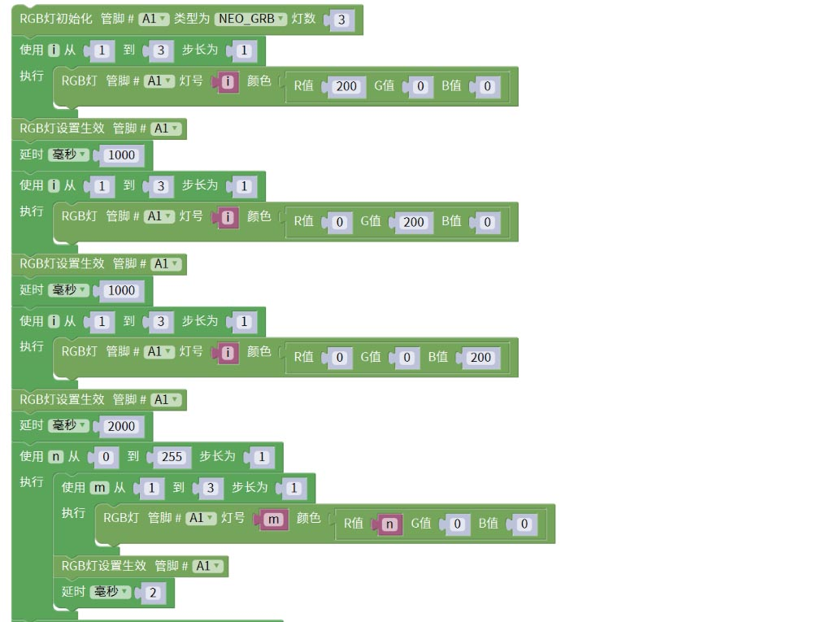

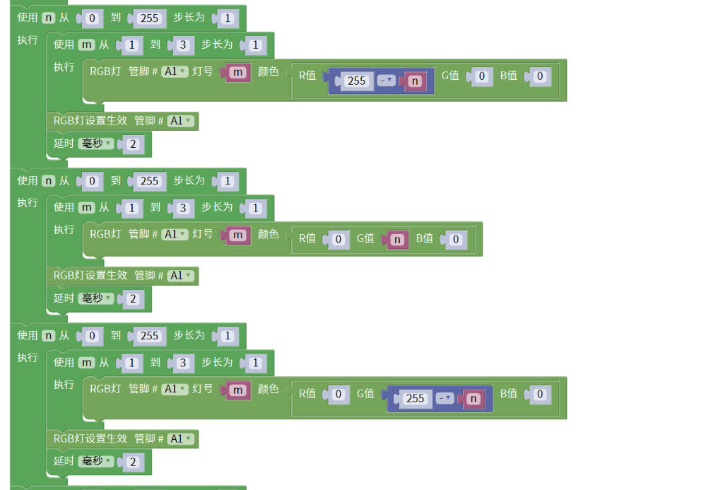

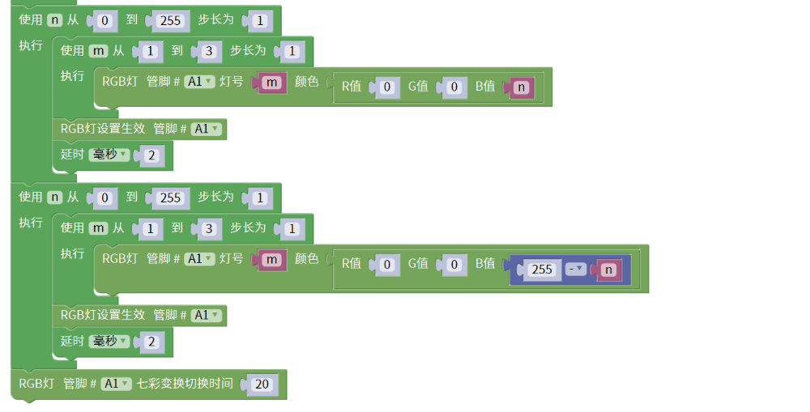

[mixly程序下载](http://download.openjumper.cn/mixly/ojxm34-ws2812.mix)

## 其他资料

[原理图下载](http://download.openjumper.cn/%E5%A4%9A%E5%8A%9F%E8%83%BD%E7%94%B5%E6%9C%BA%E9%A9%B1%E5%8A%A8%E6%89%A9%E5%B1%95%E6%9D%BF%E5%8E%9F%E7%90%86%E5%9B%BE.pdf)

[Arduino库文件下载](http://download.openjumper.cn/Openjumper_IICMotorDriver.rar)

[接口测试程序下载](https://pan.baidu.com/s/1lw9nSVzdamCZ4l-4O4OpHA?pwd=ndgh) 提取码: ndgh