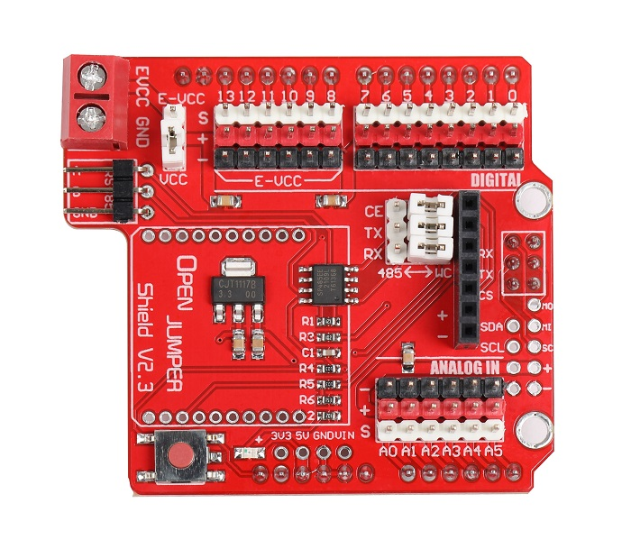
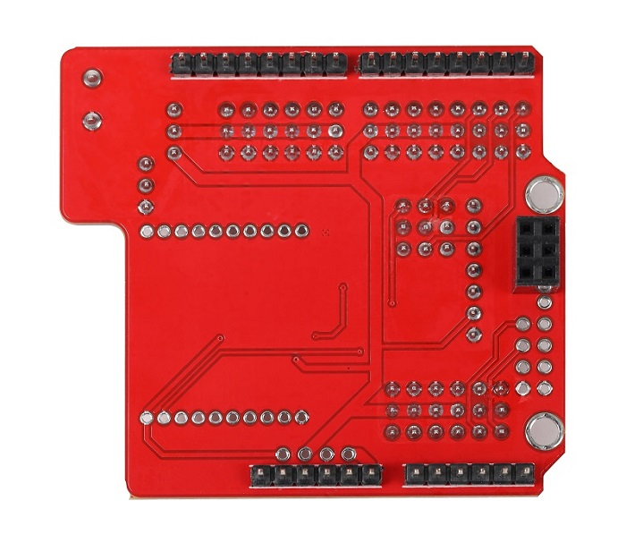
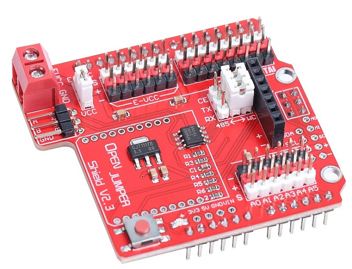
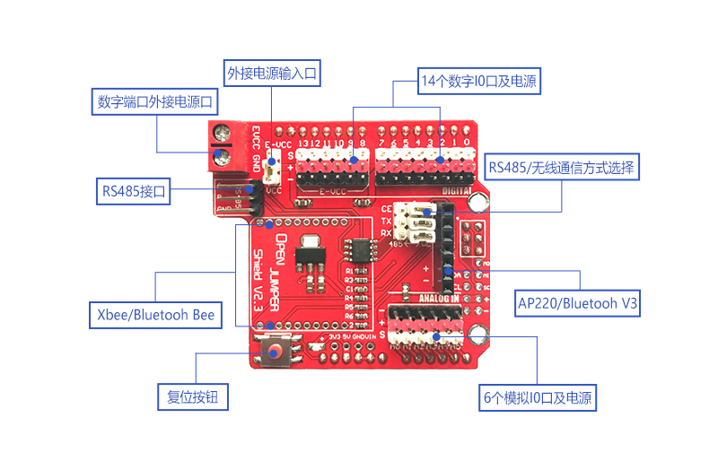

# 传感器扩展板(Arduino兼容)

## 概述

使用传感器扩展板，你能更方便的接插的你的各种模块，快速的完成你的设计。

<table border="1">

<tr>
  <td align="center"></td>
  <td align="center"></td>
  <td align="center"></td>
</tr>
<tr>
  <td style="background-color:rgb(232,232,232,0.5) "colspan="3" align="center"><a href="https://item.taobao.com/item.htm?id=537350400463">  传感器扩展板</a> </td>
</tr>
</table>

## 产品特性

+ 尺寸：54*60mm
    
+ 为每一个IO口都配置了VCC、GND接口，方便传感器插接使用
 
+ 带uart转485功能
  
+ 带7Pin无线扩展座，可连接 OJ蓝牙模块（可通过扩展板后端3个调帽切换485功能和无线通信功能）
  
+ 带Xbee扩展座
  
+ 带独立供电接口，通过调帽选择，可以给8-13端口旁的VCC接口独立供电，方便舵机等大功率设备的使用v2.2版

+ **供电方式选择：**
  
    该接口EVCC可通过可给EVCC区域（绿色区域），通过后方跳帽选择供电方式，靠EVCC插接调帽，即使用外部供电，靠VCC接插，即使用arduino控制器上的5V电源供电（出厂默认设置为使用arduino板载5V供电）。

+ **485通信接口**

   将通信选择调帽靠左插接，即可使用485通信。485通信占用0、1、2，三个数字端口

+ **XBee扩展接口**

   支持XBee及XBee兼容模块插接。通信占用0、1，两个数字端口

+ **OJ蓝牙模块接口**

    支持OPENJUMPER蓝牙2.0模块直接插接。通信占用0、1，两个数字端口，2号端口高电平，可使蓝牙模块进入AT模式。

+ **485/无线通信方式选择**

   调帽全部靠左插接，为485通信；调帽全部靠右插接，为无线接口通信。出厂设置为无线接口通信，当不使用CE功能时，可拔掉CE处跳帽，以释放2号数字端口

+  **数字接口**

    数字接口全部引出，并附带5V供电接口及GND接口，方便插接传感器。

+ **模拟接口**

     模拟接口全部引出，并附带5V供电接口及GND接口，方便插接传感器。

## 其他文档

[arduino-sensor-shield](http://www.openjumper.cn/wp-content/uploads/2012/08/arduino-sensor-shield.pdf)