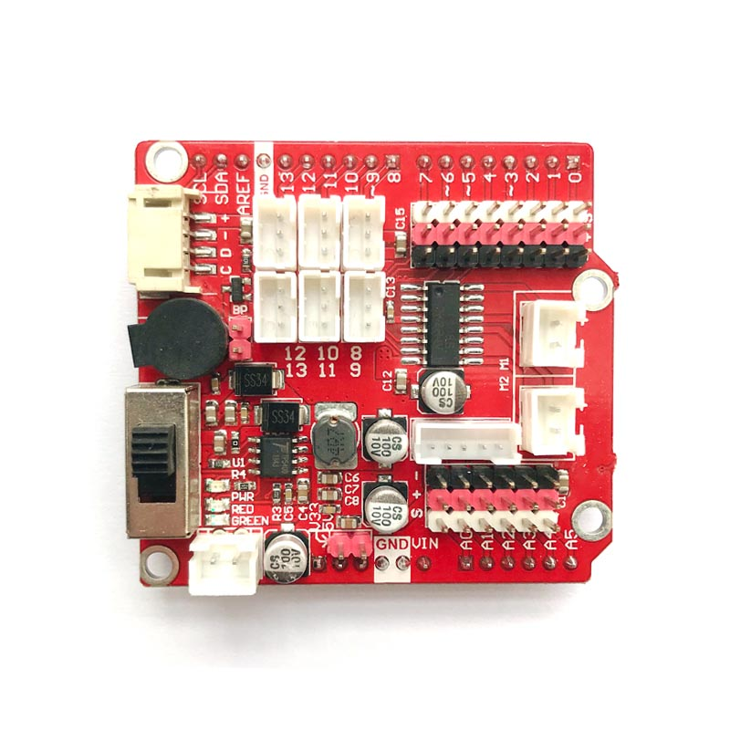
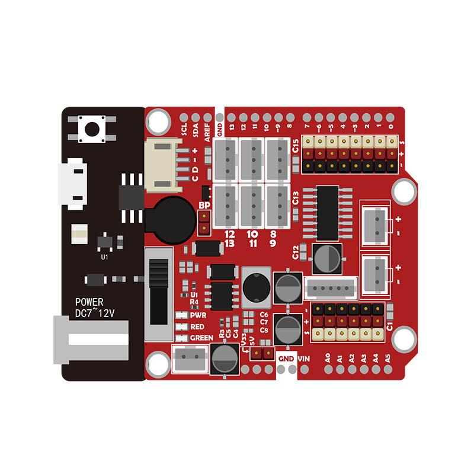

# 传感器扩展板的使用

[点我购买](https://item.taobao.com/item.htm?id=617905128074)

## 概述

当我们的wifiduino主板需要连接比较多的电路模块或者传感器的话，明显就wifiduino主板上的接口VCC和GND引脚会显得不够用，所以传感器扩展板意在将主板的IO口单独引出，并提供了一些特殊的接口，以便连接更多的传感器同一时间使用。

该传感器扩展板是将IO口单独引出，并添加适合传感器模块连接的3P接口。该传感器扩展板也兼容arduinoUNO、Genuino101等主控板。

**D0~D7:** 为插针式接口。S 、+ 、-分别表示 信号、正极VCC、负极GND。

**D8~D13：** 为防反接3P座子，使用3P防反接连接线与传感器模块相连。  
注意：当传感器扩展板堆叠在wifiduino上，而wifiduino只通过数据线连接供电的情况下，D0\~D13的VCC和GND之间不提供正常工作电压。D0~D13的 VCC与GND的供电来至于外部3.7V可充电电池供电，此时输出电压为5V）

**A0~A5：** 模拟接口中只有A0可以使用，因为esp8266中只有一个模拟接口。接口为插针式，可以通过连接线连接模拟传感器，正常工作时 S + -分别连接传感器的信号、正极VCC、负极GND。通电后+ -之间输出的工作电压是5V。

**CD-+ ：** 单独引出的IIC接口，与wifiduino的D5（SCL）、D4（SDA）相连接。采用4P防反接连接线方便连接对应传感器或者其他模块。

**蜂鸣器：** 当使用跳线将BP两针脚短路后，蜂鸣器将连接在wifiduino的D13引脚上。这时候D13接口只能作为蜂鸣器使用，不能再连接其他模块。

**电池接口：** 连接3.7V可充电锂电池（切勿连接7.4V的充电电池，这可能会导致充放电芯片烧坏）

**开关：** 可充电电池操作开关，当可充电电池正常连接时，同时传感器扩展板堆叠在wifiduino上时，开关ON即使用电池给主板和扩展板供电；开关OFF即是停止电池供电。这时候如果下面的wifiduino通过microUSB线供电的话，将会反过来给电池充电。电池充满是green指示灯，未充满是red指示灯。

**M1 M2 电机连接接口：** 可连接小功率电机，使用电机时，将占用D4、D5、D6、D7几个接口。

## 传感器扩展板与wifiduino连接

传感器扩展板与wifiduino采用堆叠方式连接，传感器扩展板将wifiduino的IO口单独引出，同时在IO口旁边引出了VCC与GND，以方便连接传感器应用于物联网项目之中。

### 注意事项：

1、不插电池，只连接microUSB数据线，扩展板传感器中的传感器不工作，为保护主板，传感器扩展板供电方式做了设定，数字输入输出口（黄色方框中的接口）供电只来至于外部电池供电。

如果只插USB数据线，只会对模拟输入传感器连接座（蓝色方框中的接口）供电，不给数字传感器（黄色方框中的接口）供电。

2、怎样给充电电池充电

注意：套件中使用的电池是3.7V可充电锂电池（其他电池不可用）。

电池工作：将开关往上拨打开电池供电。

给电池充电：将开关往下拨，并将主板microUSB口通过数据线连接5V电源适配器（一般的手机充电器）或者电脑USB接口。这样就给插在板子上的电池充电。充电时RED指示灯亮起；当充满电时，RGEEN指示灯亮起。

