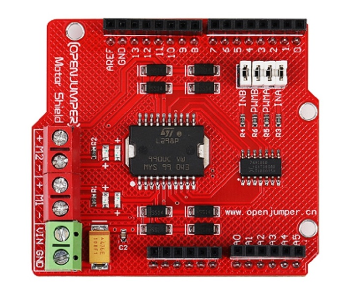
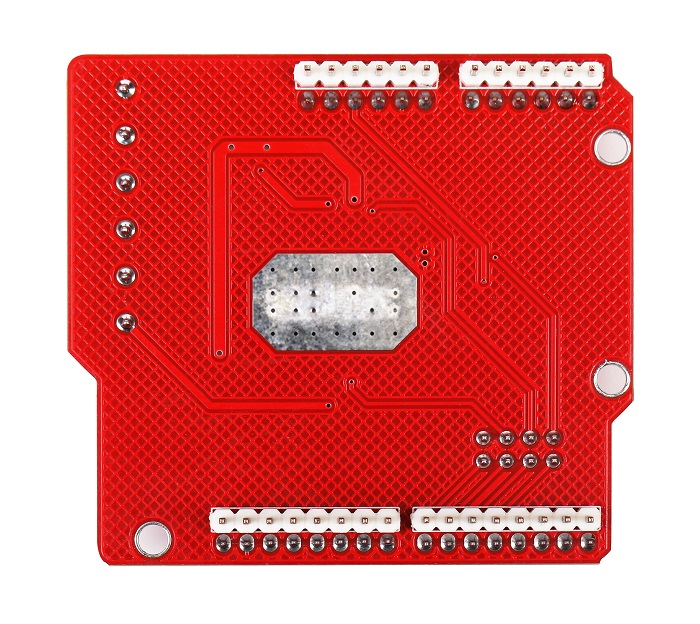
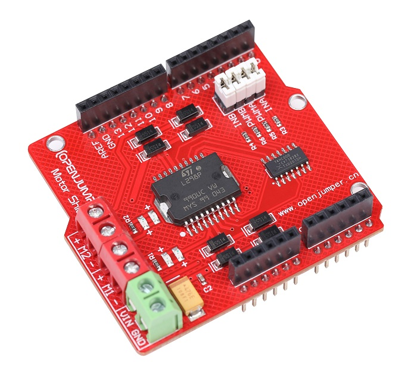

# L298两路直流电机扩展板

##  概述

Motor Shield是Arduino兼容的一款大电流电机驱动；控制端口为4个，减少对Arduino数字端口的开销，不但起到节约控制器端口，而且控制程序也更为简单。Motor Shield电机驱动器采用LGS公司优秀的大功率电机专用驱动芯片L298P，可直接驱动2路直流电机，驱动电流最大达2A。该电路线路布线合理、均采用贴元件片、体积小、方便安装，输出端采用高速肖特基二极管作为保护。你可以通过使用Motor Shield电机驱动板，轻松控制2路直流电机，不需要多余的接线，只需将其叠加在Arduino主控板之上即可。

<table border="1">

<tr>
  <td align="center"></td>
  <td align="center"></td>
  <td align="center"></td>
</tr>
<tr>
  <td style="background-color:rgb(232,232,232,0.5) "colspan="3" align="center"><a href="https://item.taobao.com/item.htm?id=537653527600"> <font style="font-size:16px"> L298两路直流电机扩展板</font></a> </td>
</tr>
</table>


## 接口说明

* 电机供电接口:
  
     为电机提供电源的接口，需对应你的电机参数选择输入电源，且输入电源不应高于25V

* 电机接口1、电机接口2：
  
     接插电机的端口

*  使能跳帽

     接上使能跳帽后方可使用本扩展板的功能（出厂默认使能）。

## 技术参数

+ 逻辑部分输入电压VD：5V
+ 驱动部分输入电压VS：4.8～25V
+ 逻辑部分工作电流Iss：≤36mA
+ 驱动部分工作电流Io：≤2A
+ 最大耗散功率：25W（T=75℃）
  
+ 控制信号输入电平：
   + 高电平：2.3V≤Vin≤5V  
   + 低电平：-0.3V≤Vin≤1.5V

+ 工作温度：-25℃～＋120℃

+ 驱动形式：双路大功率H桥驱动

+ 尺寸：62*56mm

## 使用方法

示例代码：
```C++
/*OPEN JUMPER L298 Shield*/
 int INA = 4; //电机A正反转控制端
 int PWMA = 5; //电机A调速端
 int INB = 7; //电机B正反转控制端
 int PWMB = 6; //电机B调速端

 void setup(){
   pinMode(INA,OUTPUT);
   pinMode(INB,OUTPUT);
 }
 void loop(){
  int value;
  for(value = 0 ; value <= 255; value+=5){
   digitalWrite(INA,HIGH);
   digitalWrite(INB,HIGH);
   analogWrite(PWMA,value);
   analogWrite(PWMB,value);
   delay(50);
   }
 }
```
## 常见问答

1、L298电机驱动模块必须要外接电源吗？

> 答：是的，该电机扩展板在给芯片逻辑供电（5）的情况下还需要一个驱动电压（推荐6—12V），从红色接线端子VIN、GND端输入。

2、扩展板跳帽必须得插上吗？

> 答：首先清楚，这几个跳帽是起什么作用。它们的作用是连接4、5、6、7四个I/O口到芯片驱动端口，也就是说，插上跳帽后你就可以通过4、5、6、7号数字口驱动电机。如果取下跳帽通过其他杜邦线连接其他IO口就可以通过其他数字口驱动电机。

## 相关资料

 + [L298P-datasheet](http://openjumper.cn/wp-content/uploads/2012/08/L298P-datasheet.pdf)

 + [Motor-shield-schematic](http://openjumper.cn/wp-content/uploads/2012/08/Motor-shield-schematic.pdf)

 + [L298motordriver](http://openjumper.cn/wp-content/uploads/2012/08/L298motordriver.pdf)