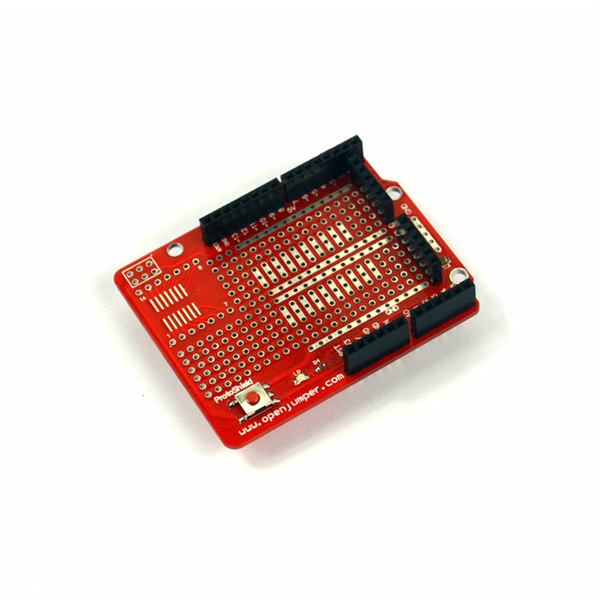

# Aduino UNO 原型板

## 概述

Aduino UNO 原型板可以堆叠在UNO系列主控板上，可允许在板载的大量焊盘上焊接电路，同时可以在原型板上搭载mini面包板（通过双面胶连接），通过连线测试各种电路，迅速搭建你的项目。

## 参数

+ 工作电压：控制器工作电压

+ 尺寸：69mm*56mm

+ 兼容控制器：Arduino UNO 、Arduino Duemilanove

## 主要特点

1、Arduino UNO所有IO都引出

2、复位按键

3、ICSP接口

4、SMD封装接口

5、丰富的电源5V、GND接口