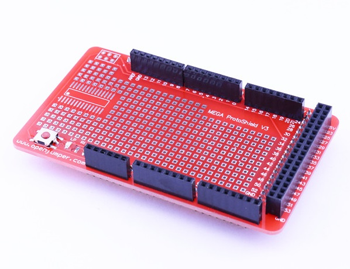

# MEGA 传感器原型板

## 概述

Zduino MEGA 原型板可以堆叠在MEGA系列主控板上，可允许在板载的大量焊盘上焊接电路，同时可以在原型板上搭载mini面包板（通过双面胶连接），通过连线测试各种电路，迅速搭建你的项目。

## 参数

+ 工作电压：控制器工作电压

+ 尺寸：98mm*57mm

+ 兼容控制器：Arduino MEGA 、Zduino MEGA2560

## 主要特点

+ arduino MEGA所有IO都引出

+ 复位按键

+ ICSP接口

+ SMD封装接口

+ 丰富的电源5V、GND接口