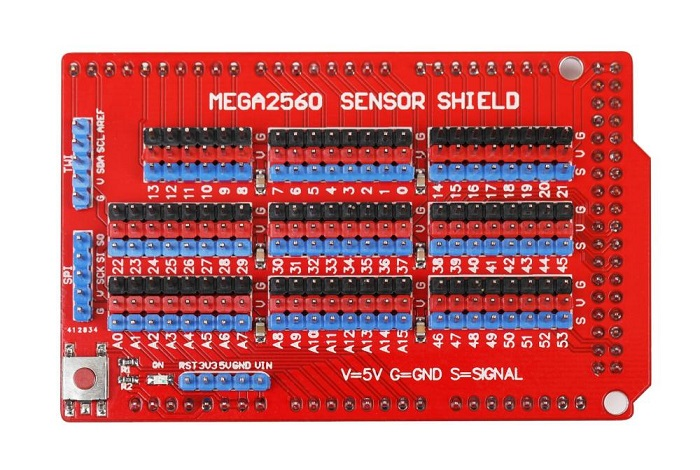
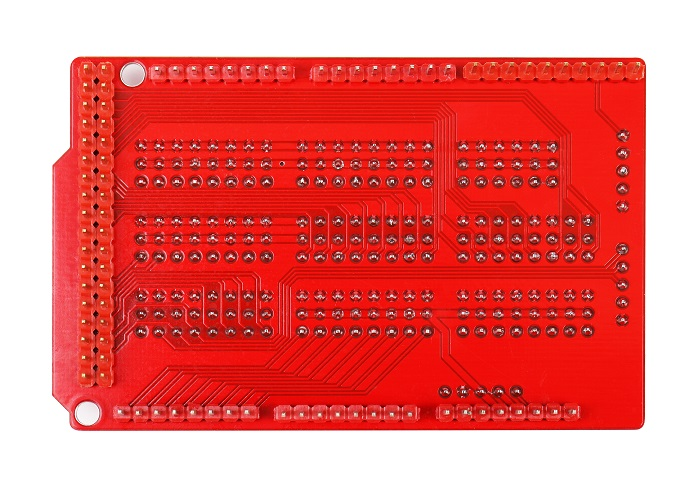
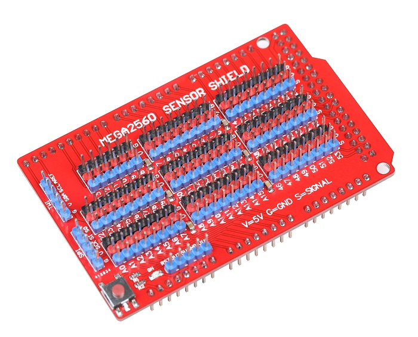

# Arduino Mega传感器扩展板

## 概述

使用OJ MGEA2560传感器传感器扩展板配合Arduino MEGA2560 ，你能更方便的接插的你的各种模块，快速的完成你的设计。

<table border="1">

<tr>
  <td align="center"></td>
  <td align="center"></td>
  <td align="center"></td>
</tr>
<tr>
  <td style="background-color:rgb(232,232,232,0.5) "colspan="3" align="center"> <a href="https://item.taobao.com/item.htm?id==615144428403"> Arduino Mega传感器扩展板</a> </td>
</tr>
</table>

## 特点

+ 扩展板为每一个IO口都配置了VCC、GND接口，方便传感器插接使用。

+ 单独引出IIC与SPI接口。

+ 引出供电接口3.3V 5V VIN RST GND 引脚。

+ 设有复位按键，可通过扩展板给主控板复位。

+ 设有电源指示灯。

## 参数

+ 尺寸：84mm*53mm

+ 适用控制器：Arduino MEGA2560 控制器