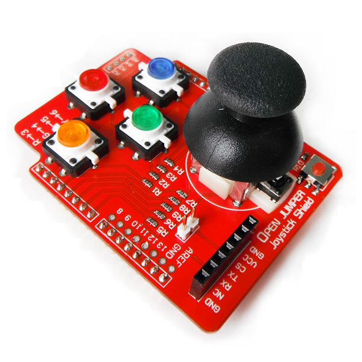

# 摇杆扩展板(Arduino兼容)

## 概述

使用OPEN JUMPER摇杆扩展板，你可以轻松的制作一个摇杆手柄；结合无线模块，可以变身无线遥控器；结合Arduino Leonardo，他还可以模拟成USB鼠标键盘。



## 参数

+ 规格：54*60mm

+ 1个摇杆，4个带LED按键，按下时发光

+ 引出8-13数字口，A2-A5模拟输入口

+ 带7Pin无线扩展座，可连接 OJ蓝牙模块等

+ **OJ蓝牙模块接口：** 支持OPENJUMPER蓝牙2.0模块直接插接。通信占用0、1，两个数字端口，2号端口高电平，可使蓝牙模块进入AT模式。
  
+ **无线模块CS选择跳帽：** 插上该跳帽时，会连接7Pin无线接口CS端到2号数字口（出厂默认连接）。通过2号口输出高电平，可使OJ蓝牙2.0模块进入AT模式。对于其他无线模块，可以通过该接口进行CS选择或者完成其他功能。 

+ **数字端口的使用：** 如若连接无线模块，即占用0、1号数字口 如若用户连接了CS选择跳帽，即占用了2号数字口 右侧4个按键，分别占用3、4、5、6号数字口 左侧摇杆带按键功能，占用7号数字口

+ **模拟端口的使用：** 左侧摇杆xy轴控制占用A0、A1模拟输入口。

## 示例程序

```C++
/*
 OpenjumperJoystick Shield Sample Sketch
 Reads the buttons and joystick position of openjumper's Arduino
 Joystick Shield. The Joystick Shield is available from 
 http://www.arduino.cn/thread-1431-1-1.html
 created August,10, 2012
 by haishen
*/

int Button=7, Y=6, R=3, G=4, B=5;
void setup(void)
{
  Serial.begin(9600);           //Turn on the Serial Port at 9600 bps
  pinMode(Button, INPUT_PULLUP); 
  pinMode(R, INPUT_PULLUP);      
  pinMode(G, INPUT_PULLUP);      
  pinMode(B, INPUT_PULLUP);      
  pinMode(Y, INPUT_PULLUP);   //Enable the pull-up resistor on  button 

}

void loop(void)
{
  Serial.print("X="); 
  Serial.print(analogRead(1));    //Read the position of the joysticks X axis and print it on the serial port.
  Serial.print(",");
  Serial.print("Y="); 
  Serial.print(analogRead(0));    //Read the position of the joysticks Y axis and print it on the serial port.
  Serial.print(",");

  Serial.print(digitalRead(Button));  
  Serial.print(digitalRead(R));   
  Serial.print(digitalRead(G));  
  Serial.print(digitalRead(B)); 
  Serial.println(digitalRead(Y));   //Read the value of the select button and print it on the serial port.

  delay(100); //Wait for 100 ms, then go back to the beginning of 'loop' and repeat.
}

```

# Joystick ShieldV2.1(Arduino compatible)


## 摘要

OPEN JUMPER摇杆扩展板Ⅱ是集成了1个摇杆和4个彩色按键的扩展板。与先前版本比较，利用彩色按键替换掉LED按键，同时扩展出软件模拟串口的接口，当硬件串口归于其他用途时，可以切换跳帽到软件串口上，解决串口冲突等问题。通过Arduino可以采集到摇杆和各按键的状态。同时扩展板带无线模块接口，可以连接蓝牙或其他无线模块使用。

## 产品规格

+ 尺寸为54*60mm

+ 1个摇杆，4个彩色按键

+ 引出8-13数字口，A2-A5模拟输入口

+ 带7Pin无线扩展座，可连接 OJ蓝牙模块等

+ 引出其他备用端口

+ 占用引脚：D3,D4,D5,D6,D7,A0,A1。

+ 跳帽选择无线串口引脚：

> H：采用硬件串口连接到arduino引脚0和1
> 
>S：采用软件模拟串口连接到arduino引脚8和9

## 示例程序

结合Arduino Leonardo，他还可以模拟成USB鼠标键盘。在使用USB模拟鼠标键盘时，Arduino会接管你的鼠标或者键盘，在使用一些命令前，你需要确保你对Arduino的控制是正常的。例子中，我们将使用摇杆模块自带的按键来开启模拟USB鼠标功能。

```
</pre>
<pre class="lang:default decode:true ">/*
OpenJumper Leonardo Example
使用摇杆扩展板模拟USB鼠标
http://www.openjumper.cn/
http://x.openjumper.cn/joystick-shield/
*/

//摇杆硬件定义
int enableButton = 7; // 摇杆按键，用作鼠标功能使能按键
int upButton = 5; // 上方按键，模拟滚轮向上
int downButton = 4; // 下方按键，模拟滚轮向下
int leftButton = 3; // 左按键，模拟鼠标左键
int rightButton = 6; // 右按键，模拟鼠标右键
int xAxis = A1; // 遥感X轴 
int yAxis = A0; // 遥感Y轴

int mouseSensitivity = 12; // 鼠标灵敏度
int wheelSensitivity = 1; // 滚轮灵敏度

boolean enable = false; //模拟鼠标功能是否可用
boolean lastEnableButtonState = HIGH; // 上一次使能按键读值

void setup() {
 //初始化各个按键
 pinMode(enableButton,INPUT);
 pinMode(upButton,INPUT);
 pinMode(downButton,INPUT);
 pinMode(leftButton,INPUT);
 pinMode(rightButton,INPUT);
 // 开始控制鼠标
 Mouse.begin();
}

void loop() {
 // 使能按键按一次使能，再按一次不使能
 boolean EnableButtonState = digitalRead(enableButton);
 if( (EnableButtonState == LOW)&&(EnableButtonState != lastEnableButtonState) ) {
 enable=!enable; 
 }
 lastEnableButtonState=EnableButtonState;

 if (enable) {
 // 读取鼠标偏移值
 int x = readAxis(xAxis);
 int y = readAxis(yAxis);
 // 读取鼠标滚轮值
 int wheel=0;
 if(digitalRead(upButton)==LOW){
 wheel=wheelSensitivity;
 }
 else if(digitalRead(downButton)==LOW){
 wheel=-wheelSensitivity;
}
// 移动鼠标位置或滚轮
 Mouse.move(x, y, wheel);
 // 点击鼠标左右键
 ifClickButton(leftButton,MOUSE_LEFT); 
ifClickButton(rightButton,MOUSE_RIGHT); 
// 延时一段时间，可以通过该值调整鼠标移动速度
 delay(10);
 }
}
// 读取摇杆数据
// 即摇杆电位器的偏移量
int readAxis(int thisAxis) { 
 int reading = analogRead(thisAxis);
 // 将读出的模拟值，缩小到一定范围
 reading = map(reading, 0, 1023, 0, mouseSensitivity);
 // 计算出一个鼠标偏移量
 int distance = reading - (mouseSensitivity/2);
 int threshold = mouseSensitivity/4;
 //如果电位器偏移量较小则不移动鼠标
if (abs(distance)<threshold) {
 distance = 0;
 } 
 // 返回鼠标偏移量
 return distance;
}
// 判断按键是否被按下
void ifClickButton(int Buttonpin,uint8_t Button) {
 if (digitalRead(Buttonpin) == LOW){
 if (!Mouse.isPressed(Button)) {
 Mouse.press(Button); 
 }
 }
 else 
 if (Mouse.isPressed(Button)) {
 Mouse.release(Button);
 }
}</pre>
<pre class="lang:default decode:true ">
```
## 其他文档

[Joystick-Shield-schematic](http://openjumper.cn/wp-content/uploads/2012/08/Joystick-Shield-schematic.pdf)
[INPUT-Shied](http://openjumper.cn/wp-content/uploads/2012/08/INPUT-Shied.pdf)
