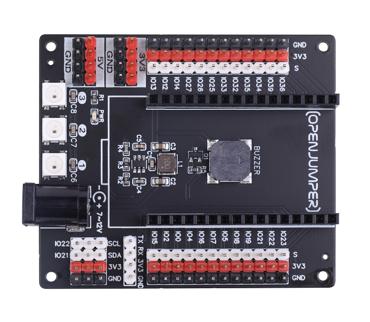
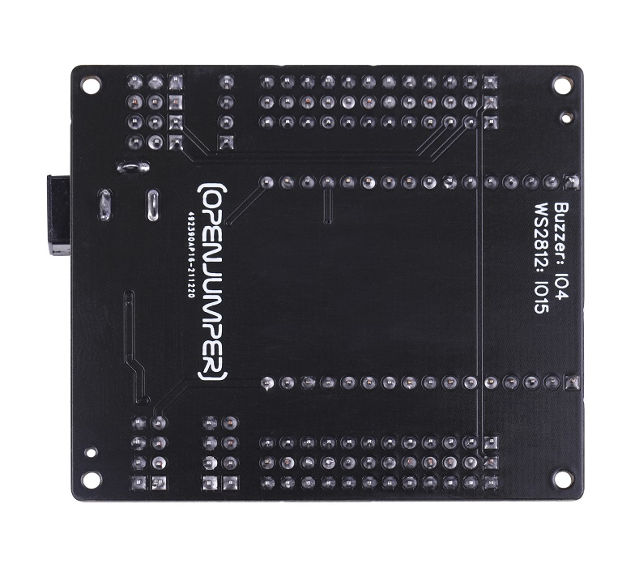
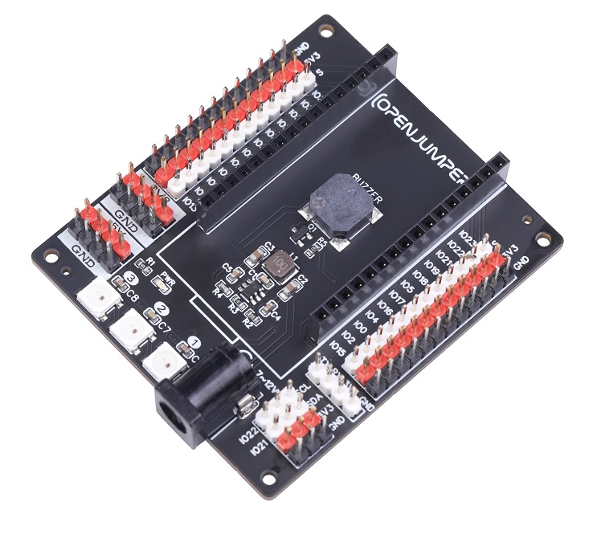

# ESP32扩展板
<table border="1" align="center">

<tr>
  <td align="center"></td>
  <td align="center"></td>
  <td align="center"></td>
</tr>
<tr>
  <td style="background-color:rgb(232,232,232,0.5) "colspan="3" align="center"> <a href="https://item.taobao.com/item.htm?id=667746818635"> ESP32扩展板</a> </td>
</tr>
</table>

OpenJumper ESP32扩展板专门适用于 OpenJumper ESP32主控板。将对应IO全部引出，且添加一个串口及三个I2C接口；扩展板自带三个WS2812灯及一个贴片蜂鸣器；自带一个电源转换电路，方便电池或其他电源供电；

## 参数

+ 扩展板尺寸：55.4X64.3（mm）

+ 固定孔中心距：50X59（mm）

+ 电源电压：7~9V

+ 板载LED：WS2812三颗

+ 板载蜂鸣器：无源蜂鸣器

## 其他资料

原理图下载：<https://pan.baidu.com/s/1ITiRLwHrT90Y2sZllgaCLw>  提取码：7hv2
