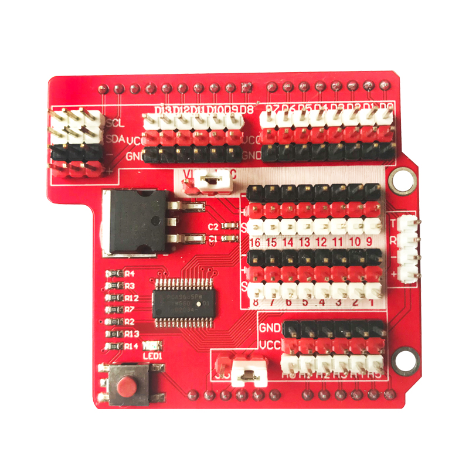
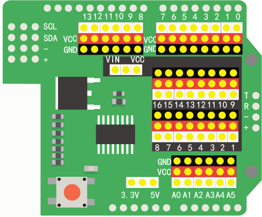
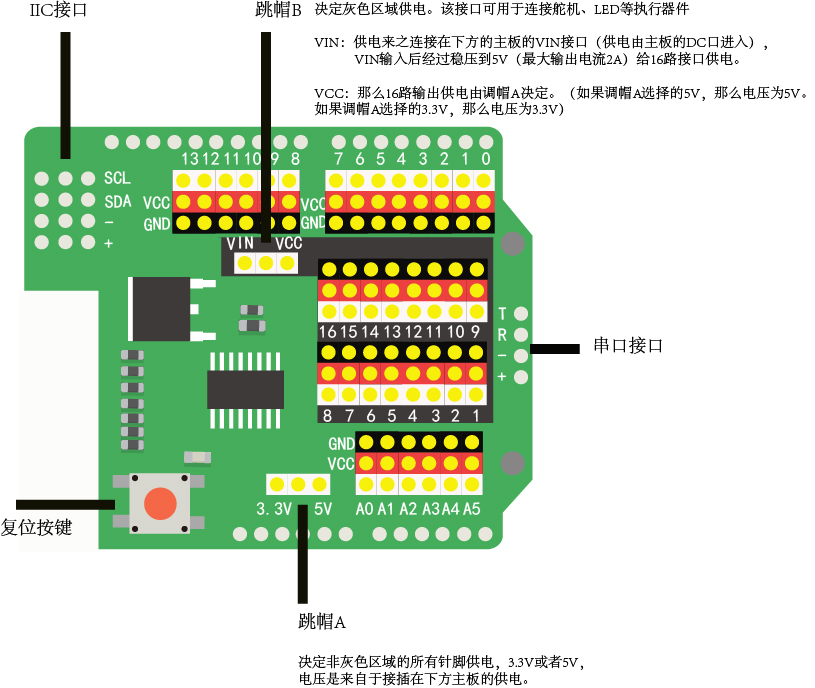

# wifiduino传感器扩展板

## 简介



[点我购买](https://item.taobao.com/item.htm?id=627190570901)

wifiduino传感器扩展板用于堆叠在wifiduino主板中，将主板的IO口扩展出来的同时，为每个IO口添加了一个供电，这样我们可以更加方便的连接传感器模块或者其他扩展硬件模块。

wifiduino传感器扩展板 也兼容wifiduino32和arduino UNO等控制器。




## 接口说明

+ 3路单通道IIC接口（他们是同一个IIC引出接口）

+ 16路舵机驱动接口 （通过IIC协议驱动）

+ 6路模拟输入接口 （wifiduino只有一路模拟输入A0）

+ 13路数字输入输出接口（wifiduino一部分接口是共用的，只有11路的输入输出接口）

+ 1路串口接口 （T连接至wifuino的D1 R连接至wifuino的D0 ）

 

## IO供电选择

通过跳帽选择IO扩展接口的供电为3.3V或者5V，这是考虑到有些传感器模块是需要3.3V供电，而有的是需要5V供电。 跳帽选择后，所有IO扩展接口的供电只能为同一种电压。

## 16路舵机接口供电选择

为了解决输出接口不足问题，wifiduino传感器扩展板还提供了 **16路的I/O扩展接口** ，他们是通过 **IIC芯片** 扩展出来的，需要使用IIC协议来驱动这16个I/O口输出状态。而这16个接口同时匹配了单独的电源供电。而这个电源供电也可以通过跳帽选择，可以选择 **VIN** 也可以选择 **VCC** 。

+ **选择VIN** ，那么这16路接口的供电来致堆叠在扩展板下方的主板的VIN接口（供电由主板的DC口进入），VIN输入后经过稳压到5V（最大输出电流2A）给16路接口供电。

+ **选择VCC** ，那么这16路接口的供电来自主板IO的供电，也就是上一跳帽的供电选择，如果跳帽选择的3.3V那么这16路供电输出就是3.3V，如果跳帽选择的是5V，那么这16路供电输出的就是5V。而这3.3v或者5v都是来自于主板提供的供电。

## 驱动舵机示例程序
```C++
/*S1 >> 7
 *S2 >> 8
 *S3 >> 15
 *S4 >> 16
 */

#include <Wire.h>
#include <Openjumper_IICMotorDriver.h>
                                      
//Openjumper_IICMotorDriver pwm = Openjumper_IICMotorDriver();
Openjumper_IICMotorDriver pwm = Openjumper_IICMotorDriver(0x41);//扩展板芯片地址

#define SERVOMIN 100 // this is the 'minimum' pulse length count (out of 4096)
#define SERVOMAX 400 // this is the 'maximum' pulse length count (out of 4096)

/**
舵机角度0-180度对应脉冲角度在0.5到2.5ms，一个脉冲宽度20ms
**/
  
void setup()
{
  Serial.begin(115200);

  pwm.begin();
  pinMode(LED_BUILTIN, OUTPUT);//8266模块灯
  digitalWrite(LED_BUILTIN, LOW);
}

void loop()
{
    pwm.setServoPulse(S1, 110);
    Serial.println("110");
    delay(1000);
    pwm.setServoPulse(S1, 380);
    Serial.println("380");
    delay(1000);
}
```
## 其他文件

库文件及驱动舵机示例程序下载

下载链接：<https://pan.baidu.com/s/10IiDX6FWAHavQDj0A0I-pw>  提取码: 3q98