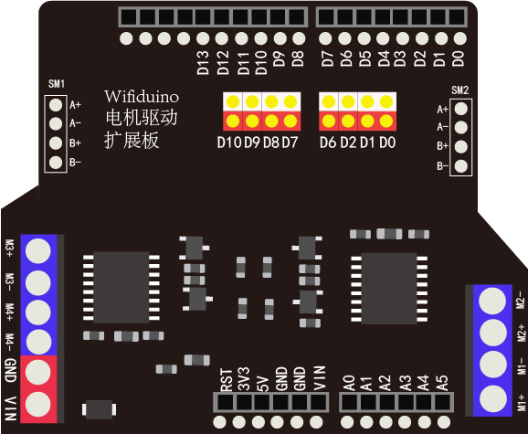

# wifiduino电机驱动扩展板

## 产品简介

wifiduino电机扩展板用于堆叠在wifiduino等主板中 ，电机扩展板可驱动四路直流电机正反转，两路步进电机，驱动芯片相较于传统的L298N具有，体积小，发热小，效率高等优点。
扩展板同时兼容wifiduino32、arduino uno等控制器。

 

## 技术参数

+ 电机驱动芯片：TB6612

+ 芯片工作电压：2.7-5.5v

+ 单通道输出电流：1.2A（平均）

+ 扩展板外部供电电压：5~12V（推荐）

+ 同时驱动直流电机：8路（最多）

+ 同时驱动步进电机：2路 （最多）

## 接口说明

**VIN和GND：** 电机驱动外部电压输入接口,最大输入15v,建议输入小于12v)

**M1~M4：** 电机驱动输出接电机

直流电机M1： M1+、M1-

直流 电机M2： M2+、M2-

直流 电机M3： M3+、M3-

直流 电机M4： M4+、M4-

**SM1~SM2：** 步进电机输出端子

步进电机 SM1 ：A+、A-、B+、B-

步进电机 SM2：A+、A-、B+、B-

**注意：**

电机M1、M2输出接口与步进电机SM1同步连接，不能同时驱动

电机M3、M4输出接口与步进电机SM2同步连接，不能同时驱动

**调帽：**

用于选择IO口是否与电机驱动相连接。具体IO控制电机引脚参考下方控制IO说明。当拔下对应调帽，IO口就失去对电机控制权，IO口就可以用于其他作用（例如：驱动传感器）

## 控制IO

|端口|wifiduino32 GPIO|wifiduino GPIO|功能|备注|
|--|--|--|--|--|
|D0|3|3|PWM控制M2速度|
|D1|1|1|PWM控制M1速度|
|D2|17|2|PWM控制M4速度|	
|D6|25|16|PWM控制M3速度|	
|D7|26|14|高电平-M2正转|低电平-M2反转|
|D8|23|12|高电平-M1正转|低电平-M1反转|
|D9|22|13|高电平-M4正转	|低电平-M4反转|
|D10|21|15|高电平-M3正转|低电平-M3反转|

## wifiduino/Arduino驱动电机示例程序

```C++
#define M3_dir D9  //m3电机正反转控制 
#define M3_pwm D2  //PWM
#define M4_pwm D6   //PMW
#define M4_dir D10  //m4电机正反转控制

void motion(int speed_A, int speed_B) //电机速度控制函数。括号内分别为m3,m4电机速度值，直接作用于电机驱动
{
  if (speed_A > 0) //范围-255～+255，正值为正转，负值为反转。
  {
    digitalWrite(M3_dir, 0);
    analogWrite(M3_pwm, abs(speed_A)); //PWM控制速度
  }
  else
  {
    digitalWrite(M3_dir, 1);
    analogWrite(M3_pwm,abs(speed_A)); //PWM控制速度
  }
  
  if (speed_B > 0)
  {
    digitalWrite(M4_dir, 0);
    analogWrite(M4_pwm, abs(speed_B)); //PWM控制速度
  }
  else
  {
    digitalWrite(M4_dir, 1);
    analogWrite(M4_pwm,abs(speed_B)); //PWM控制速度
  }
}

void setup()
{
  pinMode(M3_dir, OUTPUT); //配置电机输出IO口为输出
  pinMode(M3_pwm, OUTPUT);
  pinMode(M4_pwm, OUTPUT);
  pinMode(M4_dir, OUTPUT);
   
}
void loop()
{
 motion(255,-255) //M3正转，M4反转
}
```
## wifiduino/Arduino驱动步进电机示例程序
```C++
#define M3_dir D9  //m3电机正反转控制 
#define M3_pwm D2  //PWM
#define M4_pwm D6   //PMW
#define M4_dir D10  //m4电机正反转控制

void motion(int speed_A, int speed_B) //电机速度控制函数。括号内分别为m3,m4电机速度值，直接作用于电机驱动
{
  if (speed_A > 0) //范围-255～+255，正值为正转，负值为反转。
  {
    digitalWrite(M3_dir, 0);
    analogWrite(M3_pwm, abs(speed_A)); //PWM控制速度
  }
  else
  {
    digitalWrite(M3_dir, 1);
    analogWrite(M3_pwm,abs(speed_A)); //PWM控制速度
  }
  
  if (speed_B > 0)
  {
    digitalWrite(M4_dir, 0);
    analogWrite(M4_pwm, abs(speed_B)); //PWM控制速度
  }
  else
  {
    digitalWrite(M4_dir, 1);
    analogWrite(M4_pwm,abs(speed_B)); //PWM控制速度
  }
}

void steps(int speeds, int s) //步进电机控制函数 speeds 速度为正正转 负反转  s 步数
{
  if(speeds>0)
  {
    if(speeds<3)speeds=3;
    if(speeds>300)speeds=300;
    for(unsigned char i=0;i<s;i++)
    {
      motion(255, 0); 
      delay(speeds); 
      motion(0, 255); 
      delay(speeds);
      motion(-255, 0); 
      delay(speeds);
      motion(0, -255); 
      delay(speeds);
      }
    }else{
        speeds=abs(speeds);
        if(speeds<3)speeds=3;
        if(speeds>300)speeds=300;
        for(unsigned char i=0;i<s;i++)
        {
          motion(0, -255); 
          delay(speeds); 
          motion(-255, 0); 
          delay(speeds);
          motion(0, 255); 
          delay(speeds);
          motion(255, 0); 
          delay(speeds);
          }
      
      }
  
 }
void setup()
{
  pinMode(M3_dir, OUTPUT); //配置电机输出IO口为输出
  pinMode(M3_pwm, OUTPUT);
  pinMode(M4_pwm, OUTPUT);
  pinMode(M4_dir, OUTPUT);
   
}
void loop()
{
  steps(5,50); //步进电机以5ms每步速度正转50个周期
  steps(-5,50); //步进电机以5ms每步速度反转50个周期
}
```