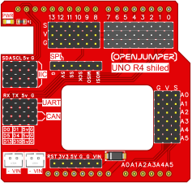
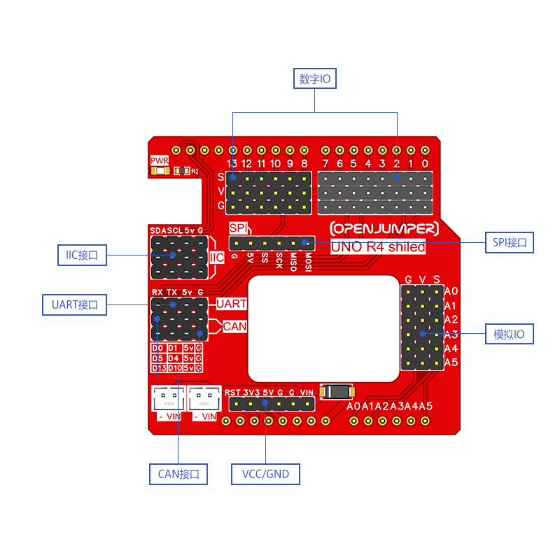

# Arduino uno R4传感器扩展板

## 简介

Openjumper UNOR4传感器扩展板将UNO R4主板的所有IO口引出同时匹配了标准的5V和GND引脚，让连接外部传感器模块更加便捷。

同时将UNO R4的特殊功能引脚，如：IIC\SPI\CAN\UART都独立引出，这使得具有通信协议的传感器或者显示器等模块可以更方便的接入。匹配对应连接线，可以兼容不同类型的传感器模块接口。然后传感器可以像电子积木一样连接在扩展板上实现具体的项目及应用。

 

## 规格参数

+ 尺寸（长 * 宽）：56mm*53mm

+ 工作电压：5V

+ 兼容控制器：arduino uno R4minima 、arduino uno R4 wifi

## 接口说明

**数字IO：**

D2/D3/D4/D5/D6/D7/D8/D9/D10/D11/D12/D13

每一路接口包含三个引脚 S(信号) 、+（5V）、-（GND）

**模拟IO：**

A0/A1/A2/A3/A4/A5

每一路接口包含三个引脚 S(信号) 、+（5V）、-（GND）

**IIC接口**：

连接在A4（SDA）、A5（SCL）、+(VCC) 、-（GND）四个引脚上

**SPI接口：**

连接在D11(MOSI) 、D12( MISO)、D13( SCK) 、D10(SS)、 5V GND

**UART接口:**

连接在0（RX）、1（DX）、+、-四个引脚上

**CAN接口:**

UNOR4minima的can接口 D5/CANRX0 （接收）、D4/CANTX0（传输）

UNOR4wifi的can接口  D13/CANRX0 （接收）、D10/CANTX0（传输）

**POWER引脚:**

将主板的RST\3V3\5V\GND\GND\VIN独立引出

**外部电源输出接口:**

VIN GND该引脚电源来至于主板的DC外部供电（6\~24v），两路VIN GND端子可以为一些执行器进行外部供电,比如电机、水泵、继电器等~

## 引脚定义

详情图

 
