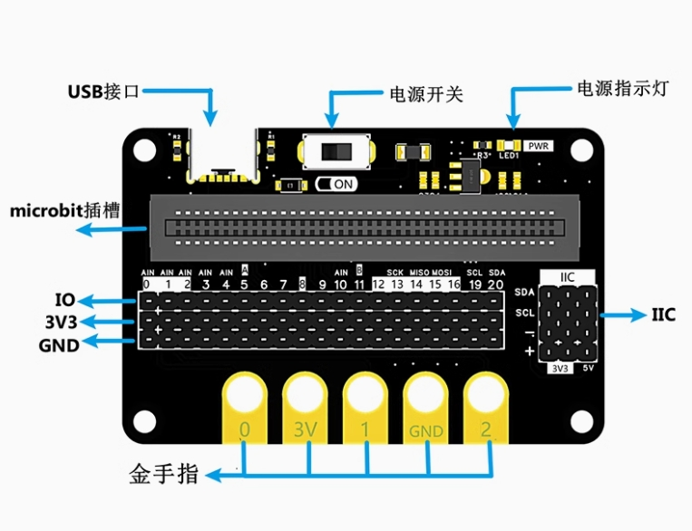

# microbit常规IO扩展板

<table border="1">

<tr>
  <td align="center"></td>
  <td align="center"></td>
  <td align="center"></td>
</tr>
<tr>
  <td style="background-color:rgb(232,232,232,0.5) "colspan="3" align="center"> <a href="https://item.taobao.com/item.htm?id=702812619801">掌控板IO扩展板</a> </td>
</tr>
</table>

## 概述：

microbi IO扩展板是一款功能强大的microbit扩展板，其引出microbit主板 20路PIN引脚，每个PIN引脚都有VCC和GND与其对应；预留了3个共用的IIC引脚SDA,SCL，IIC具有3V3和5V选择，接线方式更加灵活多样；为不同电源I2C通信的流出预留接口可提供更多可能；板供电方式使用USB插口供电或者使用microbit供电，使用USB供电时为5V，使用microbit供电时为3.3v，板上具有保险丝过流保护。

## 产品参数：

- PCB板厚度：1.6mm
- 固定孔直径：3.0mm
- 固定孔距离：58mm

- 产品尺寸：64*42mm
- USB 输入电压：5V

## 硬件接口介绍：

### IO接口：

引出从0-20引脚，丝印上写出以及microbit引脚上对应的其他功能

### **I2C接口**

- 引脚分别是+、-、P19、P20。
- 这个接口只适用于I2C设备的连接。但对于其他非I2C设备连接于该接口上，不一定能正常驱动，因为接口被固定成了I2C接口。

### 电源控制开关

拨动开关在ON这一档时，使用外部电源给传感器扩展板和micro:bit供电。当开关拨动到OFF挡时，外部电源断开供电，这时候通过扩展板上的microUSB接口可以给电池充电。

### 金手指：

金手指引出数字引脚0，1，2，以及3.3V与GND，方便后续使用

